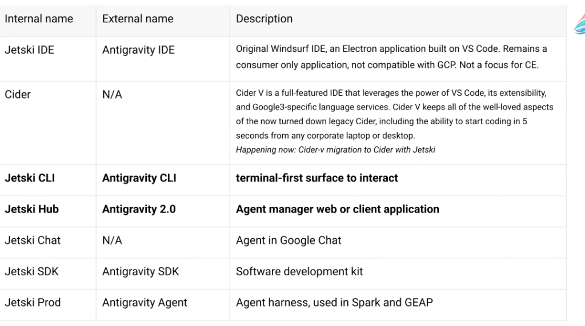
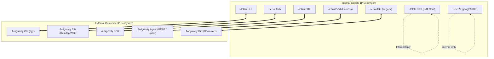

# Google Agent Ecosystem: Internal (JetSki) vs. External (Antigravity) Taxonomy

## Overview

Within Google, agentic tooling is developed under the internal **JetSki** project umbrella and externalized to customers and partners under the **Antigravity** brand. Understanding this 1:1 mapping ensures Customer Engineers and developers use the correct terminology during internal design discussions vs external customer engagements.

---

## The Nomenclature Mapping Table

| Internal Name (Google 1P) | External Name (Customer 3P) | Description & Architecture |
| :--- | :--- | :--- |
| **Jetski IDE** | **Antigravity IDE** | Original Windsurf IDE, an Electron application built on VS Code. Remains a consumer-only application, not compatible with GCP. Not a focus for CE. |
| **Cider / Cider V** | *N/A (Internal Only)* | Full-featured cloud IDE leveraging VS Code, extensibility, and Google3-specific language services. Fast 5-second corporate bootstrap. *(Currently migrating to Cider with Jetski)*. |
| **Jetski CLI** | **Antigravity CLI (`agy`)** | **Terminal-first surface to interact** with agents, execute bash tasks, and run headless scripts. |
| **Jetski Hub** | **Antigravity 2.0** | **Agent manager web or client application** for desktop orchestration, project visualization, and multi-agent coordination. |
| **Jetski Chat** | *N/A (Internal Only)* | Internal productivity agent embedded directly into Google Chat for CE toil reduction. |
| **Jetski SDK** | **Antigravity SDK** | Software Development Kit for programmatic agent definition, tool binding, and workflow execution. |
| **Jetski Prod** | **Antigravity Agent** | Production agent execution harness powering enterprise agent platforms (used in Spark and GEAP). |

---

## Architectural Mapping Hierarchy

---

## Key Tactical Guidance for Customer Engineers (CEs)

1. **Focus Demos on Antigravity 2.0 & CLI**:
   * Always present **Antigravity 2.0** (the Hub desktop/client application) and the **Antigravity CLI (`agy`)**.
   * Never refer to "Jetski" in external presentations, customer whitepapers, or public recordings.

2. **Understand the Core Execution Engines**:
   * **Antigravity Agent / Jetski Prod**: The underlying runtime harness that integrates into the **Gemini Enterprise Agent Platform (GEAP)** and **Spark**.
   * **Antigravity SDK / Jetski SDK**: The API and programmatic interface developers use to build custom agent workflows.

3. **Internal-Only Surfaces**:
   * **Cider / Cider with Jetski** and **Jetski Chat** are strictly proprietary Google internal developer tools that have no external equivalent and must never be demonstrated externally.
