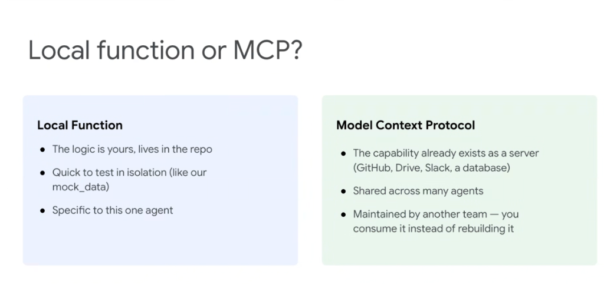
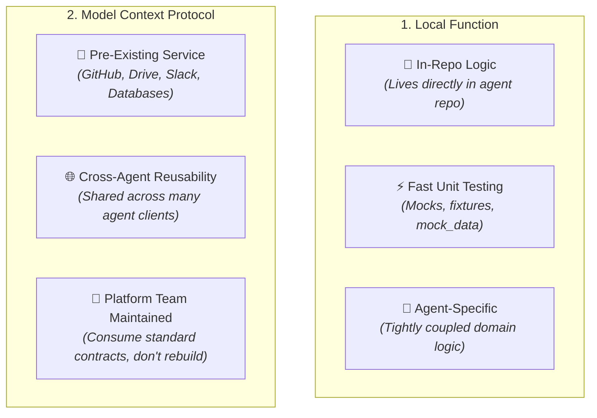
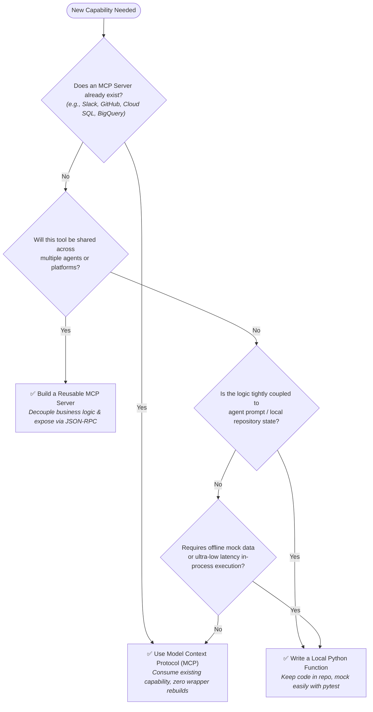

# Architectural Decision: Local Function or MCP?



## Overview

When building production agents in the Google Agent Development Kit (ADK) and Antigravity, one of the most fundamental design decisions is determining whether a tool capability should be implemented as a **Local Python Function** or consumed via the **Model Context Protocol (MCP)**. 

Choosing the right primitive optimizes developer velocity, testability, maintenance overhead, and multi-agent scalability.

---

## Core Comparison



---

## The Decision Framework

| Criterion | Choose **Local Function** When... | Choose **Model Context Protocol (MCP)** When... |
| :--- | :--- | :--- |
| **Code Ownership** | The logic is bespoke to your agent and versioned in your repository. | The service already exists as a managed server or open-source module. |
| **Reusability** | The capability is specific to one agent or a narrow reasoning step. | The capability is needed by multiple agents, IDEs, or automated pipelines. |
| **Testing Velocity** | You need instant, deterministic unit testing and local offline mocking. | You want integration testing against real backend environments or shared sandboxes. |
| **Maintenance Burden** | Your team owns and maintains the implementation end-to-end. | Another team (or third party) maintains the API, schemas, and upstream SDKs. |
| **Deployment Complexity** | Zero infrastructure overhead (runs in-process with the agent). | Requires process management (stdio) or network deployment (SSE/HTTP). |

---

## Architectural Decision Flowchart



---

## Real-World Engineering Scenarios

### Scenario A: Local Python Function
* **Use Case**: Calculating a proprietary internal lead score or formatting an agent-specific markdown summary.
* **Why Local**:
  * The business formula is unique to this agent.
  * Easy to test with `pytest` using static fixtures (`mock_data.py`).
  * No need to manage external server processes or network hops.

```python
# In-repo local function
def calculate_lead_priority(deal_size: float, days_inactive: int) -> str:
    """Calculates priority score based on bespoke internal pipeline logic."""
    if deal_size > 100_000 and days_inactive < 7:
        return "CRITICAL_ATTENTION"
    return "STANDARD_NURTURE"
```

### Scenario B: Model Context Protocol (MCP)
* **Use Case**: Querying customer records from BigQuery, searching enterprise Google Drive folders, or dispatching Slack alert threads.
* **Why MCP**:
  * Standardized servers already exist and are maintained by database/infrastructure teams.
  * Centralized credential management (OAuth / IAM tokens) without distributing API keys to local agent code.
  * Shared across Antigravity, ADK swarms, and human developer tooling simultaneously.

```python
# Consuming an existing MCP server
from google.adk.tools.mcp_tool import MCPToolset, StdioServerParameters

drive_toolset = MCPToolset(
    connection_params=StdioServerParameters(
        command="gdrive-mcp-server",
        args=["--root-folder", "Enterprise-KB"],
    )
)
```
