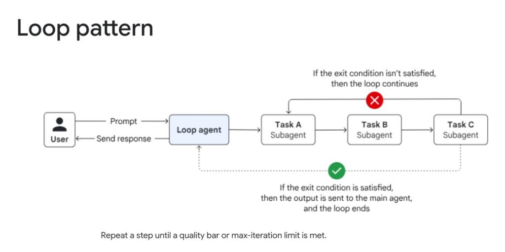
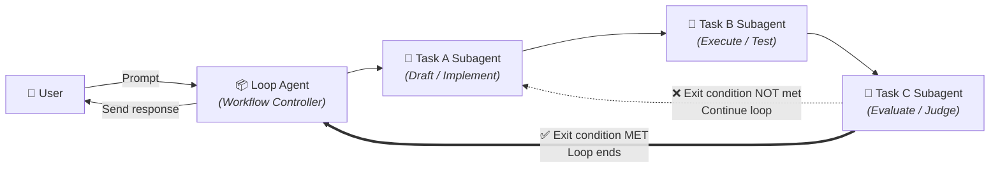
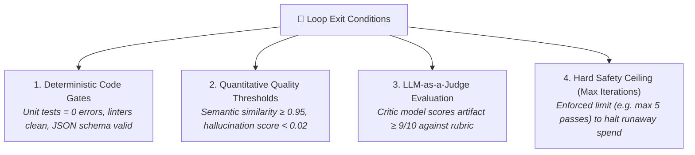

# Multi-Agent Workflow: Loop Pattern



## Overview

The **Loop Pattern** is a multi-agent workflow architecture where a sequence of subagents executes iteratively in a closed feedback cycle until an explicit exit condition is satisfied.

> **"Repeat a step until a quality bar or max-iteration limit is met."**

Unlike open-ended ReAct loops, the Loop Pattern enforces structured, multi-stage pipelines with deterministic exit evaluations—allowing autonomous refinement while preventing runaway token consumption.

---

## Architectural Execution Flow



---

## How It Works Step-by-Step

1. **Ingress & Initialization**: The user submits a prompt to the `LoopAgent`. The controller initializes the loop counter ($i = 0$) and passes state to the first subagent.
2. **Execution Pipeline ($A \rightarrow B$)**:
   * **Task A**: Generates or patches the target artifact (code, document, SQL query) using the latest feedback.
   * **Task B**: Executes the artifact against an environment, test harness, or verification suite (compiles code, runs unit tests, executes SQL dry-run).
3. **Exit Condition Gate (Task C)**:
   * Evaluates the execution outcome against strict quality criteria or a validation rubric.
4. **Conditional Branching**:
   * **❌ Unsatisfied ($i < \text{MaxIterations}$)**: Injects the error trace or critique into the state, increments $i$, and loops back to **Task A**.
   * **✅ Satisfied or Max Iterations Reached**: Terminates the cycle and hands the finalized artifact back to the `LoopAgent`.
5. **Response Delivery**: The `LoopAgent` returns the verified response and iteration summary to the user.

---

## The 4 Core Types of Exit Conditions



1. **Deterministic Code Gates (Gold Standard)**:
   * Output must pass binary checks: unit test suite `pytest == 0`, compiler exit code `0`, Pydantic validation pass.
2. **Quantitative Quality Thresholds**:
   * Mathematical metrics calculated against ground-truth references.
3. **LLM-as-a-Judge Evaluation**:
   * A distinct auditor agent checks the output against qualitative rubrics (brand voice, readability, factual grounding).
4. **Hard Safety Ceiling (`max_iterations`)**:
   * **Mandatory in production**: Always enforce a hard upper bound (e.g., $N = 3$ to $5$) and timeout deadline to prevent infinite looping.

---

## Google ADK Implementation Example

In the **Google Agent Development Kit (ADK)**, iterative loops can be constructed using `LoopAgent` or condition-gated workflows:

```python
from google.adk.agents import LlmAgent, LoopAgent
from google.adk.tools import Tool

# 1. Implementation Subagent (Task A)
coder_agent = LlmAgent(
    name="code_generator",
    model="gemini-2.5-pro",
    instruction="Write or patch Python code according to requirements and error feedback in state.",
    tools=[],
    output_key="current_code",
)

# 2. Test Execution Subagent (Task B)
test_runner_agent = LlmAgent(
    name="test_executor",
    model="gemini-2.5-flash",
    instruction="Run pytest against current_code and capture stdout/stderr error logs.",
    tools=[run_pytest_tool],
    output_key="test_results",
)

# 3. Quality & Exit Gate Subagent (Task C)
evaluator_agent = LlmAgent(
    name="quality_gate",
    model="gemini-2.5-flash",
    instruction="Check if all unit tests passed. If passed, set state['exit_condition'] = True.",
    tools=[],
    output_key="evaluation_decision",
)

# Top-level Bounded Loop Controller
tdd_loop_agent = LoopAgent(
    name="tdd_refinement_loop",
    subagents=[coder_agent, test_runner_agent, evaluator_agent],
    exit_condition=lambda state: state.get("exit_condition") is True,
    max_iterations=5,  # Mandatory circuit breaker
)
```

---

## Engineering Failure Modes & Production Mitigations

| Failure Mode | Root Cause | Production Mitigation |
| :--- | :--- | :--- |
| **Infinite Loop / Runaway Spend** | Ambiguous prompt or unreachable quality threshold | Hard `max_iterations` ceiling (e.g., 5) and token budget limits |
| **Oscillation / Cyclical Edits** | Agent fixes error 1 by creating error 2, then flips back | State diff tracking: detect repeated hash outputs and abort |
| **Context Window Congestion** | Accumulating entire failed attempts in prompt history | Pass delta diffs and truncated error traces instead of full history |
| **Goal Drift** | Model modifies core requirements to pass test cases | Pin original requirements in immutable system instructions |

---

## Linear Pipeline vs. Loop Pattern Comparison

| Feature | Sequential Pipeline | Loop Pattern |
| :--- | :--- | :--- |
| **Execution Flow** | Single linear pass ($A \rightarrow B \rightarrow C$) | Iterative cycle ($[A \rightarrow B \rightarrow C] \times K$) |
| **Error Handling** | Upstream errors propagate directly to user | Automated self-correction and retry attempts |
| **Cost & Latency** | Static and predictable ($O(N)$) | Variable depending on passes ($O(K \cdot N)$) |
| **Output Quality** | Bounded by single-shot capability | Significantly higher due to iterative refinement |
| **Best For** | Simple deterministic transformations | TDD code synthesis, deep research, schema compliance |
