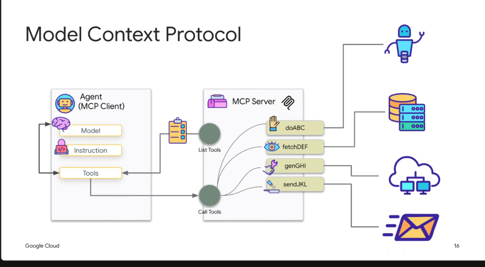
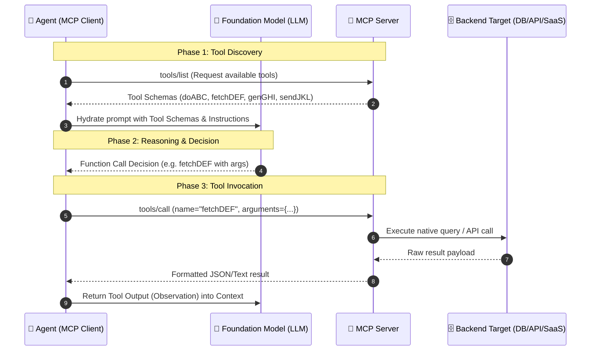

# Model Context Protocol: Client-Server Execution Flow & Tool Lifecycle



## Overview

The **Model Context Protocol (MCP)** operates as a standardized client-server architecture. It decouples the reasoning runtime (**MCP Client / Host Agent**) from the execution environment (**MCP Server**), establishing a two-phase protocol contract for **Tool Discovery (`tools/list`)** and **Tool Execution (`tools/call`)**.

---

## The MCP Client-Server Runtime Architecture



---

## Architectural Components

### 1. Agent (MCP Client / Host)
The client environment hosts the conversational loop, manages context memory, and coordinates model interactions:
* **Model**: The LLM reasoning engine (e.g., Gemini 1.5 Pro, Flash) that evaluates user intent and decides when to trigger a tool.
* **Instruction**: System prompts, project directives, and dynamic skill rules defining the agent's behavior and boundaries.
* **Tools Catalogue**: The dynamic registry where tool schemas received from MCP servers are injected into the model's function calling space.

### 2. MCP Server (Tool & Resource Provider)
A lightweight process (STDIO or HTTP/SSE) exposing standardized protocol endpoints:
* **List Tools (`tools/list`)**: Advertises available functions, argument schemas (JSON Schema), descriptions, and required parameters to the client.
* **Call Tools (`tools/call`)**: Accepts invocation requests from the client, validates arguments against schema, and runs backend execution handlers.

### 3. Downstream Execution Targets
MCP servers translate high-level agent intents into low-level backend operations across heterogeneous infrastructure:
* **Automation & Robotics (`doABC`)**: Physical actuation, task runners, and specialized sub-agent dispatch.
* **Databases & Warehouses (`fetchDEF`)**: Relational queries (Cloud SQL, AlloyDB, Spanner) and big data lookups (BigQuery).
* **Cloud & Network Services (`genGHI`)**: Infrastructure provisioning, container management, and microservice APIs.
* **Messaging & Communication (`sendJKL`)**: Dispatching notifications, emails (Gmail), or chat messages (Slack, Google Chat).

---

## Protocol Wire Contract (JSON-RPC 2.0)

### 1. Tool Discovery (`tools/list`)
The client queries the server to inspect available tools:

```json
// Client -> Server
{
  "jsonrpc": "2.0",
  "id": 1,
  "method": "tools/list",
  "params": {}
}

// Server -> Client
{
  "jsonrpc": "2.0",
  "id": 1,
  "result": {
    "tools": [
      {
        "name": "fetchDEF",
        "description": "Fetch customer database records by customer ID",
        "inputSchema": {
          "type": "object",
          "properties": {
            "customerId": { "type": "string", "description": "Unique customer ID" }
          },
          "required": ["customerId"]
        }
      }
    ]
  }
}
```

### 2. Tool Execution (`tools/call`)
The client dispatches the model's chosen function invocation:

```json
// Client -> Server
{
  "jsonrpc": "2.0",
  "id": 2,
  "method": "tools/call",
  "params": {
    "name": "fetchDEF",
    "arguments": {
      "customerId": "CUST-98214"
    }
  }
}

// Server -> Client
{
  "jsonrpc": "2.0",
  "id": 2,
  "result": {
    "content": [
      {
        "type": "text",
        "text": "{\"account\": \"Acme Corp\", \"status\": \"Active\", \"tier\": \"Enterprise\"}"
      }
    ],
    "isError": false
  }
}
```

---

## Key Benefits of Decoupled Execution

| Benefit | Mechanism | Impact |
| :--- | :--- | :--- |
| **Process Isolation** | MCP servers run in separate processes/containers from the agent host. | Prevents crash propagation and isolates untrusted code execution. |
| **Hot-Reloadable Tooling** | Clients can re-query `tools/list` dynamically at runtime. | Servers can register or deregister tools without restarting the host agent. |
| **Language Agnostic** | Standard JSON-RPC protocol over `STDIO` or `SSE`. | Clients (Python, TypeScript, Go) seamlessly connect to servers in any language (Go, Rust, Java, Python). |
| **Strict Security Gateways** | The host client intercepts `tools/call` before dispatching. | Enables deterministic human-in-the-loop approvals, allowlists, and audit logging. |
