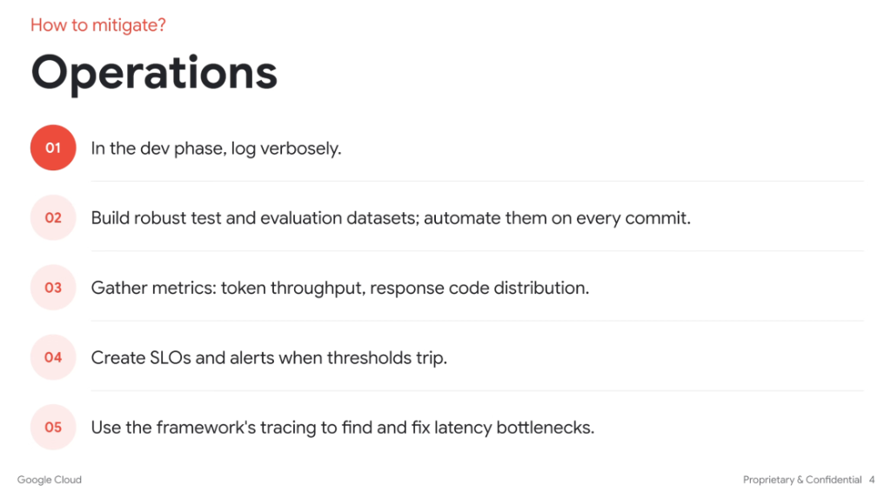

# How to Mitigate: Operations

## Overview

Operating agents reliably in production requires treating agentic workflows like distributed systems: instrumenting comprehensive telemetry, automating continuous evaluations in CI/CD, tracking cost/token pressure, and actively optimizing latency bottlenecks.

---

## The 5 Mitigation Strategies

### 01. In the Dev Phase, Log Verbosely
* Log raw prompt-response pairs, intermediate tool call payloads, schema transformations, and model thoughts.
* Verbose step-level logging during development is essential to demystify opaque LLM reasoning paths and troubleshoot unexpected tool deviations.

### 02. Build Robust Test & Evaluation Datasets (Automated in CI/CD)
* Create golden benchmark evaluation datasets covering edge cases, tool failures, and complex multi-turn scenarios.
* Automate eval runs on every commit/PR to catch behavioral regressions before deploying changes to production.

### 03. Gather Key Metrics
* **Token Throughput**: Ingestion rate, generation rate, and prompt/completion token distribution.
* **Response Code Distribution**: HTTP/gRPC status codes across underlying tool APIs and LLM provider endpoints.
* **Cost & Quota Tracking**: Cost per task/session and real-time quota headroom monitoring.

### 04. Create SLOs and Automated Alerts
* Define **Service Level Objectives (SLOs)** for agent completion latency, success rates, and tool execution error thresholds.
* Trigger alerts when token burn rates spike, loop count limits are exceeded, or error budgets degrade.

### 05. Use Distributed Tracing to Fix Latency Bottlenecks
* Leverage OpenTelemetry and framework-level tracing to measure time spent across LLM inference vs. external tool roundtrips.
* Identify slowest sub-steps, parallelize independent tool calls, and streamline context sizes to reduce TTFT (Time-to-First-Token).

---

## Strategy Implementation Matrix

| # | Strategy | Implementation / Tools | Primary Operational Outcome |
| :-: | :--- | :--- | :--- |
| **01** | Verbose Dev Logging | Step-level payload logging, reasoning trace capture | Fast debugging of opaque reasoning paths |
| **02** | Automated CI/CD Evals | Golden test datasets, LLM-as-a-judge regression tests | Prevents behavioral regressions across prompt/code updates |
| **03** | Telemetry & Metrics | Prometheus, Cloud Monitoring, token counters | Visibility into costs, quota headroom, and API health |
| **04** | SLOs & Alerting | Alertmanager, error budgets, loop limit tripwires | Fast incident detection and runaway loop prevention |
| **05** | Distributed Tracing | OpenTelemetry, Cloud Trace, framework spans | Pinpoints latency hotspots across LLM vs tool calls |
