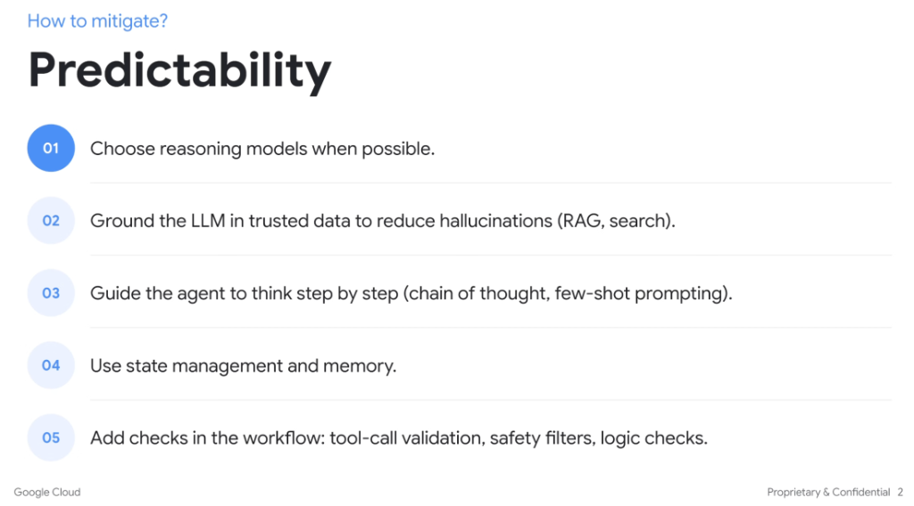

# How to Mitigate: Predictability

## Overview

Addressing LLM non-determinism, hallucinations, and fuzzy behavioral variance requires a defense-in-depth approach across model selection, prompt design, state tracking, and execution guardrails.

---

## The 5 Mitigation Strategies

### 01. Choose Reasoning Models When Possible
* Use models optimized for extended thinking, reflection, and multi-step inference (e.g. Gemini 2.0 Flash / Pro with reasoning capabilities).
* Reasoning models reduce erratic tool selection by planning intermediate steps before generating actions.

### 02. Ground the LLM in Trusted Data (RAG & Search)
* Anchor agent context in deterministic, authoritative knowledge sources (e.g., enterprise RAG, Google Search grounding).
* Minimizes hallucinations and keeps generation tightly bounded to ground-truth documentation.

### 03. Guide the Agent to Think Step-by-Step
* Implement **Chain of Thought (CoT)** reasoning scaffolds and high-quality **few-shot prompting**.
* Enforcing structured intermediate scratchpads enables the model to self-correct before executing irreversible actions.

### 04. Use State Management and Memory
* Decouple ephemeral model turns from persistent execution state.
* Maintain structured session state, context windows, and long-term memory to ensure consistent behavior across multi-turn workflows.

### 05. Add Workflow Checks & Guardrails
* **Tool-Call Validation**: Validate argument schemas, types, and constraints before dispatching execution.
* **Safety Filters**: Apply safety and content moderation checks on inputs and outputs.
* **Logic Checks & Verification**: Validate intermediate states against business rules prior to downstream execution.

---

## Strategy Implementation Matrix

| # | Strategy | Technique / Implementation | Primary Benefit |
| :-: | :--- | :--- | :--- |
| **01** | Reasoning Models | Gemini reasoning tiers, test-time compute | Reduces erratic tool selection and improves planning |
| **02** | Trusted Grounding | Enterprise RAG, Search Grounding, API feeds | Eliminates hallucination of facts and parameters |
| **03** | Step-by-Step Prompting | Chain-of-Thought, few-shot examples | Encourages self-correction and structured decomposition |
| **04** | State Management | Structured memory stores, session state machines | Prevents context drift and lost historical state |
| **05** | Workflow Checks | Schema validation, safety filters, logic gates | Catches invalid tool calls and boundary violations early |
