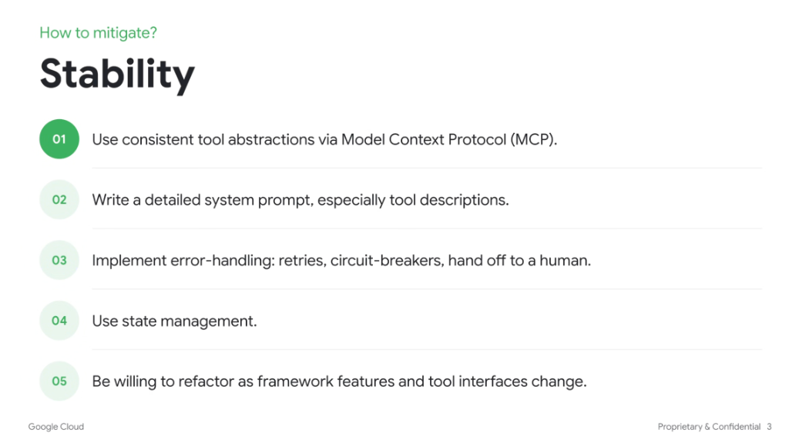

# How to Mitigate: Stability

## Overview

Stabilizing agent systems amidst rapid framework churn and heterogeneous tool failure modes requires standardized interfaces, robust error boundaries, clear semantic descriptions, and flexible architecture.

---

## The 5 Mitigation Strategies

### 01. Use Consistent Tool Abstractions via Model Context Protocol (MCP)
* Standardize tool interfaces using open protocols like **Model Context Protocol (MCP)**.
* Decouples agent orchestrators from bespoke API implementations and prevents vendor lock-in or custom integration sprawl.

### 02. Write Detailed System Prompts (Especially Tool Descriptions)
* Provide rich, unambiguous docstrings, type annotations, and field descriptions in tool definitions.
* LLMs rely directly on tool descriptions to understand parameters, prerequisites, and edge cases; clarity here directly prevents malformed invocations.

### 03. Implement Resilient Error-Handling
* **Exponential Backoff & Retries**: Handle transient network blips and rate limits gracefully.
* **Circuit Breakers**: Prevent cascading failure loops when external APIs or endpoints degrade.
* **Human-in-the-Loop (HITL) Handoff**: Escalate cleanly to human operators when confidence thresholds fail or critical exceptions occur.

### 04. Use State Management
* Centralize execution state, intermediate tool outputs, and execution history in structured state stores.
* Enables deterministic state recovery, checkpoints, and resume-on-failure capabilities.

### 05. Be Willing to Refactor as Frameworks Evolve
* Maintain modular and decoupled architecture to easily swap out orchestrator primitives as native model capabilities expand.
* Adopt an evolutionary mindset rather than over-engineering complex workarounds that models may natively solve in the next generation.

---

## Strategy Implementation Matrix

| # | Strategy | Mechanism / Pattern | Primary Benefit |
| :-: | :--- | :--- | :--- |
| **01** | Standard Abstractions | Model Context Protocol (MCP) | Interoperable, decoupled tool integrations |
| **02** | Precise Tool Prompts | Explicit JSON schemas, clear docstrings | Drastically reduces tool invocation errors |
| **03** | Error Boundaries | Retries, circuit-breakers, HITL fallbacks | Prevents catastrophic agent loop crashes |
| **04** | State Management | Structured checkpointing, session state | Guarantees resume and recovery capability |
| **05** | Agile Architecture | Modular abstractions, loose coupling | Lowers migration cost as models/frameworks evolve |
