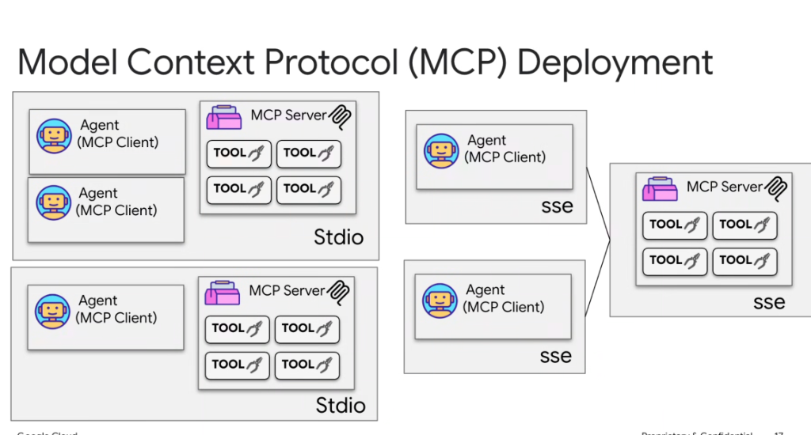

# Model Context Protocol (MCP): Deployment Topologies (Stdio vs. SSE)



## Overview

The **Model Context Protocol (MCP)** supports two foundational transport layers and deployment models: **Local Subprocess (`stdio`)** and **Remote Streaming (`SSE` / Server-Sent Events over HTTP)**. Choosing the right topology depends on whether the agent requires low-latency local execution or centralized, multi-tenant enterprise resource sharing.

---

## The Two Deployment Topologies

```mermaid
graph TD
    subgraph 1. Local Subprocess Transport (Stdio)
        subgraph Machine A
            A1["🤖 Agent Client 1"] <-->|stdin / stdout| S1["🧰 Local MCP Server"]
            A2["🤖 Agent Client 2"] <-->|stdin / stdout| S1
        end
        subgraph Machine B
            A3["🤖 Agent Client 3"] <-->|stdin / stdout| S2["🧰 Dedicated MCP Server"]
        end
    end

    subgraph 2. Distributed Network Transport (SSE / HTTP)
        subgraph Host Workstation 1
            C1["🤖 Agent Client"]
        end
        subgraph Host Workstation 2
            C2["🤖 Agent Client"]
        end
        subgraph Centralized Cloud Infrastructure
            RemoteServer["🧰 Shared Enterprise MCP Server<br/><i>(AlloyDB / Buganizer / Cloud Services)</i>"]
        end

        C1 <-->|SSE Stream + HTTP POST| RemoteServer
        C2 <-->|SSE Stream + HTTP POST| RemoteServer
    end
```

---

## 1. Local Subprocess Transport (`stdio`)

In the `stdio` deployment model, the host application (e.g., Antigravity, ADK runtime, or IDE) launches the MCP server binary as a child subprocess and communicates directly through standard input/output streams.

### Architecture & Characteristics:
* **Direct IPC (Inter-Process Communication)**: Fast, memory-efficient JSON-RPC communication over standard streams without network stack overhead.
* **Lifecycle Co-location**: The subprocess lifecycle is bound to the parent client process—when the agent terminates, the server process cleanly shuts down.
* **Local Sandboxing**: Excellent for local workstation tasks, executing bash scripts, inspecting local code trees, and managing local Git repositories.

### Topologies Supported:
1. **Multi-Agent Local Co-location**: Multiple co-located agents (or subagent processes) communicating with a local MCP daemon.
2. **Dedicated 1:1 Subprocess**: A single agent spawning its own dedicated MCP process for isolated tool execution.

---

## 2. Distributed Network Transport (`SSE` / HTTP)

In the `SSE` deployment model, the MCP server runs as a standalone microservice (e.g., on Cloud Run, GKE, or a shared VM). Clients establish a persistent **Server-Sent Events (SSE)** channel to receive server messages and use standard **HTTP POST** requests to send client RPC messages.

### Architecture & Characteristics:
* **Multi-Tenant Centralization**: Multiple distinct agents, developer workstations, and automated pipelines connect concurrently to a single authoritative MCP server.
* **Centralized Governance & Credentials**: Database connection pooling, enterprise OAuth tokens, and rate limits are managed in one secure location rather than distributed across developer laptops.
* **Horizontal Scalability**: The server can scale independently of the agent hosts behind an enterprise load balancer.

---

## Deployment Comparison: `stdio` vs. `SSE`

| Dimension | Local Subprocess (`stdio`) | Remote Network (`SSE` / HTTP) |
| :--- | :--- | :--- |
| **Transport Medium** | `stdin` / `stdout` pipes (Local IPC) | Server-Sent Events (SSE) + HTTP POST |
| **Latency** | Sub-millisecond (zero network hop) | Network-bound (~10–100ms depending on region) |
| **Lifecycle** | Tied directly to parent agent process | Long-running daemon or cloud service |
| **Best For** | File manipulation, local CLI execution, fast dev workflows | Shared databases, enterprise SaaS gateways, multi-agent swarms |
| **Auth & Security** | Local process permissions / sandbox | mTLS, OAuth 2.0 / OIDC tokens, IAM roles |
| **Resource Footprint** | Replicated per client session | Shared resource pools & centralized caching |
| **Maintenance** | Local dependencies must be installed on user machine | Zero local setup; client needs only the endpoint URL |

---

## Antigravity & ADK Configuration Patterns

### Local `stdio` Configuration Example
```json
{
  "mcpServers": {
    "local-filesystem": {
      "command": "python3",
      "args": ["/opt/mcp/fs_server.py", "--root", "/workspace"],
      "transport": "stdio"
    }
  }
}
```

### Remote `SSE` Configuration Example
```json
{
  "mcpServers": {
    "enterprise-bigquery": {
      "url": "https://mcp-bigquery.internal.corp.goog/sse",
      "transport": "sse",
      "headers": {
        "Authorization": "Bearer ${GCP_ACCESS_TOKEN}"
      }
    }
  }
}
```
