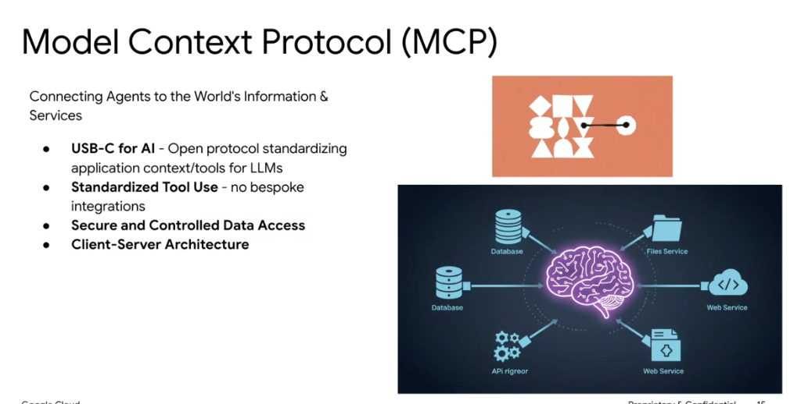
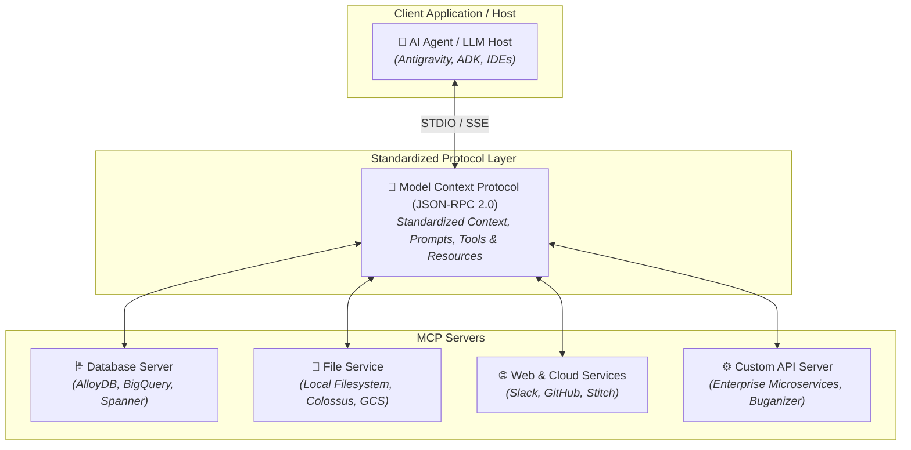

# Model Context Protocol (MCP)



## Overview

The **Model Context Protocol (MCP)** is an open, standardized protocol that connects AI models and autonomous agents to external data sources, developer tools, databases, and enterprise services. By establishing a unified communication standard between LLM applications and external systems, MCP eliminates brittle, bespoke API integrations and acts as the universal **"USB-C for AI"**.

---

## Core Pillars of MCP



### 1. 🔌 "USB-C for AI"
* **Universal Standard**: An open protocol standardizing how applications expose context, resources, dynamic prompts, and tools to LLMs.
* **Solves the $M \times N$ Integration Dilemma**: Instead of $M$ agent clients each writing custom code for $N$ tools ($M \times N$ bespoke wrappers), every client and server connects through a single protocol ($M + N$).

### 2. 🛠️ Standardized Tool Use
* **No Bespoke Integrations**: Tool schemas, parameter validation, and invocation semantics are standardized across all participating systems.
* **Interchangeable Backends**: Swap or upgrade backend service providers without needing to re-engineer or alter the agent's orchestrator code.

### 3. 🔒 Secure and Controlled Data Access
* **Fine-Grained Permissions**: Host applications maintain strict governance, user-approval gates, and authorization boundaries before dispatching commands.
* **Data Isolation**: MCP servers operate in isolated processes, ensuring least-privilege access and preventing unintended data exfiltration or unchecked mutations.

### 4. 🏛️ Client-Server Architecture
* **Decoupled Topology**: Clean separation of concerns between the **Host / Client** (which manages model interactions, context windows, and user interfaces) and **MCP Servers** (which expose domain-specific tools and resources).
* **Flexible Transports**: Supports standard IPC transports including `STDIO` (local subprocesses) and `SSE` / `HTTP` (remote network services).

---

## The $M \times N$ Problem vs. MCP Solution

```mermaid
graph LR
    subgraph Without MCP (Bespoke Chaos)
        A1["Agent A"] --> W1["Wrapper 1"] --> S1["Database"]
        A1 --> W2["Wrapper 2"] --> S2["Slack"]
        A2["Agent B"] --> W3["Wrapper 3"] --> S1
        A2 --> W4["Wrapper 4"] --> S3["GitHub"]
    end

    subgraph With MCP (Universal Bus)
        B1["Agent A"] --> Bus["🔌 MCP Protocol Bus"]
        B2["Agent B"] --> Bus
        Bus --> MS1["MCP DB Server"]
        Bus --> MS2["MCP Slack Server"]
        Bus --> MS3["MCP GitHub Server"]
    end
```

---

## MCP Primitives

| Primitive | Direction | Description | Example Use Case |
| :--- | :--- | :--- | :--- |
| **Tools** | Client $\rightarrow$ Server (Call) | Executable functions that allow the model to perform actions and mutations. | Running SQL queries, modifying files, executing terminal commands. |
| **Resources** | Server $\rightarrow$ Client (Read) | Static or dynamic data context exposed via URIs (similar to GET endpoints). | Reading documentation, fetching schema definitions, viewing file contents. |
| **Prompts** | Server $\rightarrow$ Client (Template) | Pre-configured prompt templates and conversational workflows provided by servers. | Interactive debugging workflows, code review templates. |
| **Sampling** | Server $\rightarrow$ Client (Model Call) | Allows MCP servers to request LLM completions back through the host client. | Autonomous agentic servers requiring sub-task reasoning. |

---

## Bespoke Tooling vs. Model Context Protocol (MCP)

| Dimension | Bespoke Custom Tool Integrations | Model Context Protocol (MCP) Standard |
| :--- | :--- | :--- |
| **Integration Cost** | High (Custom boilerplate per agent/model framework) | Low (Implement once, use with any MCP-compliant client) |
| **Portability** | Locked to specific orchestrator/framework APIs | Framework-agnostic across ADK, Antigravity, Claude, IDEs |
| **Security & Safety** | Ad-hoc security checks scattered across tool functions | Centralized client-level permission gates and capability negotiation |
| **Maintenance** | Fragile schema drift and high regression maintenance | Clean JSON-RPC contract versioning and decoupled server lifecycle |
| **Extensibility** | Requires touching core agent codebase to add tools | Plug-and-play via configuration files (e.g. `settings.json`) |

---

## MCP in the Google Agent & ADK Ecosystem

* **Google Antigravity**: Natively supports eagerly and lazily loaded MCP servers for local tools, cloud databases (AlloyDB, BigQuery, Spanner, Cloud SQL), and UI design engines (Stitch).
* **Google ADK (Agent Development Kit)**: Integrates MCP tools directly into agent workflows alongside native function calling and file-based Skills.
* **Enterprise Connectivity**: Bridges internal Google services (Buganizer, Moma, Plx) and third-party SaaS platforms (Slack, GitHub, Jira) using unified security boundaries.
