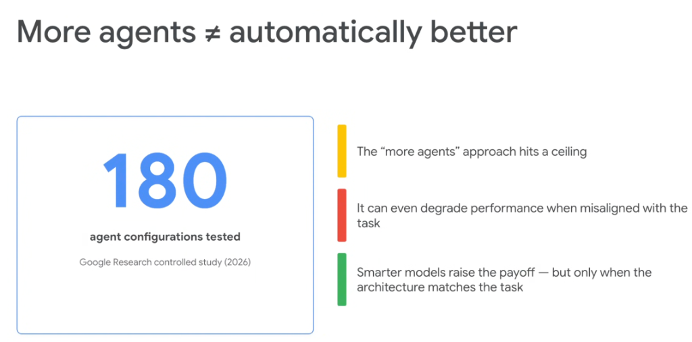
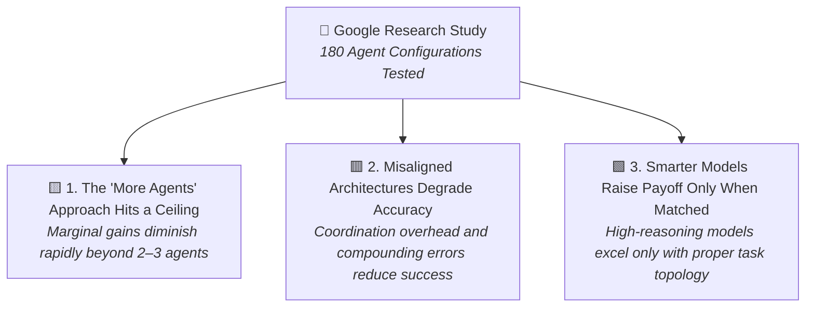
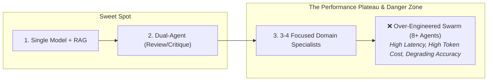
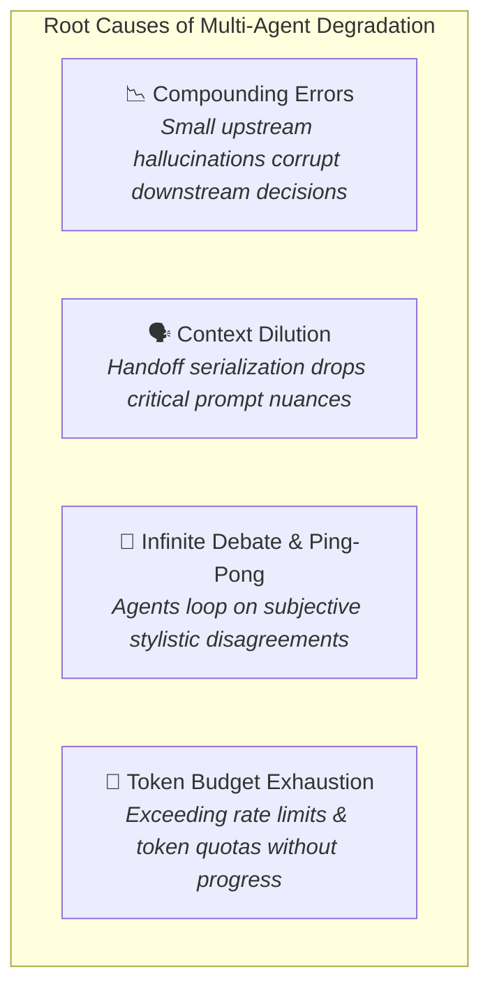

# Empirical Agent Engineering: More Agents ≠ Automatically Better

## Overview

A common anti-pattern in generative AI engineering is the assumption that adding more agents to an architecture will linearly improve intelligence and accuracy. 

> **"180 agent configurations tested in Google Research's controlled study demonstrate that simply scaling agent count hits a ceiling and can actively degrade performance."**

Engineering production systems requires adhering to the **Law of Minimal Effective Complexity**: choosing the simplest architecture that satisfies task requirements rather than defaulting to complex multi-agent swarms.

---

## The 3 Key Findings (Google Research Controlled Study)

---

### 1. The "More Agents" Approach Hits a Ceiling
* **Diminishing Returns**: Scaling from 1 to 2 specialized agents often yields substantial improvements (e.g. separating generation from critique). However, adding 4, 8, or 16 agents yields diminishing or near-zero incremental accuracy.
* **Token & Latency Explosion**: While performance plateaus, token consumption, inference billing, and wall-clock latency scale linearly or exponentially with each additional agent turn.

### 2. Performance Can Degrade When Misaligned
* **Compounding Error Rates**: In multi-agent chains, the overall probability of success is multiplicative:
  $$\text{Accuracy}_{\text{total}} = \prod_{i=1}^N \text{Accuracy}_i$$
  If four subagents each operate at 90% individual accuracy, the end-to-end pipeline accuracy drops to $0.9^4 \approx 65.6\%$. A single well-grounded model often outperforms an 8-agent swarm.
* **The "Telephone Game" Information Loss**: Serializing and deserializing state across multiple agent boundaries inevitably drops subtle nuance and constraints.
* **Adversarial Hallucination Drift**: In unstructured swarms without strict deterministic exit criteria, agents can convince each other of plausible falsehoods during collaborative debate.

### 3. Smarter Models Raise the Payoff — Only When Topology Matches
* **Frontier Model Leverage**: Upgrading to high-reasoning foundation models (e.g., Gemini 2.5 Pro) dramatically improves multi-agent outcomes—**but only when the workflow topology strictly reflects the task shape**.
* **Architecture Trumps Model Scale**: A brilliant foundation model deployed inside a chaotic, misaligned swarm will still fail due to coordination deadlocks and context drift.

---

## The Performance vs. Complexity Curve

| Architectural Scale | Accuracy Profile | Latency & Cost | Recommended Production Use |
| :--- | :--- | :--- | :--- |
| **Single LLM + Direct Tools** | Baseline | Low | Simple single-turn operations, content drafting |
| **1–2 Specialized Agents (e.g. Reviewer)** | **Highest ROI (+20–40% gain)** | Moderate | High-precision code review, legal audits, TDD |
| **3–4 Domain Specialists (Hierarchical)** | Optimal for complex tasks | Moderate to High | Multi-domain enterprise migrations, travel concierge |
| **Unbounded Swarms (8+ Agents)** | **Degrading Performance** | Extreme | Avoid in production unless strictly sandboxed |

---

## Why Multi-Agent Systems Degrade on Misaligned Tasks

---

## Production Engineering Guidelines: Minimal Effective Complexity

1. **Start Monolithic, Decompose Only on Evidence**:
   * Build the first iteration as a single `LlmAgent` with strict system instructions and relevant tools.
   * Introduce a second agent (e.g., a Critic or Domain Specialist) **only** when empirical evals show decision-space confusion or attention dilution.
2. **Match Topology to Workload Shape**:
   * Deterministic steps $\rightarrow$ Fixed Sequential / Parallel workflows.
   * Ambiguous multi-domain triage $\rightarrow$ Single-tier Coordinator.
   * Never deploy an open-ended Swarm when a 3-step Sequential pipeline suffices.
3. **Always Benchmark Against Single-Agent Baselines**:
   * In CI/CD eval suites (`agents-cli eval grade`), benchmark your multi-agent architecture against a single-agent baseline on the exact same dataset to prove the multi-agent overhead provides a genuine accuracy payoff.
