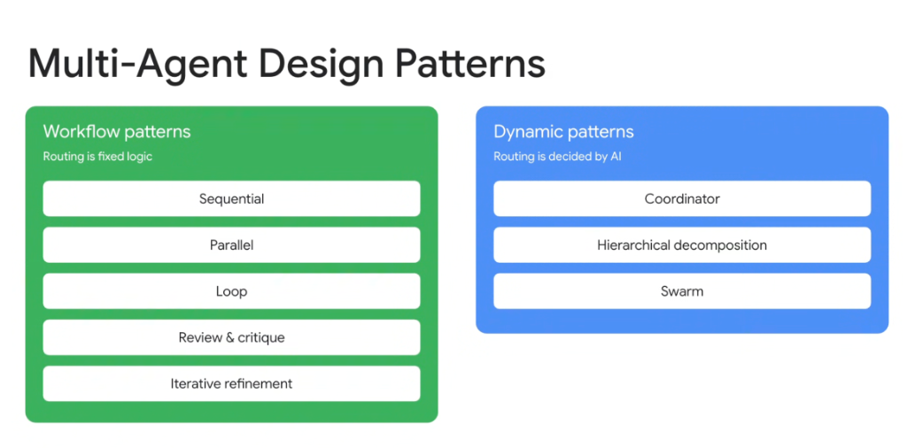
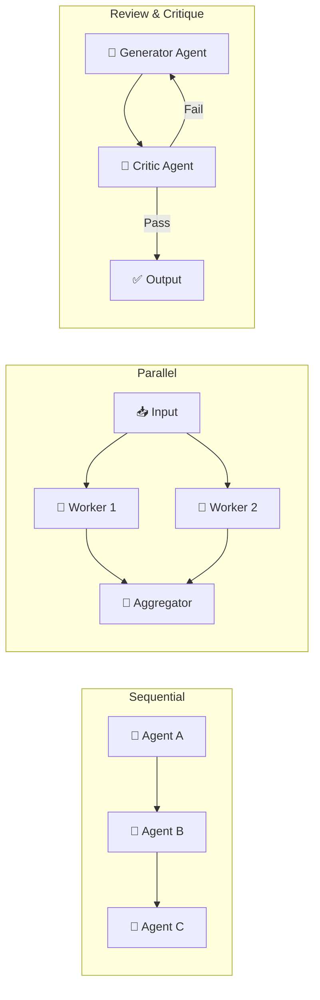
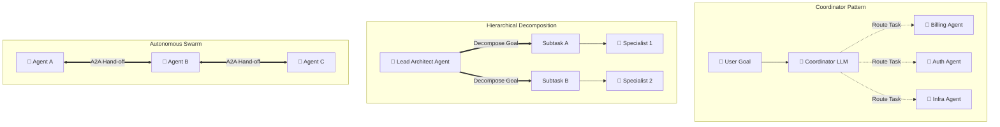
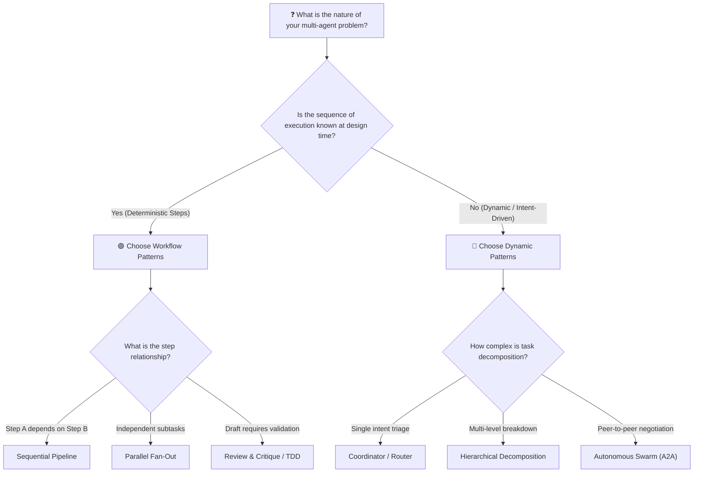

# Multi-Agent Design Patterns: Workflow vs. Dynamic Patterns



## Overview

When engineering multi-agent architectures, the central design choice lies in **who controls routing and execution flow**: deterministic software logic (**Workflow Patterns**) or the model itself (**Dynamic Patterns**).

> **"Workflow patterns use fixed, deterministic code logic to control routing. Dynamic patterns empower AI models to decide task delegation and control flow at runtime."**

Selecting between deterministic workflows and dynamic routing determines the predictability, latency, token cost, and failure modes of your multi-agent system.

---

## The Two Core Pattern Families

```mermaid
graph TD
    MADP["🔀 Multi-Agent Design Patterns"]

    subgraph Workflow Patterns [🟢 Workflow Patterns (Fixed Logic)]
        W1["1. Sequential Pipeline"]
        W2["2. Parallel Fan-Out / Fan-In"]
        W3["3. Deterministic Loop"]
        W4["4. Review & Critique"]
        W5["5. Iterative Refinement"]
    end

    subgraph Dynamic Patterns [🔵 Dynamic Patterns (AI-Decided Routing)]
        D1["1. Coordinator / Router"]
        D2["2. Hierarchical Decomposition"]
        D3["3. Autonomous Swarm (A2A)"]
    end

    MADP --> Workflow Patterns
    MADP --> Dynamic Patterns
```

---

## Part 1: Workflow Patterns (Fixed Routing Logic)

In workflow patterns, the state graph and routing transitions are hardcoded in application logic. LLMs execute the domain tasks within nodes, but deterministic code dictates execution sequence.



### 1. Sequential Pattern
* **Mechanism**: $A \rightarrow B \rightarrow C$. The structured output of Agent $A$ feeds directly into the context of Agent $B$.
* **Best For**: Linear data pipelines, ETL extraction $\rightarrow$ transformation $\rightarrow$ summarization.
* **Benefit**: 100% predictable execution order and trivial step-by-step debugging.

### 2. Parallel Pattern
* **Mechanism**: Single query dispatched simultaneously to multiple independent workers; results merged by a deterministic reducer or aggregator model.
* **Best For**: Independent audits (Security + Legal + Performance), multi-source document scraping.
* **Benefit**: Minimizes wall-clock latency to $\max(\text{worker latency})$.

### 3. Loop Pattern
* **Mechanism**: An agent executes repetitively over a fixed batch, paginated dataset, or until a deterministic stopping rule is met.
* **Best For**: Processing lists of database records, paginated API ingestion, retry policies.
* **Benefit**: Strict execution bounds without risk of infinite model loops.

### 4. Review & Critique Pattern
* **Mechanism**: An **Actor/Generator** agent drafts an output, and a separate **Critic/Auditor** agent inspects it against a rubric, policy checklist, or schema.
* **Best For**: Code review pipelines, regulatory compliance audits, safety red-teaming.
* **Benefit**: Removes self-evaluation bias by decoupling creation from evaluation.

### 5. Iterative Refinement Pattern
* **Mechanism**: Closed-loop cycle where an agent generates, runs deterministic verifications (linters, unit tests, schema validators), inspects failure output, and patches the artifact until all tests pass.
* **Best For**: Test-Driven Development (TDD), schema alignment, document formatting.
* **Benefit**: High precision and automated self-healing without human intervention.

---

## Part 2: Dynamic Patterns (AI-Decided Routing)

In dynamic patterns, the model evaluates runtime context and autonomously decides which specialist agent to invoke, how to decompose goals, or when to terminate.



### 1. Coordinator (Router) Pattern
* **Mechanism**: A central supervisor model analyzes the user query, selects the best specialized subagent from a registry, delegates execution, and formats the response.
* **Best For**: Enterprise concierge assistants, customer support triaging, multi-service gateways.
* **Benefit**: Isolates domain tools and instructions; prevents prompt congestion.

### 2. Hierarchical Decomposition Pattern
* **Mechanism**: A high-level planner agent recursively breaks complex, ambiguous goals into subtasks, dynamically instantiates or assigns subagents, and orchestrates multi-tiered execution trees.
* **Best For**: End-to-end software development, strategic market research, complex incident investigation.
* **Benefit**: Solves highly complex, non-deterministic objectives through hierarchical abstraction.

### 3. Swarm Pattern (Agent-to-Agent Mesh)
* **Mechanism**: Decentralized peer-to-peer collaboration where agents dynamically hand off control, message peers directly, and negotiate actions without a single coordinator bottleneck.
* **Best For**: Collaborative simulation environments, dynamic multi-party negotiations, distributed IoT/edge agents.
* **Benefit**: Highly flexible and resilient; no single point of architectural failure.

---

## Comprehensive Pattern Comparison Matrix

| Pattern Family | Pattern Name | Control Authority | Latency Profile | Token Cost | Failure Predictability |
| :--- | :--- | :--- | :--- | :--- | :--- |
| **Workflow** | **Sequential** | Code / State Machine | Serial ($O(\sum t_i)$) | Low to Moderate | High (Isolated step failures) |
| **Workflow** | **Parallel** | Code / State Machine | Concurrent ($O(\max t_i)$) | Moderate | High (Deterministic aggregation) |
| **Workflow** | **Loop** | Code / Condition | Iterative ($O(N \cdot t)$) | Linear with iterations | High (Bounded iteration count) |
| **Workflow** | **Review & Critique** | Code Gate / Critic | 2-stage ($O(t_{\text{act}} + t_{\text{crit}})$) | Moderate | High (Explicit evaluation rubric) |
| **Workflow** | **Iterative Refinement**| Test Suite / Code Loop | Multi-cycle ($O(K \cdot t)$) | Higher | High (Test-verified termination) |
| **Dynamic** | **Coordinator** | AI Router | 2-tier ($O(t_{\text{route}} + t_{\text{agent}})$) | Low to Moderate | Moderate (Router classification errors) |
| **Dynamic** | **Hierarchical** | Lead AI Architect | Multi-tier Tree | High | Lower (Needs guardrails & depth limits) |
| **Dynamic** | **Swarm** | Peer LLM Consensus | Non-deterministic Mesh | Variable to High | Low (Requires handoff circuit breakers) |

---

## Architectural Decision Framework: When to Use Which



### Engineering Best Practices
1. **Default to Workflow Patterns**: Wherever business logic allows deterministic sequencing, use workflow patterns. They are cheaper, faster, and easier to monitor.
2. **Use Dynamic Patterns at Ingress**: Use a dynamic Coordinator at the entrypoint to classify user intent, then route into deterministic workflow pipelines.
3. **Always Bound Dynamic Recursion**: When using Hierarchical Decomposition or Swarms, enforce hard limits on recursion depth, maximum token spend, and execution timeouts.
