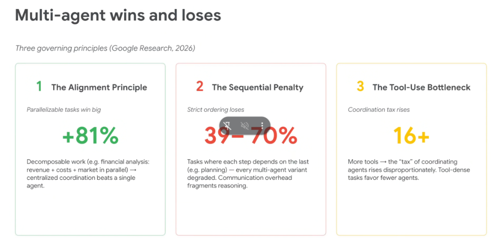
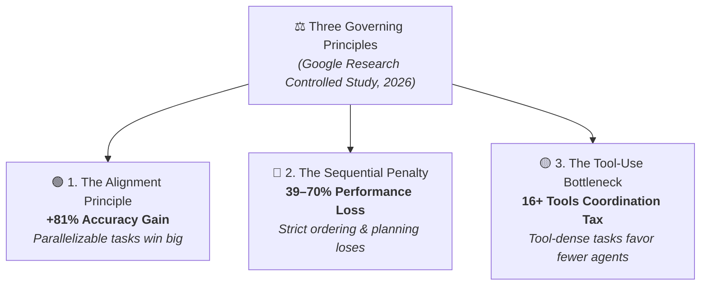
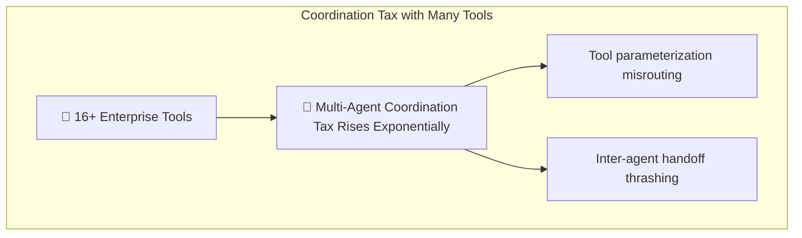

# Multi-Agent Wins and Losses: Three Governing Principles



## Overview

Based on extensive controlled research by Google Research (2026) evaluating 180 agent configurations, multi-agent systems do not universally outperform single-agent baselines. Instead, their success is governed by **three empirical principles** that determine whether multi-agent architectures provide massive performance leaps or severe degradation.

> **"Decomposable parallel work achieves +81% gains under centralized coordination, while strict sequential tasks suffer 39–70% degradation due to fragmented reasoning."**

---

## The Three Governing Principles



---

## 1. The Alignment Principle (+81% Win)

```mermaid
graph LR
    subgraph Parallelizable Financial Analysis (+81% Gain)
        Input["Financial Report"] --> Rev["🤖 Revenue Agent"] & Cost["🤖 Cost Agent"] & Mkt["🤖 Market Agent"]
        Rev & Cost & Mkt --> Synth["👑 Central Coordinator"]
        Synth --> Out["📊 High-Fidelity Synthesis"]
    end
```

* **Core Finding**: When a problem can be decomposed into independent subtasks with no temporal dependencies, multi-agent centralized coordination outperforms a single model by **+81%**.
* **Why It Wins**:
  * **Zero Cross-Step Contamination**: Each specialist operates with a dedicated, uncontaminated context window.
  * **Specialized Cognitive Focus**: The Revenue Agent focuses solely on balance sheets; the Market Agent focuses on competitive landscape.
  * **Parallel Wall-Clock Speed**: Execution time is bounded by the slowest worker rather than the sum of all tasks.
* **Ideal Workloads**: Multi-perspective risk assessments (Security + Legal + Cost), competitive market analysis, sharded batch data extraction.

---

## 2. The Sequential Penalty (39–70% Loss)

```mermaid
graph LR
    subgraph Fragmented Multi-Agent Chain (39-70% Degradation)
        Step1["🤖 Agent 1<br/>(Plan Part 1)"] -->|Handoff Loss| Step2["🤖 Agent 2<br/>(Plan Part 2)"] -->|Handoff Loss| Step3["🤖 Agent 3<br/>(Plan Part 3)"]
    end

    subgraph Unified CoT Monolith (Superior Baseline)
        SingleModel["🧠 Single High-Reasoning Model (Gemini 2.5 Pro)<br/><i>Unified internal Chain-of-Thought & full context scratchpad</i>"]
    end
```

* **Core Finding**: On tasks where each step strictly depends on the previous step (e.g. multi-step architectural planning, mathematical deduction, algorithmic problem-solving), multi-agent chains **degrade performance by 39% to 70%**.
* **Why It Loses**:
  * **"Communication Overhead Fragments Reasoning"**: When intermediate reasoning is serialized into text/JSON handoffs between agents, subtle semantic dependencies and latent constraints are lost.
  * **Broken Chain-of-Thought**: A single high-reasoning model (such as Gemini 2.5 Pro) maintaining an unbroken internal Chain-of-Thought scratchpad vastly outperforms a sequence of subagents passing summaries down a wire.
* **Production Rule**: **Do not break complex sequential planning across multiple agents**. Keep sequential reasoning inside a single capable model's context window.

---

## 3. The Tool-Use Bottleneck (16+ Tools Coordination Tax)



* **Core Finding**: When tasks require interacting with dense toolsets (**16+ tools**), the coordination tax of managing multiple agents rises disproportionately. Tool-dense tasks favor **fewer, more capable agents**.
* **Why It Happens**:
  * **Two-Dimensional Decision Complexity**: An agent must decide *which subagent to call* AND *which tool to execute*. As tool count scales beyond 16, routing ambiguity causes inter-agent thrashing and tool parameter mismatches.
  * **State Synchronization Overhead**: Synchronizing intermediate tool side-effects across 5+ agents creates race conditions and state drift.
* **Production Rule**: When building tool-heavy systems (e.g., cloud infrastructure management, devops automation), use **1–2 well-equipped agents with Skills** rather than an expansive swarm of micro-agents.

---

## Empirical Comparison Matrix

| Workload Type | Task Structure | Single Agent vs. Multi-Agent Delta | Winner | Recommended Architecture |
| :--- | :--- | :--- | :--- | :--- |
| **Independent Analysis** | Decomposable, concurrent | **+81% Multi-Agent Win** | 🟢 Multi-Agent | Centralized Parallel Coordinator |
| **Multi-Step Planning** | Strict temporal dependency | **39–70% Multi-Agent Degradation** | 🔴 Single Agent | Single Frontier Model with CoT |
| **Tool-Heavy Execution (16+)**| High API & tool density | **Multi-Agent Coordination Tax** | 🟡 Fewer Agents | Single Agent equipped with Skills / MCP |
| **Code Review / Auditing** | Creation + Verification | **+25–40% Multi-Agent Win** | 🟢 Dual-Agent | Generator-Critic Review Loop |

---

## Architectural Rules of Thumb for Engineers

1. **Parallelize Independent Work, Monolithize Dependent Work**:
   * If subtasks can run simultaneously without waiting for one another $\rightarrow$ **Use Parallel Multi-Agent Swarms (+81%)**.
   * If Step 2 cannot begin without full understanding of Step 1 $\rightarrow$ **Keep it in a single model's reasoning loop**.
2. **Cap Agent Count in Tool-Dense Workflows**:
   * If your system requires 20+ tools, do not distribute 2 tools to 10 agents. Instead, group them into **Skills** loaded on-demand by 1–2 primary agents.
3. **Never Replace CoT with Inter-Agent Handoffs**:
   * Natural language handoffs between agents are a lossy compression format. Do not use multi-agent pipelines as a substitute for deep single-model reasoning.
