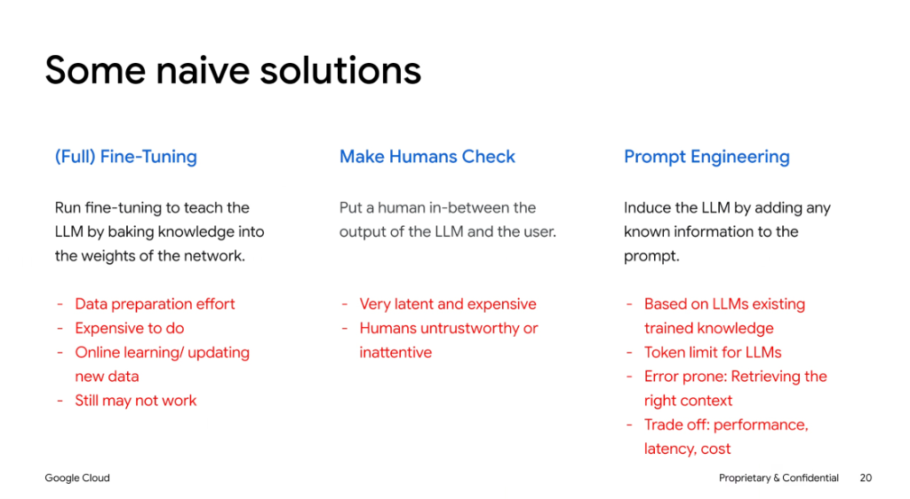

# Naive Solutions to Data Augmentation & Grounding

## Overview

When attempting to ground LLMs in private or dynamic enterprise data, teams often consider three intuitive—yet fundamentally flawed or naive—approaches: **(Full) Fine-Tuning**, **Manual Human Checking**, and **Static Prompt Engineering**.

---

## The Three Naive Approaches

### 1. (Full) Fine-Tuning
> *Run fine-tuning to teach the LLM by baking knowledge into the weights of the network.*

* **Major Limitations**:
  * **Intensive Data Preparation**: Requires substantial effort to format, label, clean, and curate domain datasets.
  * **High Compute & Operational Cost**: Training runs are resource-intensive and expensive to reproduce.
  * **Inability to Support Dynamic/Real-Time Data**: Updating weights for continuous daily changes is computationally infeasible; weights remain frozen post-training.
  * **Unreliable Factuality**: Fine-tuning teaches *style, formatting, and tone* well, but models still hallucinate specific factual details without grounding.

### 2. Make Humans Check
> *Put a human in-between the output of the LLM and the user.*

* **Major Limitations**:
  * **High Latency & Poor Scalability**: Introduces massive response bottlenecks, destroying real-time interactive user experience.
  * **Prohibitive Labor Costs**: Scaling human reviewers linearly with user volume is financially unsustainable.
  * **Human Inattention & Inconsistency**: Reviewers experience fatigue, skip verification steps, and are susceptible to accepting plausible-sounding errors.

### 3. Static Prompt Engineering
> *Induce the LLM by adding any known information directly to the prompt.*

* **Major Limitations**:
  * **Tied to Prior Knowledge**: Still bounded by the model's underlying pre-training biases and gaps.
  * **Context & Token Window Limits**: Infeasible for large enterprise repositories, multi-megabyte PDFs, or massive SQL tables.
  * **Error-Prone Context Selection**: Manually deciding what context to include leads to missing critical facts (loss in the middle).
  * **High Latency & Token Cost**: Stuffing massive static prompts inflates token bills and increases Time-to-First-Token (TTFT).

---

## Comparison of Naive Approaches

| Dimension | (Full) Fine-Tuning | Make Humans Check | Static Prompt Engineering |
| :--- | :--- | :--- | :--- |
| **Primary Goal** | Bake knowledge into weights | Catch errors before delivery | Inject raw text into context |
| **Update Frequency** | Very slow (requires retrain) | Real-time human effort | Manual prompt updates |
| **Latency Impact** | Low inference latency | Extreme latency delay | High prompt processing latency |
| **Financial Cost** | High (GPU compute) | High (ongoing labor) | Moderate to High (token consumption) |
| **Failure Mode** | Hallucinations still persist | Reviewer fatigue & oversight | Token limits & missing context |
