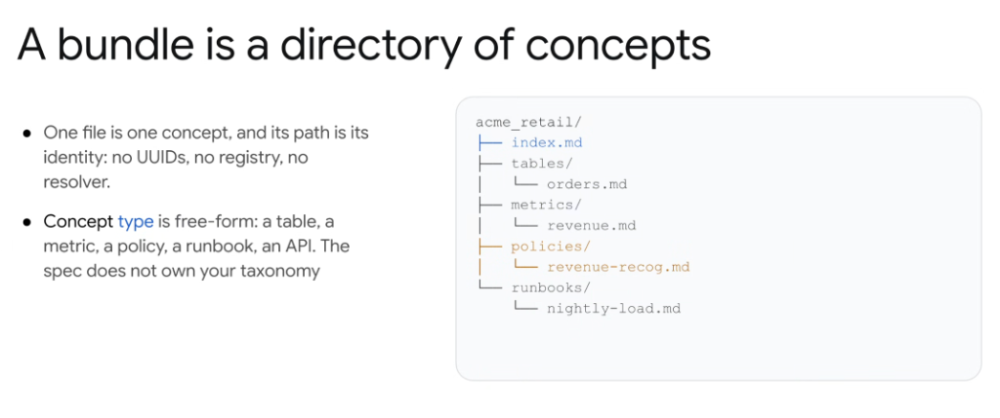

# Open Knowledge Format: A Bundle Is a Directory of Concepts



## Overview

In the Open Knowledge Format (OKF), a **Bundle** is simply a directory in a Git repository containing structured Markdown files. Knowledge organization relies on intuitive, path-based addressing rather than centralized database registries or opaque UUIDs.

---

## Core OKF Architectural Principles

### 1. One File = One Concept (Path as Identity)
* Each Markdown file represents exactly one atomic business or technical concept.
* **The filepath itself is the concept's universal identity**:
  * No synthetic UUIDs to maintain or look up.
  * No centralized ID registry or database coordinator.
  * No complex name-resolution microservices.
  * Easy human and machine cross-referencing via standard relative Markdown links (e.g., `[Orders Table](tables/orders.md)`).

### 2. Free-Form Concept Taxonomy
* **The specification does not own or restrict your taxonomy**.
* Teams freely define the concept directories that reflect their operational realities:
  * Database schemas & tables (`tables/`)
  * Business KPIs & calculated formulas (`metrics/`)
  * Compliance, legal, and operational rules (`policies/`)
  * Engineering SOPs & troubleshooting runbooks (`runbooks/`)
  * Microservice and integration contracts (`apis/`)

---

## Canonical Bundle Directory Structure

```text
acme_retail/
├── index.md                      # Bundle root manifest & domain overview
├── tables/
│   └── orders.md                 # Table schemas, primary keys, and shard definitions
├── metrics/
│   └── revenue.md                # Formula, exclusions, and business calculation logic
├── policies/
│   └── revenue-recog.md          # ASC 606 revenue recognition rules and governance
└── runbooks/
    └── nightly-load.md           # Step-by-step pipeline operational SOPs
```

---

## Concept Types & Examples

| Directory / Type | Example Concept Path | Primary Information Captured |
| :--- | :--- | :--- |
| **Root Manifest** | `acme_retail/index.md` | Domain overview, maintainer contacts, and key sub-directories |
| **Tables / Schemas** | `acme_retail/tables/orders.md` | Column types, foreign keys, partition keys, upstream sources |
| **Business Metrics** | `acme_retail/metrics/revenue.md` | SQL calculation formula, currency handling, tax exclusions |
| **Governance Policies** | `acme_retail/policies/revenue-recog.md` | Regulatory compliance rules, approval gates, SLAs |
| **Operations Runbooks** | `acme_retail/runbooks/nightly-load.md` | Incident troubleshooting, rerun steps, alert thresholds |

---

## Why "Path-as-Identity" Wins for AI Agents

1. **Human & Agent Parity**: Both humans and LLMs immediately grasp hierarchy from standard Unix path conventions.
2. **Deterministic Context Retrieval**: Agents can traverse directories, glob match paths (`metrics/*.md`), and resolve dependencies using plain filesystem operations.
3. **Zero-Overhead Git Versioning**: Renaming, moving, or branching concepts creates clean, reviewable Git diffs without database migration scripts.
