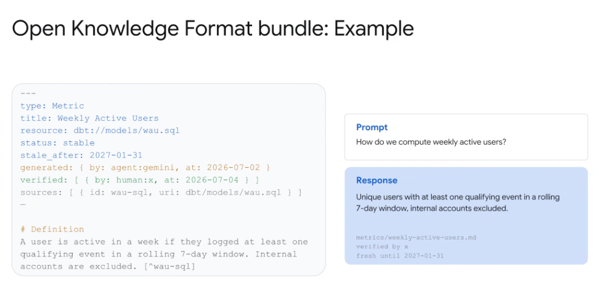

# Open Knowledge Format: Concrete Implementation Example (WAU Metric)



## Overview

This example demonstrates how an **Open Knowledge Format (OKF)** concept document (`metrics/weekly-active-users.md`) transforms an ambiguous query into an exact, enterprise-verified response with complete audit provenance.

---

## Canonical OKF Concept Document

```markdown
---
type: Metric
title: Weekly Active Users
resource: dbt://models/wau.sql
status: stable
stale_after: 2027-01-31
generated: { by: agent:gemini, at: 2026-07-02 }
verified: [ { by: human:x, at: 2026-07-04 } ]
sources: [ { id: wau-sql, uri: dbt/models/wau.sql } ]
---

# Definition
A user is active in a week if they logged at least one qualifying event in a rolling 7-day window. Internal accounts are excluded. [^wau-sql]
```

---

## In Action: Prompt vs. Grounded Response

### The User Prompt
```text
How do we compute weekly active users?
```

### The Grounded LLM Response
> **"Unique users with at least one qualifying event in a rolling 7-day window, internal accounts excluded."**

### Attached Provenance & Citation Metadata
```text
Source: metrics/weekly-active-users.md
Verified by: human:x (2026-07-04)
Freshness: fresh until 2027-01-31
Primary Lineage: dbt://models/wau.sql
```

---

## Comparison: Ungrounded vs. OKF-Grounded

| Dimension | Ungrounded Base LLM | OKF-Grounded Agent |
| :--- | :--- | :--- |
| **Output** | *"Number of unique users who performed at least one session in a rolling seven-day window, counted from events table."* | *"Unique users with at least one qualifying event in a rolling 7-day window, internal accounts excluded."* |
| **Accuracy** | Generic textbook formula; inaccurate for enterprise | Exact business definition with specific filters (qualifying events, test account exclusions) |
| **Accountability** | Anonymous, unverified probabilistic generation | Explicitly tracked: generated by `agent:gemini`, signed off by `human:x` |
| **Freshness Check** | Unknown data cutoff | Explicitly verified fresh until `2027-01-31` |
| **Provenance** | None | Footnote link directly to `dbt://models/wau.sql` |
