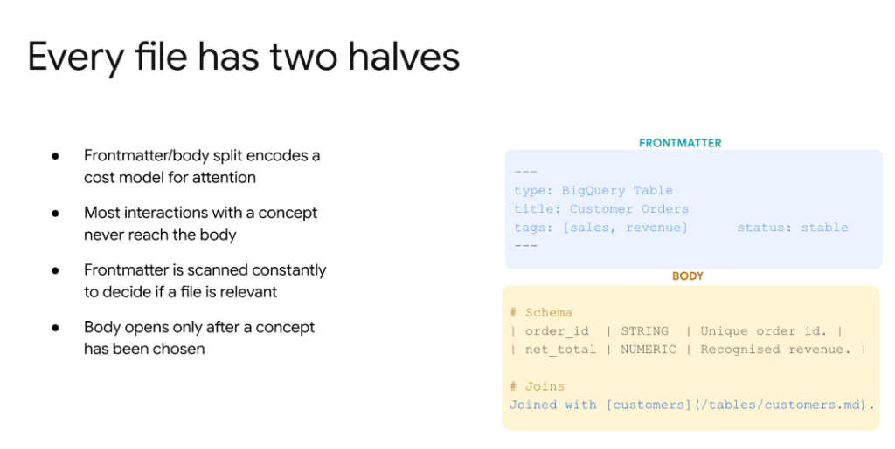
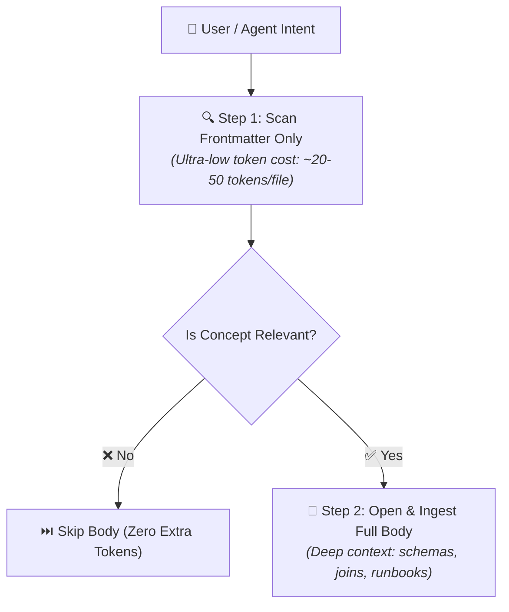

# Open Knowledge Format: Every File Has Two Halves



## Overview

In the Open Knowledge Format (OKF), every document is divided into two distinct functional sections: **YAML Frontmatter** and the **Markdown Body**. This split establishes a **cost model for LLM attention**, allowing agents to rapidly evaluate thousands of concepts without incurring massive token overheads.

---

## The Cost Model for Attention



* **Core Premise**: Most interactions with a concept repository never need to reach the full document body.
* **Fast Scanning**: Frontmatter is scanned continuously to filter and route candidate concepts.
* **Lazy Loading**: The full body is only loaded into the model's active context window once a concept has been selected.

---

## Anatomy of an OKF File

### 1. Frontmatter (The Fast-Filter Layer)
```yaml
---
type: BigQuery Table
title: Customer Orders
tags: [sales, revenue]
status: stable
---
```
* **Purpose**: Provides structured metadata for rapid routing, categorizing, and relevance scoring.
* **Key Fields**:
  * `type`: The taxonomy classification (e.g. `BigQuery Table`, `Metric`, `Policy`, `Runbook`).
  * `title`: Human-readable and agent-searchable name.
  * `tags`: Semantic keywords for faceted filtering.
  * `status`: Lifecycle maturity (`stable`, `draft`, `deprecated`).

### 2. Body (The Deep Execution Layer)
```markdown
# Schema
| Column Name | Data Type | Description |
| :--- | :--- | :--- |
| `order_id` | STRING | Unique order identifier. |
| `net_total` | NUMERIC | Recognized net revenue. |

# Joins
Joined with [customers](/tables/customers.md) on `customer_id`.
```
* **Purpose**: Contains the comprehensive domain logic, column-level schemas, formulas, code snippets, and relative concept links.
* **Lifecycle**: Only read when executing specific operations (e.g. generating SQL, verifying business rules, running incident playbooks).

---

## Comparison: Frontmatter vs. Body

| Dimension | Frontmatter (Metadata Header) | Body (Deep Content) |
| :--- | :--- | :--- |
| **Format** | YAML (`--- ... ---`) | Markdown (GFM, tables, code blocks) |
| **Token Footprint** | Tiny (~20–60 tokens) | Moderate to Large (300–3,000+ tokens) |
| **Access Frequency** | Constantly scanned on every query | Opened selectively on demand |
| **Primary Consumer** | Vector/lexical indexers, agent routing planners | LLM code generators, human engineers |
| **Key Function** | Candidate filtering & disambiguation | Grounded execution & exact reasoning |
