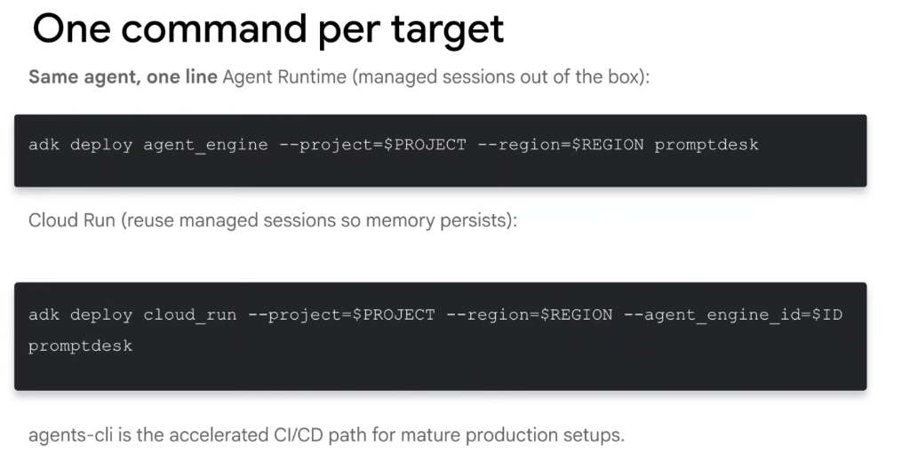
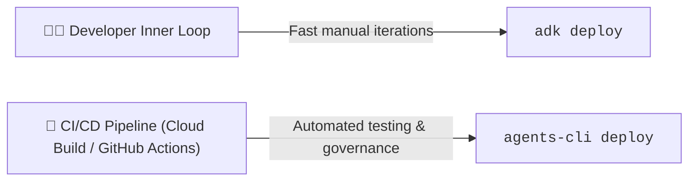

# Google ADK: One Command Per Target (CLI Deployments)



## Overview

The Google Agent Development Kit (ADK) provides a streamlined, single-command deployment interface for every Google Cloud hosting target. With a single line in your terminal, the exact same agent codebase deploys to **Agent Runtime** or **Cloud Run**.

By leveraging the `--agent_engine_id` bridge, Cloud Run deployments can tap into managed session persistence without writing custom database adapters.

> **"Same agent, one line: Agent Runtime for managed sessions out of the box; Cloud Run with `--agent_engine_id` for container scale-to-zero with durable memory. `agents-cli` is the accelerated CI/CD path for mature production setups."**

---

## Unified CLI Deployment Workflow

```mermaid
graph TD
    Source["📂 Local Agent Codebase<br/><code>./promptdesk/</code>"]

    subgraph Target 1: Agent Runtime (Managed PaaS)
        Cmd1["⚡ <code>adk deploy agent_engine --project=$PROJECT --region=$REGION promptdesk</code>"]
        AR["👤 <b>Agent Runtime</b><br/>• Managed runner<br/>• Built-in <code>VertexAiSessionService</code>"]
    end

    subgraph Target 2: Cloud Run (Hybrid Serverless Container)
        Cmd2["🖐️ <code>adk deploy cloud_run --project=$PROJECT --region=$REGION --agent_engine_id=$ID promptdesk</code>"]
        CR["📦 <b>Cloud Run</b><br/>• Scales to Zero ($0 idle cost)<br/>• Builds via Cloud Build → Artifact Registry"]
        MemBridge["🔗 <b>Persistent State Bridge</b><br/><i>Reuses Agent Engine session storage</i>"]
    end

    Source ==> Cmd1 ==> AR
    Source ==> Cmd2 ==> CR
    CR -.->|--agent_engine_id| MemBridge
```

---

## The Core Deployment Commands

### 1. Deploying to Agent Runtime (Managed PaaS)
Deploy directly to Google Cloud's fully-managed agent runtime with managed memory and session persistence active by default:

```bash
adk deploy agent_engine \
  --project=$PROJECT \
  --region=$REGION \
  promptdesk
```

#### What Happens Under the Hood:
1. Validates the agent structure and entrypoint inside `./promptdesk`.
2. Provisions or updates the managed `VertexAiSessionService` state engine.
3. Deploys the agent runner to the managed Agent Runtime environment.
4. Outputs the provisioned **Agent Engine ID** (e.g. `projects/12345/locations/us-central1/agentEngines/promptdesk-engine-abc`).

---

### 2. Deploying to Cloud Run (With Managed Session Persistence)
Deploy as an OCI serverless container that scales to zero when idle, while routing state persistence to an existing Agent Engine instance:

```bash
adk deploy cloud_run \
  --project=$PROJECT \
  --region=$REGION \
  --agent_engine_id=$ID \
  promptdesk
```

#### Why the `--agent_engine_id` Flag Is Crucial:
* **Overcomes Container Amnesia**: Standard Cloud Run containers lose memory on restart or scale-to-zero.
* **Hybrid Best-of-Both-Worlds**: You get Cloud Run's custom Dockerfile and scale-to-zero economics, paired with Agent Runtime's durable cross-session memory without having to spin up a custom database.

---

## `adk deploy` vs. `agents-cli` for Enterprise CI/CD

While `adk deploy` is the fastest path for developers deploying from a local shell, `agents-cli` serves as the enterprise standard for automated CI/CD pipelines:



| Dimension | `adk deploy` | `agents-cli deploy` |
| :--- | :--- | :--- |
| **Primary Audience** | Developers & Engineers | Automated CI/CD Pipelines |
| **Execution Context** | Local developer terminal / REPL | Cloud Build, GitHub Actions, GitLab CI |
| **Evaluation Integration** | Manual CLI trigger (`adk eval`) | **Automated pre-deploy evaluation gating** |
| **Governance & Policies** | Developer-level IAM credentials | Service Account / Workload Identity Federation |
| **Production Rollbacks** | Manual CLI re-deployment | **Automated canary & blue-green traffic splits** |

---

## Production CI/CD Workflow (`.github/workflows/deploy.yaml`)

Automating ADK agent deployments in GitHub Actions using `agents-cli`:

```yaml
name: Deploy Agent to Cloud Run

on:
  push:
    branches: [ main ]

jobs:
  deploy:
    runs-on: ubuntu-latest
    steps:
      - name: Checkout Code
        uses: actions/checkout@v4

      - name: Setup Python
        uses: actions/setup-python@v5
        with:
          python-version: '3.11'

      - name: Install Google Agents CLI & uv
        run: |
          pip install uv google-agents-cli

      - name: Authenticate to Google Cloud
        uses: google-github-actions/auth@v2
        with:
          workload_identity_provider: ${{ secrets.WIF_PROVIDER }}
          service_account: ${{ secrets.WIF_SERVICE_ACCOUNT }}

      - name: Run Pre-Deployment Regression Evaluations
        run: |
          uv run pytest promptdesk/tests/test_agent_eval.py

      - name: Deploy to Cloud Run via agents-cli
        run: |
          agents-cli deploy cloud-run \
            --project=${{ secrets.GCP_PROJECT }} \
            --region=us-central1 \
            --agent-dir=./promptdesk \
            --agent_engine_id=${{ secrets.AGENT_ENGINE_ID }} \
            --cpu-boost
```

---

## CLI Flag Reference Matrix

| Flag | Description | Required for `agent_engine` | Required for `cloud_run` |
| :--- | :--- | :--- | :--- |
| `--project` | Target Google Cloud Project ID | **Yes** | **Yes** |
| `--region` | Compute region (e.g. `us-central1`) | **Yes** | **Yes** |
| `--agent_engine_id` | Managed session engine ID for state persistence | N/A (Auto-created) | Optional (Recommended for state) |
| `--session-backend` | Custom database backend (`firestore`, `postgres`) | N/A | Optional (If not using engine ID) |
| `--cpu-boost` | Allocates extra CPU during container cold start | N/A | Optional (Recommended for latency) |

---

## Key Takeaways

1. **One Line Per Target**: Switch seamlessly between Agent Runtime and Cloud Run without changing Python source files.
2. **Bridge Cloud Run to Agent Engine**: Use `--agent_engine_id` to eliminate Cloud Run restart memory loss without provisioning external databases.
3. **Use `agents-cli` for CI/CD**: Standardize automated deployments on `agents-cli` with evaluation gates before shipping to production.
