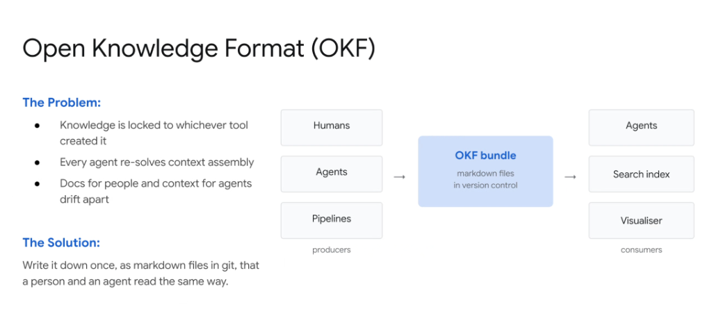
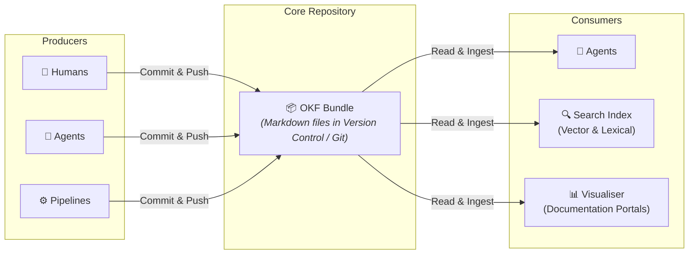

# Open Knowledge Format (OKF)

## Overview

The **Open Knowledge Format (OKF)** standardizes enterprise knowledge management by establishing a single source of truth: **human-readable, machine-parseable Markdown files stored directly in Git version control**.

> **"Write it down once, as markdown files in git, that a person and an agent read the same way."**

---

## The Core Problems Solved by OKF

1. **Tool Lock-In**: Domain knowledge is typically locked inside proprietary vendor silos (Confluence, Notion, bespoke metadata portals).
2. **Redundant Context Assembly**: Every autonomous agent instance is forced to independently rediscover and assemble context from disparate sources.
3. **Semantic Drift**: Human-facing documentation and agent-facing prompt context diverge over time, leading to operational misalignment.

---

## The OKF Producer-Consumer Architecture

---

## Architectural Ecosystem

### 1. Producers (Who Creates Knowledge?)
* **Humans**: Engineers, product managers, and operators authoring design docs, runbooks, and schema definitions.
* **Agents**: Autonomous reasoning agents committing newly learned entity relationships, operational findings, and post-mortems back to Git.
* **Pipelines**: CI/CD pipelines and data sync jobs automatically extracting table schemas, dbt catalog models, and API specs into structured Markdown.

### 2. The OKF Bundle (The Core Asset)
* **Format**: Standardized GitHub Flavored Markdown (GFM) with YAML frontmatter.
* **Storage**: Git repositories enabling full commit history, diff audits, pull request reviews, and branch versioning.
* **Portability**: Plain-text format accessible across any editor, CLI, or LLM context window without bespoke API dependencies.

### 3. Consumers (Who Uses Knowledge?)
* **Agents**: Ingest standardized Markdown directly into context prompts or tool lookup systems.
* **Search Indices**: Ingestion engines parse, chunk, embed, and index OKF bundles into vector databases and Elasticsearch.
* **Visualizers**: Static site generators (e.g. MkDocs, Docusaurus) render the same markdown into interactive web documentation.

---

## Key Enterprise Benefits

| Advantage | Mechanism | Business Impact |
| :--- | :--- | :--- |
| **GitOps for Knowledge** | Full version history, code review, branching | Complete auditability and rollback capability for business logic. |
| **Zero Semantic Drift** | Single document read by both humans and LLMs | Ensures agents execute strictly according to human-verified SOPs. |
| **Universal Interoperability** | Standard Markdown & Git | Eliminates vendor lock-in and works across all LLM frameworks (ADK, LangChain, LlamaIndex). |
| **Instant Cold-Start Context** | Pre-assembled OKF bundles | New agents start immediately with full organizational context. |
