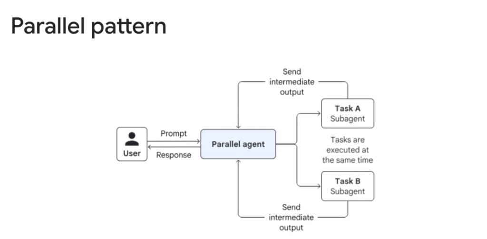
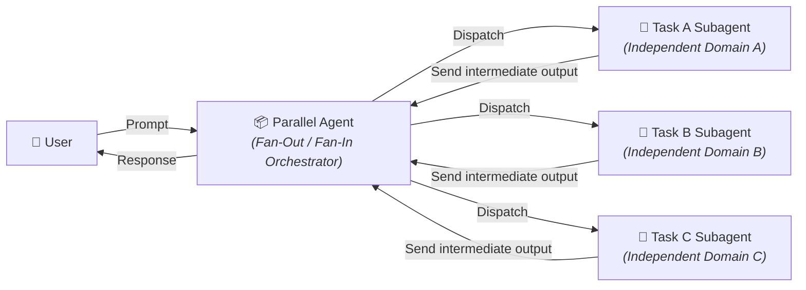
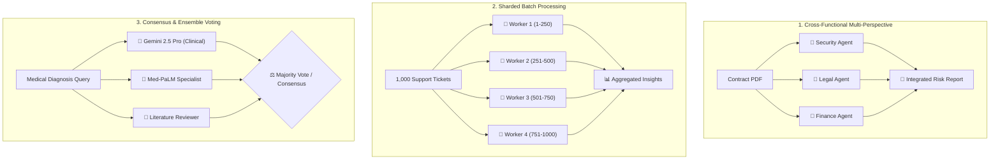

# Multi-Agent Workflow: Parallel Pattern



## Overview

The **Parallel Pattern** is a multi-agent workflow architecture where independent subagent tasks are executed concurrently rather than sequentially.

> **"Tasks are executed at the same time."**

In this pattern, a top-level **Parallel Agent** receives the user prompt, fans out execution across multiple specialized subagents simultaneously, collects their intermediate outputs upon completion, and aggregates the results into a unified response.

---

## Architectural Execution Flow



---

## How It Works Step-by-Step

1. **Ingress & Task Fan-Out**: The user submits a prompt to the `ParallelAgent`. The orchestrator determines the subtasks and dispatches them concurrently across subagents using asynchronous runtimes (`asyncio.gather` or thread pooling).
2. **Concurrent Execution**: Each subagent runs independently in its own isolated context window with its own specialized tools, without waiting for sibling agents.
3. **Intermediate Output Delivery**: As subagents finish, they transmit their structured findings or artifacts back to the orchestrator.
4. **Fan-In Aggregation & Synthesis**: The `ParallelAgent` merges the intermediate outputs using deterministic rules (concatenation, voting, diffing) or passes them to a synthesis LLM to generate a unified briefing.
5. **Response Delivery**: The synthesized response is returned to the user.

---

## Core Variations of the Parallel Pattern



### 1. Cross-Functional Multi-Perspective
* **Mechanism**: Evaluating the same source document or scenario from distinct professional lenses simultaneously.
* **Example**: Architecture review where Security, Performance, and Billing agents evaluate a proposed Terraform script concurrently.

### 2. Sharded Batch Processing (Data Parallelism)
* **Mechanism**: Partitioning large datasets into smaller chunks and assigning each chunk to identical worker agents.
* **Example**: Summarizing 50 customer incident tickets in parallel.

### 3. Consensus & Ensemble Voting
* **Mechanism**: Querying multiple diverse models or prompts with the same question to detect discrepancies and reach a verified consensus.
* **Example**: High-stakes compliance audits requiring unanimous agreement across three independent models.

### 4. Speculative Execution
* **Mechanism**: Launching multiple plausible strategies in parallel; adopting the first verified solution and cancelling the rest.
* **Example**: Competitive code generation trying 3 different algorithm designs simultaneously.

---

## Google ADK Implementation Example

In the **Google Agent Development Kit (ADK)**, parallel execution is implemented using `ParallelAgent`:

```python
from google.adk.agents import LlmAgent, ParallelAgent
from google.adk.tools import Tool

# 1. Security Specialist Agent
security_agent = LlmAgent(
    name="security_auditor",
    model="gemini-2.5-flash",
    instruction="Analyze the given architecture for IAM, network, and vulnerability risks.",
    tools=[check_iam_policies_tool],
    output_key="security_findings",
)

# 2. Cost & Performance Specialist Agent
cost_agent = LlmAgent(
    name="cost_optimizer",
    model="gemini-2.5-flash",
    instruction="Analyze the given architecture for cloud resource costs and compute sizing.",
    tools=[query_pricing_calculator_tool],
    output_key="cost_findings",
)

# 3. Compliance Specialist Agent
compliance_agent = LlmAgent(
    name="compliance_auditor",
    model="gemini-2.5-flash",
    instruction="Verify GDPR, HIPAA, and SOC2 compliance for the proposed data flows.",
    tools=[check_compliance_matrix_tool],
    output_key="compliance_findings",
)

# Parallel Fan-Out / Fan-In Orchestrator
architecture_review_agent = ParallelAgent(
    name="parallel_architecture_auditor",
    subagents=[security_agent, cost_agent, compliance_agent],
    synthesizer_instruction=(
        "Synthesize the security, cost, and compliance findings into an executive summary "
        "with prioritized remediation recommendations."
    ),
)
```

---

## Sequential vs. Parallel Pattern Comparison

| Feature | Sequential Pattern ($A \rightarrow B \rightarrow C$) | Parallel Pattern ($A \parallel B \parallel C$) |
| :--- | :--- | :--- |
| **Execution Flow** | Serial linear dependency | Concurrent independent execution |
| **Total Wall-Clock Latency** | Cumulative: $\sum_{i=1}^N T_i$ | Bounded by slowest worker: $\max_i(T_i) + T_{\text{agg}}$ |
| **Token Cost Profile** | Context builds up or passes through stages | Simultaneous multi-prompt token consumption |
| **Fault Resilience** | Upstream failure halts downstream stages | Worker failure can be isolated; partial results usable |
| **API Quota Pressure** | Low (queries spread over time) | High (concurrent bursts against rate limits / TPM) |
| **Ideal Problem Space** | Dependent multi-step transformations | Multi-angle reviews, sharded batches, voting |

---

## Engineering Trade-offs & Production Best Practices

1. **Concurrency Limits & Throttling**: Use worker semaphores to prevent hitting LLM rate limits (`ResourceExhausted` 429 errors) during large fan-outs.
2. **Partial Result Handling (Graceful Degradation)**: If 1 out of 5 parallel subagents times out or errors, allow the aggregator to synthesize the remaining 4 outputs with an explicit notice rather than failing the entire job.
3. **Strict Output Schemas**: Require subagents to return structured JSON/Pydantic schemas so the aggregator can deterministically diff and merge results without secondary hallucination.
4. **Token Budgeting**: Because all subagents execute simultaneously, compute peak token bandwidth requirements to ensure enterprise billing quotas are preserved.
