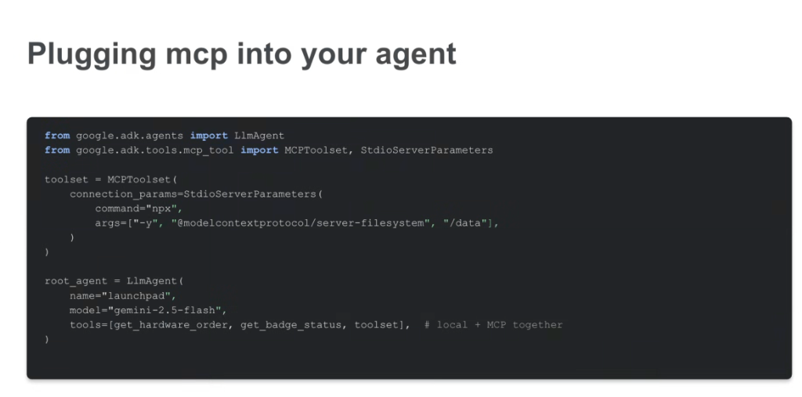

# Google ADK: Plugging MCP into Your Agent



## Overview

The **Google Agent Development Kit (ADK)** provides native, first-class bindings for the **Model Context Protocol (MCP)** via the `google.adk.tools.mcp_tool` module. This allows developers to seamlessly blend standard, bespoke Python functions with external MCP toolsets within the same agent definition.

---

## Core Code Implementation

```python
from google.adk.agents import LlmAgent
from google.adk.tools.mcp_tool import MCPToolset, StdioServerParameters

# 1. Define the MCP Toolset using Stdio Subprocess transport
toolset = MCPToolset(
    connection_params=StdioServerParameters(
        command="npx",
        args=["-y", "@modelcontextprotocol/server-filesystem", "/data"],
    )
)

# 2. Instantiate the Agent with both Local Functions and MCP Toolsets
root_agent = LlmAgent(
    name="launchpad",
    model="gemini-2.5-flash",
    tools=[get_hardware_order, get_badge_status, toolset],  # local + MCP together
)
```

---

## Hybrid Tooling Architecture

ADK treats native Python functions and MCP Toolsets as interchangeable, first-class tool providers. The agent's reasoning loop evaluates all available tools uniformly:

```mermaid
graph TD
    subgraph LlmAgent ("🤖 LlmAgent (name='launchpad', model='gemini-2.5-flash')")
        Model["🧠 Gemini Reasoning Engine"]
        Registry["🛠️ Unified Tool Space"]
    end

    subgraph Native Python Tools
        T1["🐍 get_hardware_order()"]
        T2["🐍 get_badge_status()"]
    end

    subgraph MCP Toolset ("🔌 MCPToolset (StdioServerParameters)")
        M1["📁 read_file"]
        M2["📁 list_directory"]
        M3["📁 write_file"]
    end

    Model --> Registry
    Registry --> T1 & T2
    Registry --> MCPToolset
    MCPToolset --> M1 & M2 & M3
```

---

## Key Architectural Components

### 1. `MCPToolset`
* **Dynamic Discovery**: Wraps the MCP protocol lifecycle, automatically calling `tools/list` during agent initialization to discover and convert MCP tool schemas into ADK-compatible function declarations.
* **Execution Dispatch**: Translates model function call invocations directly into `tools/call` JSON-RPC payloads and extracts text/binary responses back into the agent context.

### 2. `StdioServerParameters` vs. `SseServerParameters`
ADK supports both local subprocess IPC and remote networked streaming:

* **Local Subprocess (`StdioServerParameters`)**:
  ```python
  from google.adk.tools.mcp_tool import StdioServerParameters

  stdio_params = StdioServerParameters(
      command="npx",
      args=["-y", "@modelcontextprotocol/server-filesystem", "/data"],
  )
  ```

* **Remote Network (`SseServerParameters`)**:
  ```python
  from google.adk.tools.mcp_tool import SseServerParameters

  sse_params = SseServerParameters(
      url="https://mcp-enterprise-db.internal.net/sse",
      headers={"Authorization": "Bearer token"},
  )
  ```

### 3. Co-mingling Local & MCP Tools (`local + MCP together`)
* **Flexibility**: Lightweight domain functions (`get_hardware_order`, `get_badge_status`) run in-process with minimal overhead.
* **Standardization**: Complex or external system interactions (filesystem, databases, GitHub, BigQuery) are offloaded to decoupled MCP servers.

---

## Best Practices for MCP in ADK

| Practice | Recommendation | Rationale |
| :--- | :--- | :--- |
| **Model Selection** | Use `gemini-2.5-flash` or `gemini-2.5-pro` | High function-calling fidelity and low latency across multi-tool decision spaces. |
| **Path Scoping** | Restrict filesystem paths (e.g., `["/data"]`) | Enforces least-privilege security boundaries and prevents root directory traversal. |
| **Lazy Loading** | Group MCP toolsets into modular **Skills** | Avoids token inflation by only instantiating MCP toolsets when specific workflows activate. |
| **Error Handling** | Wrap tool executions in structured try/except blocks | Prevents a single MCP server timeout or crash from failing the parent agent session. |
