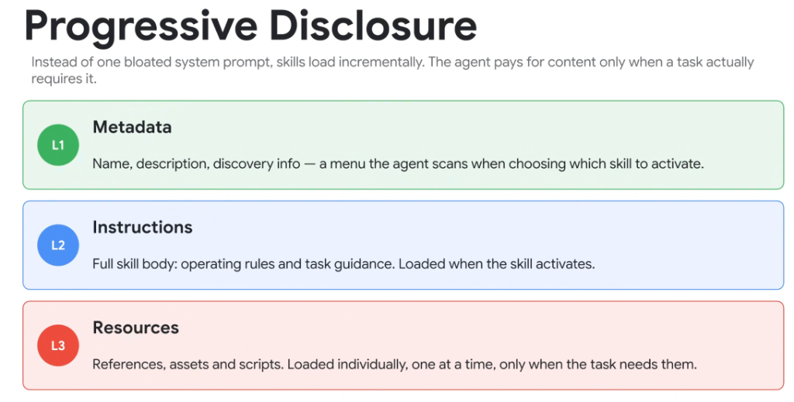
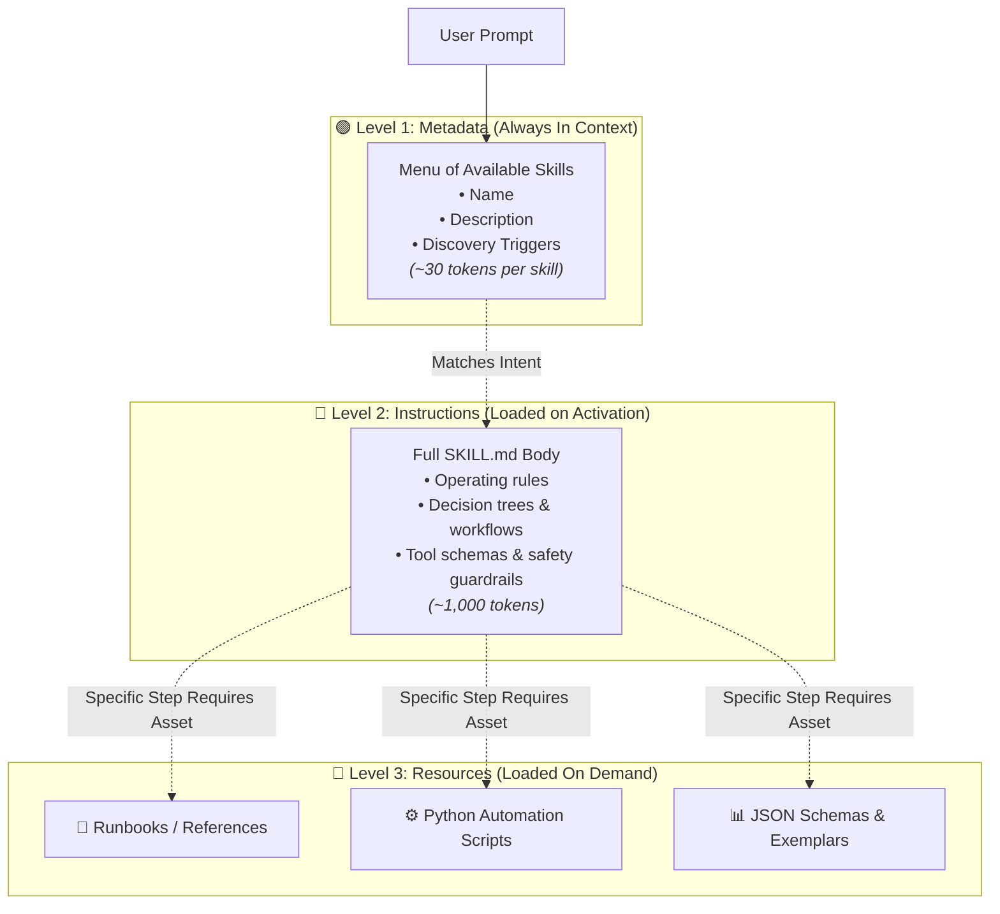

# Skills: Progressive Disclosure & Context Economics

## Overview

A major bottleneck in agent systems is the **bloated system prompt trap**—cramming every tool definition, enterprise policy, and runbook into the initial prompt. 

The **Progressive Disclosure** pattern solves this by loading skill content incrementally across three distinct tiers (L1, L2, and L3). The agent only consumes context tokens for domain knowledge when an incoming user request explicitly requires it.

> **"Instead of one bloated system prompt, skills load incrementally. The agent pays for content only when a task actually requires it."**

---

## The 3-Tier Progressive Disclosure Model

---

## Tier-by-Tier Breakdown

### Level 1: Metadata (The Discovery Menu)
* **What It Contains**: Skill name, single-sentence description, and capability tags.
* **When It Loads**: Always present in the root agent prompt.
* **Token Cost**: Extremely lightweight (~20–50 tokens per skill).
* **Purpose**: Acts as an index or "table of contents" allowing the agent to evaluate 100+ skills without blowing up its context window.

### Level 2: Instructions (Core Operational Guidance)
* **What It Contains**: Full `SKILL.md` body, workflow steps, tool routing instructions, and edge-case handling rules.
* **When It Loads**: Ingested into context only when the agent decides to activate that specific skill.
* **Token Cost**: Moderate (~500–2,500 tokens).
* **Purpose**: Guides the agent through complex domain logic without leaking into unrelated tasks.

### Level 3: Resources (Execution Assets & Specialized Data)
* **What It Contains**: Deep reference manuals (`references/`), deterministic helper scripts (`scripts/`), and golden dataset exemplars (`resources/`).
* **When It Loads**: Fetched individually, one file at a time, only when an active step explicitly requires the underlying asset.
* **Token Cost**: Zero baseline overhead (only loaded during active execution).
* **Purpose**: Provides deep domain artifacts without cluttering the reasoning trace.

---

## Context Economics: Monolithic Prompts vs. Progressive Disclosure

| Architectural Dimension | Monolithic System Prompt | Progressive Disclosure (Skills) |
| :--- | :--- | :--- |
| **Idle Context Overhead** | 50,000+ tokens (all tools & docs loaded) | < 1,000 tokens (L1 metadata menu only) |
| **Inference Cost** | High on every single turn | Minimal baseline; scales strictly with task complexity |
| **Time to First Token (TTFT)** | Slow (huge prompt prefill latency) | Ultra-fast (sub-second prompt ingestion) |
| **Model Attention Accuracy** | Degraded (attention dilution & tool confusion) | Focused (only relevant domain rules present) |
| **Scalability Horizon** | Hard-capped at model context limit (~20-30 tools max) | Scalable to 500+ skills and thousands of tools |
