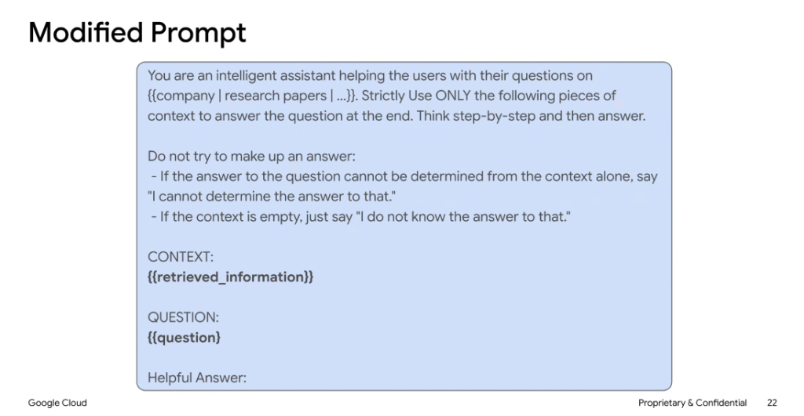

# RAG Prompt Engineering: The Modified Prompt Template



## Overview

In a Retrieval-Augmented Generation (RAG) architecture, the **Modified Prompt** (or augmented prompt) is the crucial bridge between the information retrieval system and the generator LLM. It enforces strict grounding boundaries, inhibits hallucination, and establishes deterministic fallback behavior.

---

## Canonical RAG Prompt Template

```text
You are an intelligent assistant helping the users with their questions on {{company | research papers | ...}}. Strictly Use ONLY the following pieces of context to answer the question at the end. Think step-by-step and then answer.

Do not try to make up an answer:
- If the answer to the question cannot be determined from the context alone, say "I cannot determine the answer to that."
- If the context is empty, just say "I do not know the answer to that."

CONTEXT:
{{retrieved_information}}

QUESTION:
{{question}}

Helpful Answer:
```

---

## Prompt Anatomy & Guardrails

### 1. Persona & Domain Boundary
* `You are an intelligent assistant helping the users with their questions on {{domain}}`
* Scopes model attention to the relevant enterprise topic and prevents generic conversational drift.

### 2. Strict Closed-Book Constraint
* `Strictly Use ONLY the following pieces of context to answer the question at the end.`
* Explicitly forces the model to ignore ungrounded pre-training assumptions and rely entirely on injected context passages.

### 3. Step-by-Step Chain of Thought
* `Think step-by-step and then answer.`
* Activates reasoning pathways to perform context extraction and cross-passage verification before generating the final response.

### 4. Explicit Fallback & Refusal Rules
* `- If the answer to the question cannot be determined from the context alone, say "I cannot determine the answer to that."`
* `- If the context is empty, just say "I do not know the answer to that."`
* Gives the model an explicit "safe exit" to prevent sycophantic fabrications when retrieved data is insufficient.

### 5. Context & Query Delimitation
* `CONTEXT: {{retrieved_information}}` & `QUESTION: {{question}}`
* Uses distinct visual and semantic separators to prevent prompt injection attacks and context confusion.

---

## Python Example (Gemini / ADK)

```python
RAG_PROMPT_TEMPLATE = """You are an intelligent assistant helping users with their questions on {domain}. Strictly Use ONLY the following pieces of context to answer the question at the end. Think step-by-step and then answer.

Do not try to make up an answer:
- If the answer to the question cannot be determined from the context alone, say "I cannot determine the answer to that."
- If the context is empty, just say "I do not know the answer to that."

CONTEXT:
{context}

QUESTION:
{query}

Helpful Answer:"""

def generate_rag_prompt(domain: str, context_chunks: list[str], query: str) -> str:
    formatted_context = "\n\n---\n\n".join(context_chunks) if context_chunks else ""
    return RAG_PROMPT_TEMPLATE.format(
        domain=domain,
        context=formatted_context,
        query=query
    )
```
