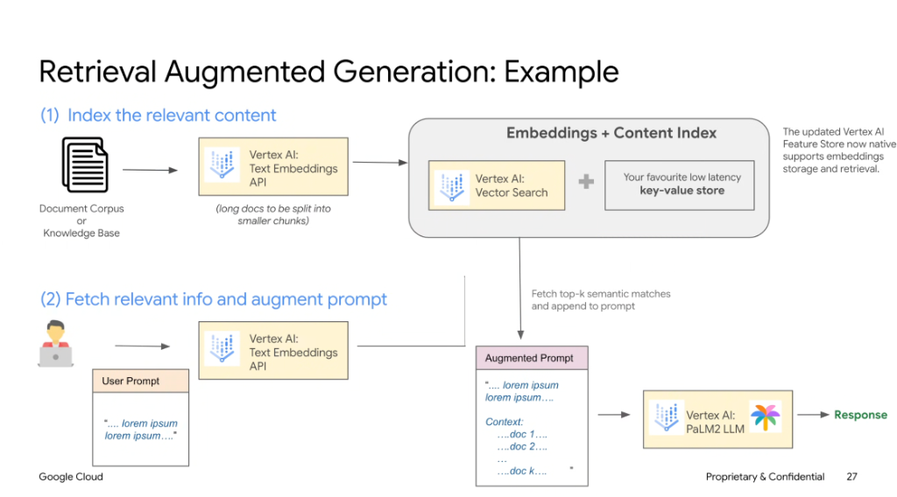
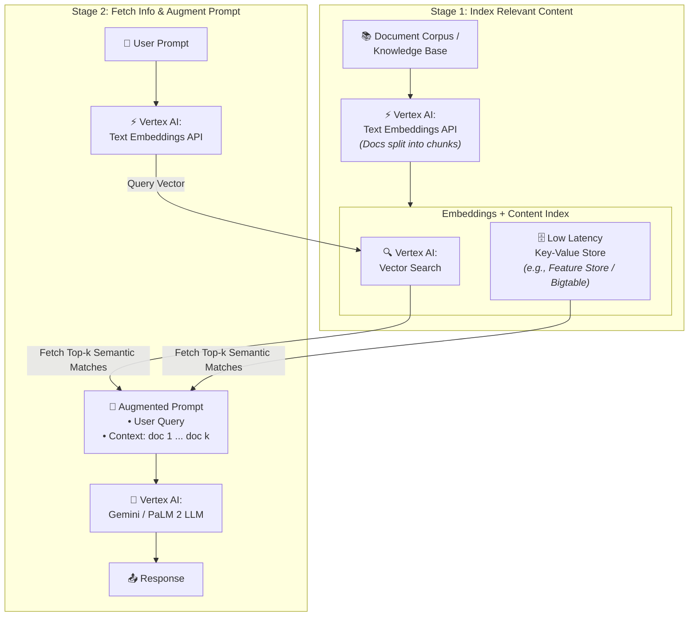

# Retrieval-Augmented Generation: Google Cloud Vertex AI Reference Architecture

## Architecture Overview

This reference architecture implements **Retrieval-Augmented Generation (RAG)** using Google Cloud native services: **Vertex AI Text Embeddings API**, **Vertex AI Vector Search**, **low-latency key-value stores**, and **Vertex AI Foundation Models** (Gemini / PaLM 2).

---

## Architectural Diagram

---

## The 2-Stage Lifecycle on Google Cloud

### (1) Index the Relevant Content (Offline / Streaming)
1. **Document Ingestion & Chunking**: Long documents from Cloud Storage or internal repositories are split into semantic chunks.
2. **Vertex AI Text Embeddings API**: Encodes chunked text into dense semantic vector representations (`text-embedding-004`).
3. **Embeddings + Content Index**:
   * **Vertex AI Vector Search**: Indexes the dense embeddings for ultra-fast, sub-10ms Approximate Nearest Neighbor (ANN) search.
   * **Low-Latency Key-Value Store**: Stores the original raw text chunks, document metadata, and ACLs (e.g. Vertex AI Feature Store, Cloud Bigtable, or Memorystore).

### (2) Fetch Relevant Info & Augment Prompt (Online Serving)
1. **User Prompt Ingestion**: Receives the real-time user query.
2. **Query Embedding**: Vertex AI Text Embeddings API generates a dense vector representing the user's intent.
3. **Top-$k$ Retrieval**: Vertex AI Vector Search identifies the nearest neighbor vector IDs, and the Key-Value store hydrates the raw text passages.
4. **Augmented Prompt Assembly**: The user prompt and retrieved passages (`doc 1 ... doc k`) are combined into a structured prompt.
5. **Generative Inference**: Vertex AI Foundation Models (Gemini / PaLM 2) synthesize a grounded, accurate response.

---

## Google Cloud Services Mapping

| Component | Google Cloud Service | Purpose & Responsibility |
| :--- | :--- | :--- |
| **Document Storage** | Google Cloud Storage (GCS) / BigQuery | Raw document and unstructured file repository |
| **Embeddings Generation** | Vertex AI Text Embeddings API | Generates 768 / 1536-dimensional embeddings for chunks and queries |
| **Vector Indexing** | Vertex AI Vector Search (ScaNN) | High-scale, sub-millisecond nearest neighbor search |
| **Metadata & Text Storage** | Vertex AI Feature Store / Cloud Bigtable | Low-latency hydration of raw text chunks from vector IDs |
| **Foundation Model** | Vertex AI Gemini / PaLM 2 API | Reasoning and grounded generation from augmented prompts |
