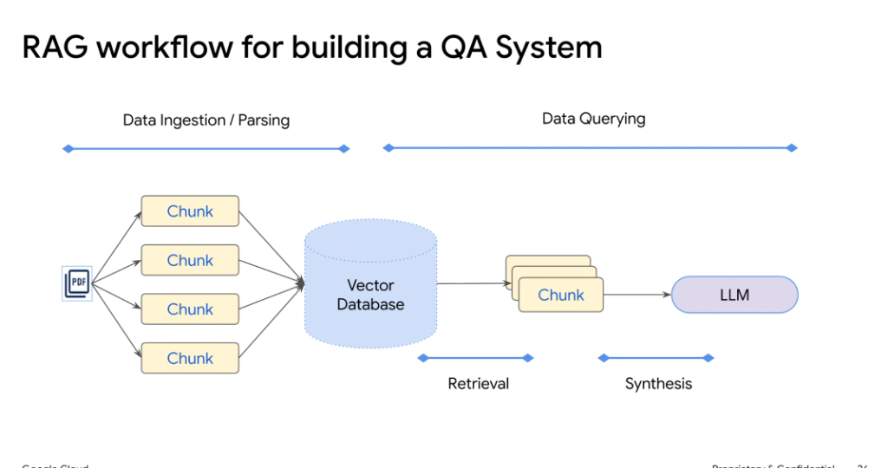
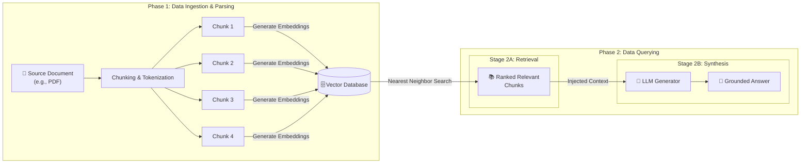

# RAG Workflow for Building an Enterprise QA System

## Overview

Building an enterprise **Question-Answering (QA) System** with Retrieval-Augmented Generation (RAG) spans two primary architectural phases: **Data Ingestion / Parsing** (offline/continuous indexing) and **Data Querying** (real-time retrieval & generative synthesis).

---

## End-to-End QA Pipeline Architecture

---

## Phase Breakdown

### Phase 1: Data Ingestion / Parsing (Indexing Pipeline)
1. **Document Parsing & Extraction**: Ingest raw source files (PDFs, docs, tables) and extract clean plain text, metadata, and structural headers.
2. **Semantic Chunking**: Split long documents into coherent, context-preserving segments (e.g., 256–512 tokens with 10–20% sliding window overlap).
3. **Embedding Vectorization**: Pass text chunks through an embedding model (e.g. `text-embedding-004`) to compute dense vector embeddings.
4. **Vector Database Ingestion**: Store vectors alongside text payloads and metadata filters in a vector database (e.g., Vertex AI Vector Search, AlloyDB pgvector, Cloud SQL).

### Phase 2: Data Querying (Online Inference Pipeline)

#### Stage 2A: Retrieval
* **Query Embedding**: The incoming user query is embedded into the same vector space.
* **Vector Similarity Search**: The vector database executes cosine/dot-product distance comparisons to retrieve the most semantically relevant chunks.

#### Stage 2B: Synthesis
* **Prompt Assembly**: The retrieved top-$k$ chunks are formatted into the system prompt context window.
* **Generative Synthesis**: The foundation model (LLM) reads the retrieved context, reasons across the passages, and synthesizes a direct, factually grounded answer with citations.

---

## Key Configuration Parameters for Enterprise QA

| Parameter | Recommended Standard | Impact on QA Quality |
| :--- | :--- | :--- |
| **Chunk Size** | 200–500 tokens | Smaller chunks improve retrieval precision; larger chunks preserve surrounding narrative context. |
| **Chunk Overlap** | 10%–20% (e.g., 50 tokens) | Prevents information loss across chunk boundaries. |
| **Top-$k$ Chunks** | $k = 3 \text{ to } 7$ | Balances context coverage against LLM context dilution and token cost. |
| **Distance Metric** | Cosine / Dot Product | Determines similarity matching in normalized embedding space. |
