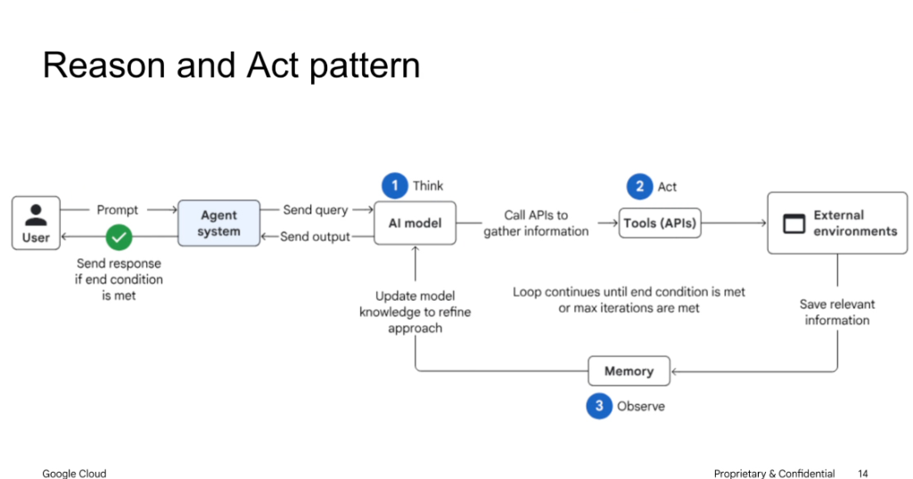
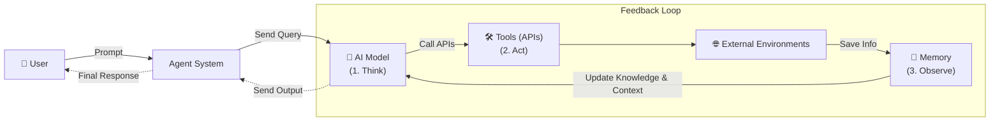

# Reason and Act (ReAct) Pattern: Architectural Deep Dive

## Architecture Overview

The **Reason and Act (ReAct)** pattern establishes a closed-loop execution topology where an AI model reasons through intermediate states, triggers tool invocations against external environments, assimilates observations into memory, and continuously refines its approach until an objective or exit condition is satisfied.

---

## Architectural Workflow Diagram

---

## The 3-Step Iterative Cycle

### 1. Think (Reasoning & Planning)
* The **Agent System** sends the user query along with prior conversational history and tool definitions to the **AI Model**.
* The model analyzes the current state, formulates hypotheses, and determines if additional information or external actions are required.

### 2. Act (Tool & API Execution)
* If the model determines external interaction is required, it emits structured tool call requests with validated arguments.
* The **Tools Layer** executes calls against **External Environments** (e.g., databases, search engines, file systems, third-party APIs).

### 3. Observe (Memory Assimilation & State Update)
* Raw tool responses and artifacts from external environments are captured and stored in **Memory**.
* Memory feeds updated observations and intermediate knowledge back to the **AI Model**, refining its reasoning context for the subsequent turn.

---

## Termination & Guardrails

* **Loop Continuation**: The iterative cycle repeats as long as intermediate steps are required.
* **Exit Conditions**:
  1. **Goal Satisfied**: The model determines the objective is complete and generates the final output payload to the Agent System, which delivers it to the User.
  2. **Max Iterations Reached**: A deterministic tripwire prevents runaway execution or unbounded token consumption if the model loops without making forward progress.

---

## Component Responsibilities

| Component | Role & Responsibility |
| :--- | :--- |
| **User** | Issues initial prompt/intent and receives final verified output. |
| **Agent System** | Manages session lifecycle, enforces security/guardrails, and orchestrates model/tool dispatch. |
| **AI Model (Think)** | Decomposes tasks, reasons over context, selects tools, and synthesizes answers. |
| **Tools / APIs (Act)** | Interacts with external environments, executing operations and returning structured responses. |
| **External Environments** | Third-party services, APIs, databases, or sandboxed command execution environments. |
| **Memory (Observe)** | Accumulates step observations, preserves multi-turn state, and updates the active context. |
