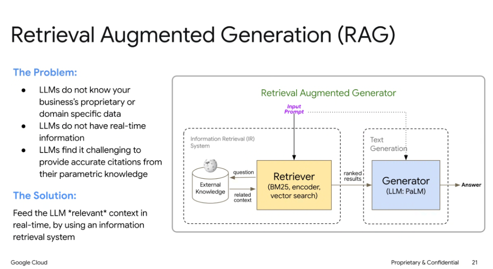
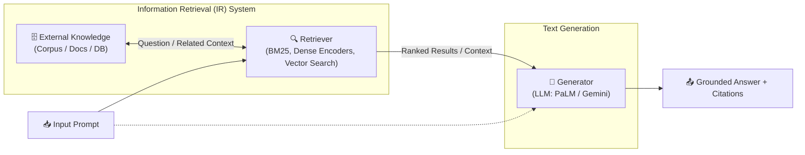

# Retrieval-Augmented Generation (RAG)

## Overview

**Retrieval-Augmented Generation (RAG)** decouples knowledge storage from model parameter weights. By pairing an Information Retrieval (IR) subsystem with a generative foundation model (LLM), RAG supplies the model with dynamic, authoritative domain context in real-time.

---

## The Core Problem

1. **Proprietary & Domain-Specific Blindness**: Foundation LLMs are trained on public data and lack internal enterprise knowledge.
2. **Static Pre-training Horizons**: Models cannot access fresh, real-time data created after their training cutoff.
3. **Citation & Factuality Challenges**: Purely parametric memory struggles with exact provenance and accurate citation of source material.

---

## The Architectural Solution

> **Feed the LLM *relevant* context in real-time using an information retrieval system.**

---

## The Two-Stage RAG Pipeline

### 1. Information Retrieval (IR) Stage
* **Input Query**: Receives the user prompt or question.
* **Retrieval Algorithms**:
  * **Lexical / Sparse Search**: BM25, TF-IDF for exact keyword matching.
  * **Dense Semantic Search**: Neural embeddings (e.g. `text-embedding-004`) + Vector index (Vertex AI Vector Search).
  * **Hybrid Search & Re-ranking**: Combines keyword + semantic scores, followed by cross-encoder re-ranking.
* **Output**: Top-$k$ ranked, highly relevant context chunks.

### 2. Generative Stage
* **Context Augmentation**: Synthesizes the original prompt alongside the retrieved context passages into an augmented system prompt.
* **LLM Generation**: The generator (e.g., Gemini 2.0 Flash/Pro) processes the augmented prompt, extracts answers strictly from the provided passages, and outputs verified responses with exact source citations.

---

## Key System Components

| Component | Responsibility | Typical Technologies |
| :--- | :--- | :--- |
| **External Knowledge** | Authoritative corpus storage | Cloud Storage, BigQuery, PostgreSQL, Firestore |
| **Embedding Model** | Maps text chunks to high-dimensional semantic vectors | `text-embedding-004`, Gecko |
| **Vector / IR Index** | Fast nearest-neighbor and keyword retrieval | Vertex AI Vector Search, AlloyDB pgvector, Elasticsearch |
| **Generator (LLM)** | Reasons over injected context and synthesizes grounded answers | Gemini 2.0 Flash / Pro, PaLM 2 |
