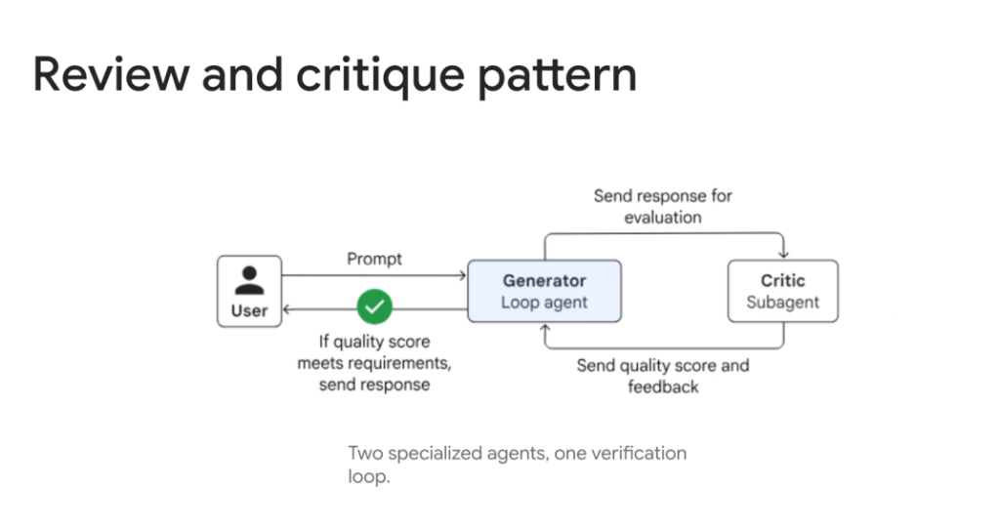
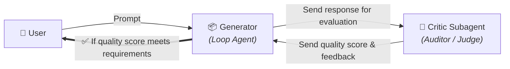

# Multi-Agent Workflow: Review and Critique Pattern



## Overview

The **Review and Critique Pattern** is a dual-agent verification architecture that decouples the creation of an artifact from its evaluation.

> **"Two specialized agents, one verification loop."**

In this pattern, a **Generator (Loop Agent)** drafts an initial solution and routes it to a dedicated **Critic Subagent**. The Critic evaluates the draft against strict objective rubrics, returning a numerical quality score and actionable feedback. If the score satisfies the target threshold, the response is delivered to the user; otherwise, the Generator refines the draft based on the Critic's critique.

---

## Architectural Execution Flow



---

## The Self-Critique Paradox: Why Two Specialized Agents?

When a single LLM is asked to review its own output in the same prompt context, it suffers from **autoregressive confirmation bias**—the model tends to justify its own prior tokens rather than rigorously spotting flaws.

```mermaid
graph TD
    subgraph Single Agent (Biased)
        S1["Monolithic Prompt"] --> S2["Generate Draft"] --> S3["Review Draft<br/><i>(High hallucination & rubber-stamping)</i>"]
    end

    subgraph Dual-Agent (Decoupled & Objective)
        D_Gen["🎨 Generator Persona<br/><i>Creative, expansive, tool-driven</i>"]
        D_Crit["🧐 Critic Persona<br/><i>Adversarial, skeptical, rubric-driven</i>"]
        D_Gen <==>|Adversarial Feedback Loop| D_Crit
    end
```

### Advantages of Decoupled Personas:
1. **Asymmetric Cognitive Focus**: The Generator focuses 100% on synthesis and tool calling; the Critic focuses 100% on rule verification, safety checks, and edge cases.
2. **Asymmetric Model Selection**: Pair a fast, high-throughput model (e.g. Gemini 2.5 Flash) for drafting with a high-reasoning model (e.g. Gemini 2.5 Pro) for critique—or vice versa.
3. **Zero Context Contamination**: The Critic inspects only the final generated artifact against clean guidelines, without being biased by intermediate scratchpad reasoning.

---

## Anatomy of a Production Critic Rubric

To prevent vague feedback, the Critic must output a structured schema (JSON / Pydantic):

```json
{
  "quality_score": 8.5,
  "passed": true,
  "rubric_evaluations": {
    "factual_grounding": "PASS",
    "security_compliance": "PASS",
    "tone_and_clarity": "WARN"
  },
  "identified_flaws": [
    "Missing explicit error handler for HTTP 429 rate limit exceptions."
  ],
  "actionable_remediations": [
    "Wrap the API request in an exponential backoff retry block."
  ]
}
```

---

## Google ADK Implementation Example

In the **Google Agent Development Kit (ADK)**, this pattern is constructed using a `LoopAgent` coordinating a generator and critic:

```python
from google.adk.agents import LlmAgent, LoopAgent
from pydantic import BaseModel, Field

class CritiqueResult(BaseModel):
    score: float = Field(description="Score from 0.0 to 10.0")
    passed: bool = Field(description="True if score >= 8.5 and no security violations")
    feedback: str = Field(description="Concise, actionable feedback for improvement")

# 1. Specialized Critic Subagent
critic_agent = LlmAgent(
    name="technical_critic",
    model="gemini-2.5-pro",
    instruction=(
        "You are an adversarial technical reviewer. Audit the proposed architecture "
        "or code strictly against security, scalability, and clarity rubrics. "
        "Output structured CritiqueResult."
    ),
    output_schema=CritiqueResult,
    output_key="latest_critique",
)

# 2. Specialized Generator Subagent
generator_agent = LlmAgent(
    name="solution_generator",
    model="gemini-2.5-flash",
    instruction=(
        "Generate or refine the technical solution based on user prompt and any "
        "actionable critique feedback stored in state['latest_critique']."
    ),
    output_key="draft_solution",
)

# 3. Top-Level Review & Critique Verification Loop
review_loop_agent = LoopAgent(
    name="review_critique_system",
    subagents=[generator_agent, critic_agent],
    exit_condition=lambda state: (
        state.get("latest_critique") is not None and 
        state["latest_critique"].passed is True
    ),
    max_iterations=4,  # Circuit breaker preventing infinite debate
)
```

---

## Common Failure Modes & Production Mitigations

| Failure Mode | Root Cause | Production Mitigation |
| :--- | :--- | :--- |
| **Hyper-Critical Infinite Loop** | Critic refuses to award passing score due to stylistic nits | Define binary pass/fail thresholds with explicit tolerance levels |
| **Sycophantic Rubber-Stamping** | Critic praises weak drafts without inspection | Provide few-shot negative examples showing harsh, thorough critiques |
| **Vague Complaints** | Critic outputs generic feedback ("make it better") | Mandate structured schemas with `actionable_remediations` |
| **Drifting Requirements** | Generator rewrites entire architecture to please Critic | Pin immutable user requirements in state that cannot be modified |

---

## Self-Critique vs. Dual-Agent vs. Deterministic Validator

| Evaluation Approach | Evaluator Type | Objectivity | Latency | Cost | Best Use Case |
| :--- | :--- | :--- | :--- | :--- | :--- |
| **Single-Prompt Self-Critique** | Same LLM turn | Low (Confirmation bias) | Lowest (1 call) | Lowest | Low-risk formatting checks |
| **Dual-Agent Review & Critique** | Decoupled Critic LLM | High (Adversarial persona) | Moderate (2–4 calls) | Moderate | Code reviews, legal docs, complex policies |
| **Deterministic Validator** | Linter / Compiler / Test Suite | Absolute (Binary 0/1) | Sub-second | Zero token cost | Syntax, types, unit test execution |
