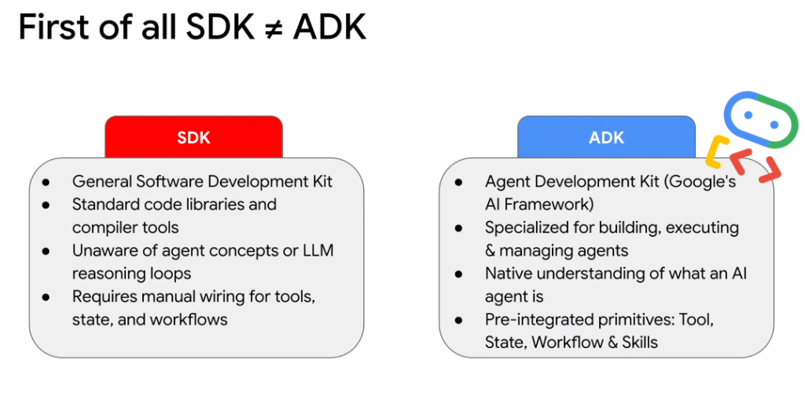
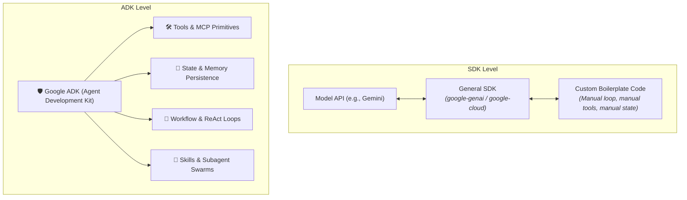

# First of All: SDK ≠ ADK

## Overview

A fundamental distinction in building AI systems is understanding the difference between a **Software Development Kit (SDK)** and an **Agent Development Kit (ADK)**. While an SDK provides low-level programmatic access to model endpoints, an ADK provides the holistic engineering framework required to run stateful, autonomous agent loops.

---

## Architectural Comparison

---

## Deep Dive: SDK vs. ADK

### 1. SDK (Software Development Kit)
* **Definition**: General-purpose client libraries, network wrappers, and compiler tools (e.g., `google-genai`, `google-cloud-storage`).
* **Characteristics**:
  * Provides typed Python/Go/Java bindings over raw HTTP/REST or gRPC endpoints.
  * **Completely unaware of agent concepts**: Does not understand reasoning loops, planning trees, memory hierarchies, or multi-agent delegation.
  * **Requires heavy manual wiring**: Developers must hand-code the `while` loops, JSON schema serializations, error boundaries, session caches, and tool dispatch tables.

### 2. ADK (Agent Development Kit - Google's AI Framework)
* **Definition**: Specialized, high-level engineering framework built specifically for designing, executing, observing, and managing autonomous AI agents.
* **Characteristics**:
  * **Native understanding of agent semantics**: Built-in awareness of personas, instructions, tools, reflections, and termination criteria.
  * **Pre-integrated First-Class Primitives**:
    * **`Tool`**: Standardized interface for function calling, MCP integration, and schema validation.
    * **`State`**: Deterministic session persistence, context hydration, and rollback checkpoints.
    * **`Workflow`**: Pre-built orchestration topologies (ReAct, Human-in-the-Loop, Plan-and-Solve).
    * **`Skills`**: Modular, swappable capability packages that agents can invoke on demand.

---

## Direct Comparison Matrix

| Dimension | SDK (Software Development Kit) | ADK (Agent Development Kit) |
| :--- | :--- | :--- |
| **Primary Scope** | Model & API connectivity | Agent lifecycle, orchestration & governance |
| **Agent Awareness** | None (treats LLM as raw text input $
\rightarrow$ output) | Native (reasons over agent states, loops & goals) |
| **Tool Execution** | Developer manually parses JSON & calls functions | Framework automatically validates & dispatches tools |
| **State & Memory** | Developer must build database schemas & caching | Out-of-the-box state management & memory stores |
| **Telemetry & Evals** | Basic HTTP status logging | Native OpenTelemetry step tracing & regression eval harness |
| **Example Packages** | `google-genai`, `openai`, `boto3` | `google.adk` |
