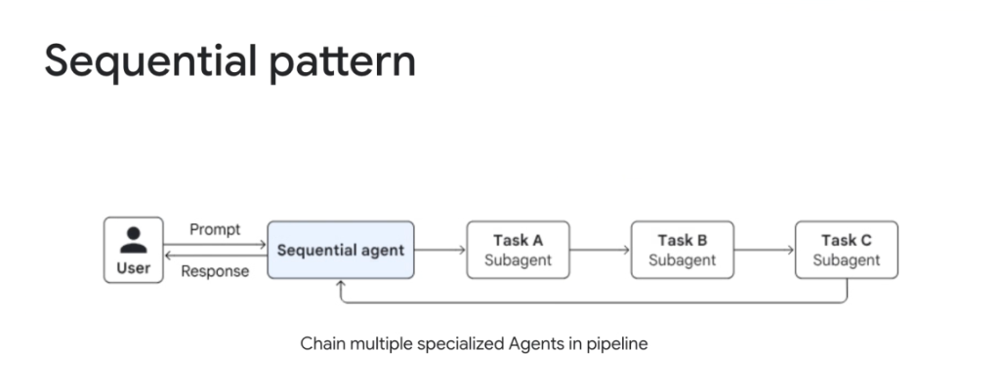
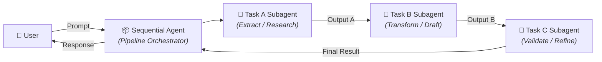

# Multi-Agent Workflow: Sequential Pattern



## Overview

The **Sequential Pattern** is a foundational multi-agent workflow architecture where specialized agents are chained together in a strict linear pipeline. 

> **"Chain multiple specialized Agents in pipeline."**

In this pattern, a top-level **Sequential Agent** receives the initial user prompt, executes a series of task-specific subagents in predetermined order ($A \rightarrow B \rightarrow C$), and routes the final synthesized result back to the user.

---

## Architectural Execution Flow



---

## How It Works Step-by-Step

1. **Ingress & Initialization**: The user submits a high-level request to the `SequentialAgent`.
2. **Stage 1 (Task A Subagent)**: Performs domain research, data extraction, or query decomposition. It produces a structured intermediate artifact (e.g. key facts, database records, technical specification).
3. **Stage 2 (Task B Subagent)**: Consumes the output from Stage 1. Performs code generation, document drafting, or data transformation based on the extracted context.
4. **Stage 3 (Task C Subagent)**: Consumes the output from Stage 2. Runs validation, fact-checking, style alignment, or security audits, producing the finalized artifact.
5. **Egress & Response Delivery**: The pipeline orchestrator captures the output of the final stage and returns the response to the user.

---

## Context & State Propagation Strategies

When chaining agents in sequence, managing token consumption and context cleanliness is crucial:

```mermaid
graph TD
    subgraph 1. Accumulative Context (Naive)
        In1["User Prompt"] --> Ag1["Agent A"]
        Ag1 -->|Prompt + Out A| Ag2["Agent B"]
        Ag2 -->|Prompt + Out A + Out B| Ag3["Agent C"]
    end

    subgraph 2. Structured Handoff (Token-Optimized)
        In2["User Prompt"] --> HAg1["Agent A"]
        HAg1 -->|Schema Output A| HAg2["Agent B"]
        HAg2 -->|Schema Output B| HAg3["Agent C"]
    end

    subgraph 3. Shared Blackboard State (ADK Standard)
        In3["User Prompt"] --> BB[("💾 Shared Session State")]
        BB <--> BAg1["Agent A"]
        BB <--> BAg2["Agent B"]
        BB <--> BAg3["Agent C"]
    end
```

1. **Accumulative Context (Naive)**: Each agent appends its raw message history to the prompt.
   * *Drawback*: Rapid token bloat, high cost, and attention dilution.
2. **Structured Handoff (Token-Optimized)**: Subagents communicate solely through validated Pydantic/JSON schemas. Agent $B$ receives *only* the structured output of Agent $A$, keeping prompts lightweight.
3. **Shared Blackboard State (ADK Recommended)**: Agents write their domain results to a common session state dictionary (`session.state["task_a_result"]`), allowing subsequent agents to selectively read only the fields they need.

---

## Google ADK Implementation Example

In the **Google Agent Development Kit (ADK)**, sequential execution can be configured using `SequentialAgent` or workflow pipelines:

```python
from google.adk.agents import LlmAgent, SequentialAgent
from google.adk.tools import Tool

# Step 1: Research Specialist
research_agent = LlmAgent(
    name="research_specialist",
    model="gemini-2.5-flash",
    instruction="Extract core technical requirements and database schemas from the user prompt.",
    tools=[search_documentation_tool],
    output_key="research_notes",
)

# Step 2: Implementation Specialist
code_agent = LlmAgent(
    name="code_implementer",
    model="gemini-2.5-pro",
    instruction="Generate clean, production-grade Python code satisfying the research notes in state.",
    tools=[],
    output_key="generated_code",
)

# Step 3: Verification & Security Specialist
verifier_agent = LlmAgent(
    name="code_verifier",
    model="gemini-2.5-flash",
    instruction="Audit the generated code for security vulnerabilities, type hints, and PEP 8 compliance.",
    tools=[run_linter_tool],
    output_key="final_reviewed_code",
)

# Top-level Sequential Pipeline Orchestrator
pipeline_agent = SequentialAgent(
    name="software_engineering_pipeline",
    subagents=[research_agent, code_agent, verifier_agent],
)
```

---

## Engineering Trade-offs & Failure Modes

| Dimension | Strength / Benefit | Vulnerability / Failure Mode | Recommended Mitigation |
| :--- | :--- | :--- | :--- |
| **Predictability** | 100% deterministic execution order | Rigid; cannot dynamically skip steps based on input | Introduce conditional branches / routing gates |
| **Fault Isolation** | Easy to pinpoint which stage failed | **Compounding Errors**: Bad output in Stage A corrupts Stage B & C | Enforce Pydantic schema validation at each boundary |
| **Latency** | Predictable serial timeline | Cumulative latency: $T_{\text{total}} = \sum_{i=1}^N T_i$ | Use fast models (Flash) for extraction/formatting stages |
| **Debugging** | Clear step-by-step logs and traces | Opaque state drift if schemas are unstructured | Log input/output artifacts per subagent turn |

---

## When to Use vs. Avoid

### ✅ Best Used For
* **Multi-Stage Refinement**: Requirements $\rightarrow$ Code $\rightarrow$ Security Review $\rightarrow$ Tests.
* **ETL & Ingestion Pipelines**: Document Scraping $\rightarrow$ Chunk Extraction $\rightarrow$ Embedding Generation $\rightarrow$ DB Ingestion.
* **Content Generation**: Deep Topic Research $\rightarrow$ Outline Drafting $\rightarrow$ Article Writing $\rightarrow$ Fact Checking.

### ❌ Avoid When
* **Tasks are independent**: If tasks can run concurrently without dependencies, use the **Parallel Pattern**.
* **Intent is ambiguous**: If the required steps cannot be known in advance, use a dynamic **Coordinator** or **Hierarchical Decomposition**.
* **Interactive dialogue is required**: If the user needs to provide continuous feedback at each step, use **Human-in-the-Loop** gates.
