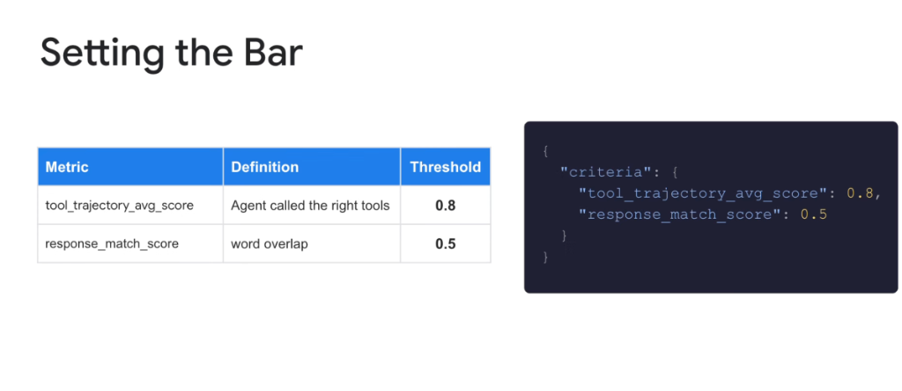
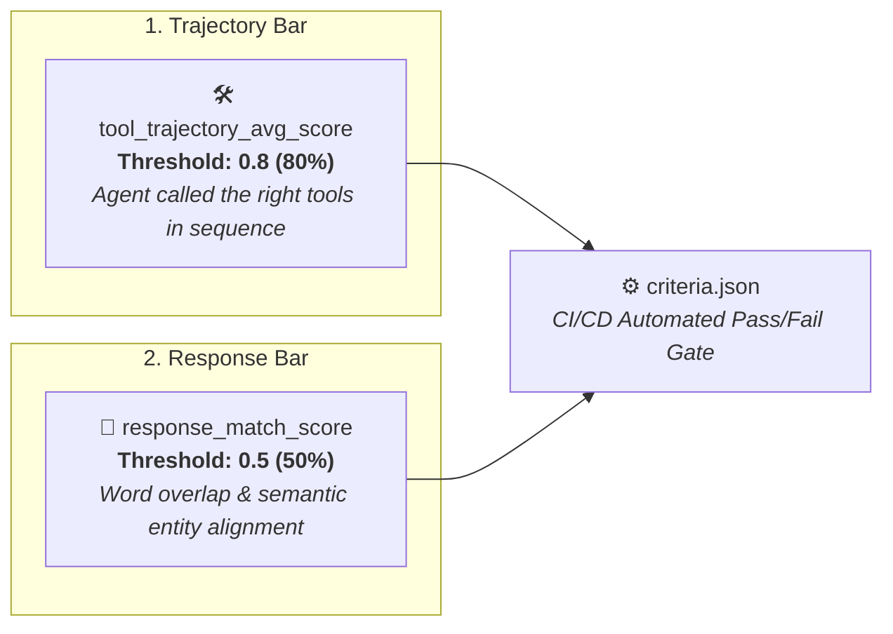
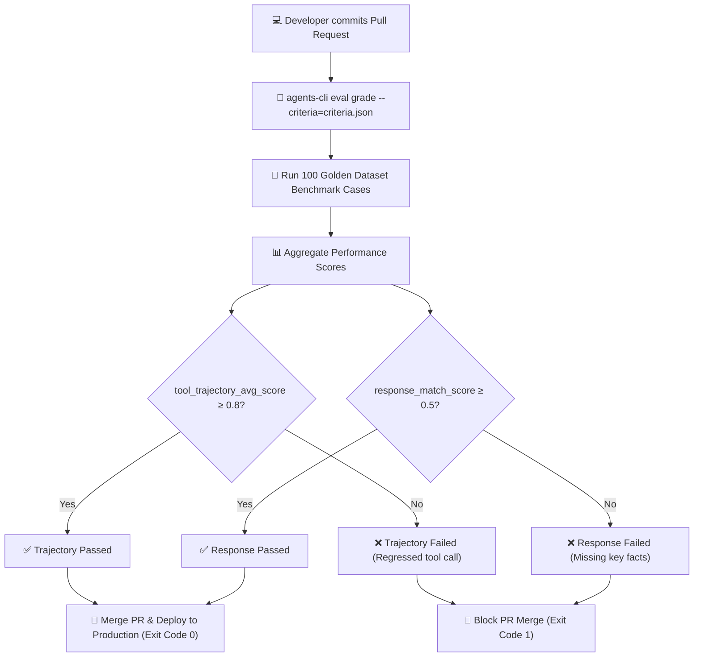

# Agent Evaluation: Setting the Bar (Thresholds & Criteria)



## Overview

Defining metrics is only half the battle in evaluation engineering; the other half is **setting explicit, quantitative acceptance thresholds**. Without enforced thresholds, evaluation suites cannot automate pass/fail decisions in CI/CD pipelines.

> **"Setting the Bar: Configuring quantitative criteria thresholds in ADK to automate regression detection across tool trajectories and response matching."**

---

## The Core Baseline Thresholds



---

## Detailed Breakdown of Baseline Criteria

### 1. `tool_trajectory_avg_score` (Threshold: 0.8)
* **Definition**: Measures whether the agent called the correct tools with valid parameters in the expected sequence.
* **Calculation**: Composite F1-score combining:
  * **Tool Call Precision**: Fraction of invoked tools that were required ($T_{\text{valid}} / T_{\text{invoked}}$).
  * **Tool Call Recall**: Fraction of required golden tools that were successfully executed ($T_{\text{valid}} / T_{\text{required}}$).
  * **Argument Conformance**: Degree to which tool JSON parameters matched expected schema values.
* **Why 0.8?**: A strict bar ($\ge 80\%$) ensures the agent consistently adheres to operational business logic while tolerating minor benign exploration steps. Scores below 0.8 indicate dangerous tool skipping or hallucinated API parameters.

---

### 2. `response_match_score` (Threshold: 0.5)
* **Definition**: Measures the lexical and semantic overlap (e.g., ROUGE-1/ROUGE-L recall, key token intersection, or cosine embedding similarity) between the agent's output and the golden ground-truth response.
* **Why 0.5?**:
  * **Permits Creative Phrasing**: Unlike deterministic code, generative responses should not be penalized for using alternative phrasing, varying sentence structure, or polite transitions.
  * **Enforces Core Entity Recall**: A 0.5 threshold ensures that critical domain entities (e.g. `$49.99`, `Order #9821`, `3-5 business days`) are present, while rejecting outputs that hallucinate or omit essential resolution details.

---

## ADK Evaluation Configuration Schema

In Google ADK, criteria thresholds are specified in JSON/YAML configuration files passed directly to the evaluation engine:

```json
{
  "criteria": {
    "tool_trajectory_avg_score": 0.8,
    "response_match_score": 0.5
  }
}
```

### Advanced Multi-Dimensional Criteria Configuration

For enterprise production deployments, teams expand the baseline criteria into a comprehensive quality envelope:

```json
{
  "criteria": {
    "tool_trajectory_avg_score": 0.85,
    "response_match_score": 0.50,
    "factual_grounding_score": 0.90,
    "safety_policy_violation_rate": 0.00,
    "max_average_turn_count": 3.5,
    "p95_latency_seconds": 4.0
  }
}
```

---

## How CI/CD Enforces the Bar



---

## Threshold Calibration & Tuning Guide

| Observed Score | Diagnostic State | Root Cause & Remediation |
| :--- | :--- | :--- |
| **Trajectory $< 0.8$**<br/>Response $\ge 0.5$ | ⚠️ **Lucky Hallucination** | Agent is guessing answers without calling required tools. Strengthen system prompt instructions on mandatory tool usage. |
| **Trajectory $\ge 0.8$**<br/>Response $< 0.5$ | ❌ **Synthesis Failure** | Agent executed all tools correctly but failed to format the extracted data into the final response. Improve output template formatting. |
| **Trajectory $\ge 0.8$**<br/>Response $\ge 0.5$ | ✅ **Golden Pass** | Agent followed the correct operational trajectory and generated an accurate, grounded answer. |
| **Trajectory $< 0.8$**<br/>Response $< 0.5$ | 💥 **Total Failure** | Agent failed both tool selection and generation. Check tool schema descriptions and system prompt clarity. |

---

## Best Practices for Setting Production Bars

1. **Never Lower the Trajectory Bar to Fix Test Failures**:
   * If an agent fails `tool_trajectory_avg_score >= 0.8`, fix the agent prompt or tool definitions; never lower the threshold to force a passing build.
2. **Calibrate Response Overlap Against Golden Variants**:
   * If legitimate creative responses score below 0.5 on lexical matching, supplement golden test cases with 2–3 acceptable response variations or switch to semantic embedding similarity.
3. **Set Zero Tolerance for Safety Violations**:
   * Always pair trajectory and response thresholds with a strict `0.0` tolerance gate for PII leaks, jailbreak vulnerabilities, and toxic outputs.
