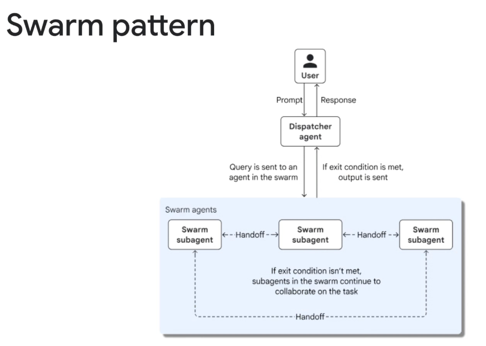
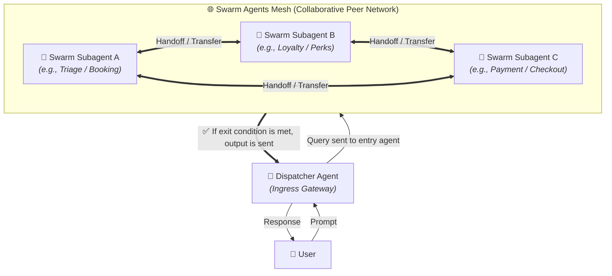

# Multi-Agent Dynamic Pattern: Swarm Pattern



## Overview

The **Swarm Pattern** is a decentralized, peer-to-peer (P2P) dynamic multi-agent architecture where autonomous agents collaborate through direct handoffs and lateral communication—eliminating the need for a rigid central supervisor to oversee every turn.

> **"Decentralized peer agents dynamically hand off control and collaborate until an exit condition is met."**

In a swarm, a lightweight **Dispatcher Agent** acts as the ingress gateway, forwarding the initial query to the most appropriate agent in the swarm. From there, swarm agents autonomously transfer control, pass execution context, and negotiate directly with peer specialists via **Handoffs** until the task is complete.

---

## Architectural Execution Flow



---

## Core Mechanisms of Swarm Systems

```mermaid
graph LR
    subgraph 1. Direct Handoff Function
        A1["🤖 Agent A"] -->|Calls transfer_to_agent_b()| A2["🤖 Agent B"]
    end

    subgraph 2. Shared Execution Ledger
        A2 -->|Reads/Updates State| State[("💾 Blackboard Context")]
    end

    subgraph 3. Terminal Exit Condition
        A2 -->|Goal Achieved| Exit["🏁 Return Final Output"]
    end
```

### 1. The Handoff (Transfer) Primitive
* In a swarm, agents treat other peer agents as executable targets.
* An agent can call a transfer function (e.g. `transfer_to_loyalty_agent(user_id, booking_id)`) which switches the active conversational turn and context directly to the recipient agent.

### 2. Autonomous Peer-to-Peer Collaboration
* Agents converse laterally without bubbling every message back up to a central coordinator.
* Enables fluid conversational flows (e.g., Booking Specialist hands off to Loyalty Specialist to apply points, which then hands off to Payment Specialist to charge the remainder).

### 3. Exit Conditions & Termination Gates
* The swarm continues collaborating until an agent explicitly determines the user's objective is satisfied (or calls a completion tool), routing the finalized result back through the Dispatcher gateway to the user.

---

## Centralized Coordinator vs. Multi-Tier Hierarchy vs. Swarm

```mermaid
graph TD
    subgraph Centralized Coordinator (Hub & Spoke)
        C_Hub["👑 Central Coordinator"] --> C1["Worker 1"] & C2["Worker 2"] & C3["Worker 3"]
    end

    subgraph Hierarchical Decomposition (Tree)
        H_Lead["👑 Executive Lead"] --> H_L1["Lead 1"] & H_L2["Lead 2"]
        H_L1 --> HW1["Worker 1"] & HW2["Worker 2"]
    end

    subgraph Autonomous Swarm (Mesh)
        S1["🤖 Agent 1"] <--> S2["🤖 Agent 2"] <--> S3["🤖 Agent 3"]
        S3 <--> S1
    end
```

| Architectural Dimension | Coordinator Pattern | Hierarchical Decomposition | Swarm Pattern (P2P Mesh) |
| :--- | :--- | :--- | :--- |
| **Control Topology** | Centralized Hub & Spoke | Multi-tier Tree | Decentralized Mesh |
| **Routing Authority** | Central model makes all routing decisions | Leads decompose and route downward | Active agent transfers control laterally |
| **Context Overhead** | Coordinator must synthesize all intermediate outputs | Summarized at each hierarchical tier | Passed directly between collaborating peers |
| **Flexibility** | Moderate (Constrained by hub prompt) | High (Structured domain scopes) | Maximum (Fluid peer transitions) |
| **Failure Predictability** | High (Single point of orchestration) | High (Encapsulated subtrees) | Lower (Risk of infinite handoff ping-pong) |

---

## Google ADK Implementation Example

In the **Google Agent Development Kit (ADK)** and Agent-to-Agent (A2A) topologies, swarms are implemented using agent handoff functions:

```python
from google.adk.agents import LlmAgent
from google.adk.tools import Tool

# 1. Payment Specialist Agent (Terminal exit agent)
payment_agent = LlmAgent(
    name="payment_specialist",
    model="gemini-2.5-flash",
    instruction="Process customer payments, issue invoices, and complete checkout.",
    tools=[charge_card_tool, generate_receipt_tool],
)

# 2. Loyalty & Discounts Specialist Agent
def transfer_to_payment():
    """Handoff control to the payment specialist when checkout is ready."""
    return payment_agent

loyalty_agent = LlmAgent(
    name="loyalty_specialist",
    model="gemini-2.5-flash",
    instruction="Apply reward points and promo discounts, then transfer to payment.",
    tools=[lookup_points_tool, apply_discount_tool, transfer_to_payment],
)

# 3. Flight Booking Specialist Agent (Swarm Entry)
def transfer_to_loyalty():
    """Handoff control to loyalty specialist to apply member discounts."""
    return loyalty_agent

booking_agent = LlmAgent(
    name="booking_specialist",
    model="gemini-2.5-flash",
    instruction="Help user select flights, reserve seats, and transfer to loyalty for discounts.",
    tools=[search_flights_tool, reserve_seat_tool, transfer_to_loyalty],
)

# 4. Ingress Dispatcher Agent
dispatcher_agent = LlmAgent(
    name="gateway_dispatcher",
    model="gemini-2.5-flash",
    instruction="Route incoming travel requests to the booking_specialist in the swarm.",
    subagents=[booking_agent, loyalty_agent, payment_agent],
)
```

---

## Production Failure Modes & Engineering Mitigations

| Failure Mode | Root Cause | Production Mitigation |
| :--- | :--- | :--- |
| **Endless Ping-Pong Loops** | Agent A transfers to Agent B, which transfers back to Agent A | **Handoff Circuit Breaker**: Enforce a hard maximum transfer count (e.g., $\text{max\_handoffs} = 6$) |
| **Context & State Drift** | Long handoff chains lose track of the original user query | Anchor the immutable original user intent in shared session state across all handoffs |
| **Orphaned Execution** | Agent fails to call a handoff or return a response | Set per-agent execution timeouts and fallback default handlers |
| **Undirected Wandering** | Agents pass tasks around without making concrete progress | Track a `task_completed` checklist in the blackboard state |

---

## Ideal Problem Space

* **Customer Lifecycle & Journey Automation**: Triage $\rightarrow$ Consult $\rightarrow$ Upsell / Loyalty $\rightarrow$ Checkout $\rightarrow$ Post-purchase support.
* **Autonomous Incident Remediation**: Alert Ingress $\rightarrow$ Log Analyzer $\leftrightarrow$ Network Diagnostics $\rightarrow$ Auto-Patcher.
* **Interactive Multi-Character Simulations**: Peer negotiations, adversarial red-teaming, and collaborative role-playing.
