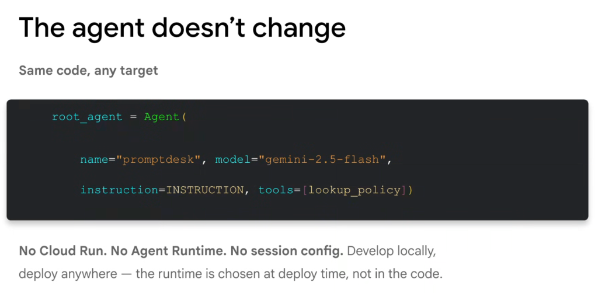

# Google ADK: The Agent Doesn't Change (Same Code, Any Target)



## Overview

A defining architectural strength of the Google Agent Development Kit (ADK) is the absolute separation of **agent business logic** from **cloud hosting infrastructure**.

Your agent code contains **no Cloud Run references, no Agent Runtime hooks, and no hardcoded session storage configurations**. You write clean, standard Python that can be developed and debugged locally, and choose the target runtime at deploy time.

> **"No Cloud Run. No Agent Runtime. No session config. Develop locally, deploy anywhere — the runtime is chosen at deploy time, not in the code."**

---

## Clean Code Architecture: One Agent, Multiple Targets

```mermaid
graph TD
    subgraph Pure Python Core (Unchanged)
        AgentCode["<b>Clean ADK Agent Definition</b><br/><code>root_agent = Agent(<br/>&nbsp;&nbsp;name='promptdesk',<br/>&nbsp;&nbsp;model='gemini-2.5-flash',<br/>&nbsp;&nbsp;instruction=INSTRUCTION,<br/>&nbsp;&nbsp;tools=[lookup_policy]<br/>)</code>"]
    end

    subgraph Deploy-Time Binding (Zero Code Changes)
        T0["💻 <b>Local Interactive REPL</b><br/><code>uv run adk run promptdesk</code>"]
        T1["🧪 <b>CI/CD Pytest Suite</b><br/><code>uv run pytest tests/test_eval.py</code>"]
        T2["👤 <b>Agent Runtime (Managed PaaS)</b><br/><code>agents-cli deploy agent-runtime</code>"]
        T3["🖐️ <b>Cloud Run (Serverless Container)</b><br/><code>agents-cli deploy cloud-run</code>"]
        T4["🔧 <b>GKE (Kubernetes Fleet)</b><br/><code>agents-cli deploy gke</code>"]
    end

    AgentCode ==> T0
    AgentCode ==> T1
    AgentCode ==> T2
    AgentCode ==> T3
    AgentCode ==> T4
```

---

## The Pure ADK Agent Definition

The developer writes pure, declarative Python without any cloud SDK bloat:

```python
# src/promptdesk/agent.py
from google.adk import Agent
from google.adk.tools import FunctionTool

INSTRUCTION = """
You are PromptDesk, an internal IT and HR support assistant.
Help employees navigate corporate policies and resolve common access issues.
Always ground your answers in verified policy documentation.
"""

def lookup_policy(query: str) -> dict:
    """Searches corporate policy documentation."""
    # Production tool logic / API integration
    return {"status": "success", "results": [f"Policy details for: {query}"]}

# The Root Agent: Clean, testable, and infrastructure-agnostic
root_agent = Agent(
    name="promptdesk",
    model="gemini-2.5-flash",
    instruction=INSTRUCTION,
    tools=[lookup_policy],
)
```

---

## Deploy-Time Binding: Zero Code Changes

Because the agent code is completely decoupled from the runtime, switching from a local development sandbox to production hosting targets requires **zero line edits** to Python files:

### 1. Local Interactive REPL
```bash
# Run locally in interactive terminal
uv run adk run promptdesk
```

### 2. Automated CI/CD Regression Evaluation
```bash
# Evaluate against golden datasets in pytest
uv run pytest promptdesk/tests/test_agent_eval.py
```

### 3. Deploy to Agent Runtime (Managed PaaS)
```bash
# Deploys with automatic VertexAiSessionService state management
agents-cli deploy agent-runtime \
  --agent-dir=./src/promptdesk \
  --region=us-central1
```

### 4. Deploy to Cloud Run (Serverless Container)
```bash
# Deploys as serverless OCI container with externalized Firestore state
agents-cli deploy cloud-run \
  --agent-dir=./src/promptdesk \
  --region=us-central1 \
  --session-backend=firestore \
  --cpu-boost
```

### 5. Deploy to GKE (Kubernetes Cluster)
```bash
# Deploys to managed Kubernetes namespace with private VPC networking
agents-cli deploy gke \
  --agent-dir=./src/promptdesk \
  --cluster=enterprise-agents \
  --namespace=support-team
```

---

## Framework Comparison: Code Purity vs. Infrastructure Pollution

| Dimension | ❌ Infrastructure-Polluted Frameworks | ✅ Google ADK Architecture |
| :--- | :--- | :--- |
| **Python Code Coupling** | Imports cloud runtime libraries, HTTP handlers, and container SDKs directly inside agent files. | **Pure Python domain logic**; zero infrastructure dependencies. |
| **Session Persistence** | Hardcodes database connection pools, Redis clients, and SQL queries into prompt handlers. | **Injected at deploy-time** or configured via clean session interfaces. |
| **Local Unit Testing** | Requires running local Docker daemons, mock database containers, and web servers. | **Executes instantly in memory with pytest**; lightweight and fast. |
| **Target Portability** | Migrating from serverless to Kubernetes requires complete code refactoring. | **Single CLI flag change**; identical codebase runs anywhere. |

---

## Architectural Invariants

1. **Keep Agent Files Infrastructure-Agnostic**: Never import `gcloud`, container daemons, or cloud-specific HTTP server frameworks inside `agent.py`.
2. **Inject Infrastructure at the Boundary**: Keep sessions, secrets, API keys, and environment variables bound at deploy time via `agents-cli` or environment configurations.
3. **Test in Local Isolation First**: Because the agent is pure Python, verify tool schemas and prompt trajectories locally before triggering cloud builds.
