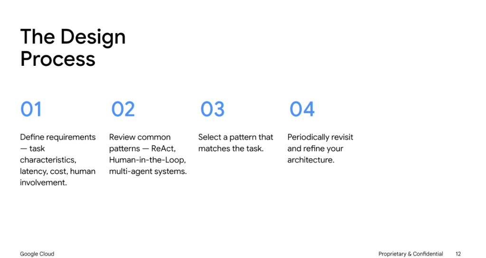
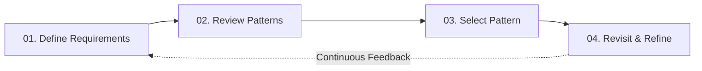

# The Design Process

## Overview

Designing agent architectures is a systematic engineering process that balances autonomy, latency, operational cost, and human oversight. Rather than defaulting to complex multi-agent setups, teams should methodically assess task characteristics before selecting and refining architectural patterns.

---

## The 4 Design Stages

### 01. Define Requirements
Analyze the underlying problem dimensions before writing code:
* **Task Characteristics**: Is the workflow deterministic, linear, or exploratory?
* **Latency Budget**: Does the user need real-time streaming (<500ms) or is asynchronous execution acceptable?
* **Cost & Token Constraints**: What is the target cost per completion/task?
* **Human Involvement Level**: Is full autonomy safe, or does the system require supervisory approvals for high-stakes actions?

### 02. Review Common Patterns
Survey established architectural patterns to find suitable blueprints:
* **ReAct (Reason + Act)**: Interleaved reasoning steps and tool calls for dynamic investigation.
* **Human-in-the-Loop (HITL)**: Workflow pauses for human approval or input on sensitive operations.
* **Plan-and-Execute**: Explicit upfront planning followed by batch or sequential tool execution.
* **Multi-Agent Systems**: Hierarchical or peer swarms with specialized domain agents and supervisor coordinators.

### 03. Select a Pattern Matching the Task
* Choose the **simplest architecture** that satisfies all constraints (Principle of Parsimony).
* Avoid premature multi-agent complexity if a single ReAct agent or structured prompt chain achieves the goal with lower latency and fewer failure modes.

### 04. Periodically Revisit and Refine Your Architecture
* Continuously benchmark performance, cost, and failure rates against real production traffic.
* **Refactor proactively**: As foundational model capabilities and context windows improve, remove obsolete scaffolding and simplify agent topologies.

---

## Process Summary Matrix

| Stage | Focus Area | Key Questions / Actions |
| :-: | :--- | :--- |
| **01** | Requirement Analysis | What are the latency SLAs, cost ceilings, autonomy boundaries, and tool dependencies? |
| **02** | Pattern Exploration | Evaluate ReAct, HITL, Plan-and-Solve, and Multi-Agent topologies. |
| **03** | Pattern Selection | Match task complexity to the minimal required architectural pattern. |
| **04** | Iterative Refinement | Audit latency/cost bottlenecks, remove redundant scaffolding, and adapt to model upgrades. |
