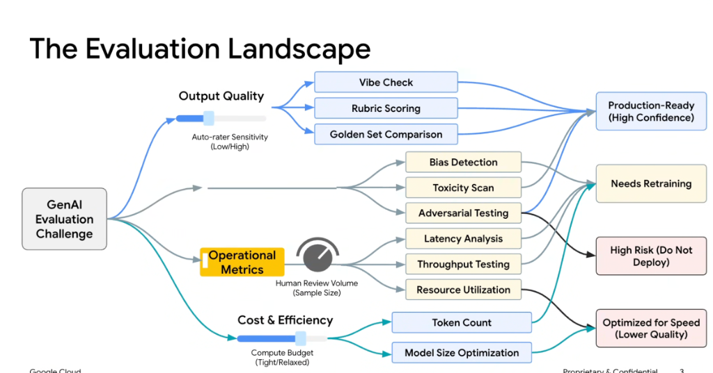
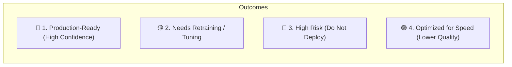

# GenAI & Agent Evaluation: The Evaluation Landscape



## Overview

Evaluating Generative AI applications and autonomous agents is a multi-dimensional engineering discipline. A production system cannot be judged solely on whether an answer "looks good"; engineers must simultaneously evaluate **Output Quality**, **Operational Metrics & Safety**, and **Cost & Efficiency**.

> **"The GenAI Evaluation Landscape navigates the trade-offs between automated rater sensitivity, human review volume, and compute budgets to categorize models into actionable deployment tiers."**

---

## The Evaluation Landscape Map

```mermaid
graph TD
    Root["🎯 GenAI Evaluation Challenge"]

    subgraph Pillar 1: Output Quality
        Root --> Q["Output Quality<br/><i>[Slider: Auto-rater Sensitivity]</i>"]
        Q --> Q1["Vibe Check"]
        Q --> Q2["Rubric Scoring"]
        Q --> Q3["Golden Set Comparison"]
    end

    subgraph Pillar 2: Operational Metrics & Safety
        Root --> O["Operational Metrics<br/><i>[Dial: Human Review Volume]</i>"]
        O --> O1["Bias Detection"]
        O --> O2["Toxicity Scan"]
        O --> O3["Adversarial Testing (Red-Teaming)"]
        O --> O4["Latency Analysis"]
        O --> O5["Throughput Testing"]
        O --> O6["Resource Utilization"]
    end

    subgraph Pillar 3: Cost & Efficiency
        Root --> C["Cost & Efficiency<br/><i>[Slider: Compute Budget]</i>"]
        C --> C1["Token Count Tracking"]
        C --> C2["Model Size Optimization"]
    end

    subgraph Deployment Classifications (Outcomes)
        Q2 & Q3 & O4 --> PR["🔵 Production-Ready<br/><i>(High Confidence)</i>"]
        Q1 & O1 --> NR["🟡 Needs Retraining / Tuning"]
        O2 & O3 --> HR["🔴 High Risk<br/><i>(Do Not Deploy)</i>"]
        C1 & C2 --> OS["🟣 Optimized for Speed<br/><i>(Lower Quality Trade-off)</i>"]
    end
```

---

## The 3 Evaluation Pillars Detailed

### 1. Output Quality
* **Control Lever**: *Auto-rater Sensitivity (Low $\leftrightarrow$ High)*. Calibrates how strictly automated LLM judges enforce rules.
* **Evaluation Techniques**:
  * **Vibe Check**: Informal, manual qualitative inspection during early prototyping. Rapid but unscientific and prone to confirmation bias.
  * **Rubric Scoring**: Multi-point structured criteria evaluated by LLM-as-a-Judge (e.g. Grounding $\ge 4/5$, Conciseness $\ge 4/5$, Tone $\ge 4/5$).
  * **Golden Set Comparison**: Automated semantic and exact-match benchmarking against curated, human-verified ground truth datasets.

### 2. Operational Metrics & Safety
* **Control Lever**: *Human Review Volume (Sample Size)*. Calibrates what percentage of production and eval traffic undergoes manual spot-checking.
* **Evaluation Techniques**:
  * **Bias & Fairness Detection**: Statistical audits across demographic, cultural, and domain variables.
  * **Toxicity & Harm Scans**: Automated safety classifiers detecting offensive language, hate speech, and PII leakage.
  * **Adversarial Testing (Red-Teaming)**: Automated fuzzing, jailbreaks, prompt injections, and privilege escalation attacks.
  * **Latency & Throughput Analysis**: Profiling time-to-first-token (TTFT), inter-token latency, and total turn duration under load.
  * **Resource Utilization**: Tracking CPU/GPU memory saturation and API rate limit headroom.

### 3. Cost & Efficiency
* **Control Lever**: *Compute Budget (Tight $\leftrightarrow$ Relaxed)*. Sets token ceilings and inference cost envelopes.
* **Evaluation Techniques**:
  * **Token Count Economics**: Auditing system prompt bloat, tool schema overhead, and intermediate scratchpad token usage.
  * **Model Size Optimization**: Benchmarking smaller/distilled models (e.g., Gemini 2.5 Flash vs. Pro) to maximize performance-per-dollar.

---

## The 4 Production Deployment Classifications



| Deployment Classification | Qualifying Criteria | Required Action |
| :--- | :--- | :--- |
| 🔵 **Production-Ready** | High golden set accuracy ($\ge 95\%$), zero safety violations, latency within SLO ($< 3\text{s}$). | Deploy to production with live telemetry. |
| 🟡 **Needs Retraining** | Quality degradation on edge cases, rubric score drift, or minor tone misalignment. | Refine system prompt instructions, add few-shot examples, or fine-tune. |
| 🔴 **High Risk (Do Not Deploy)** | Failed adversarial red-teaming, toxicity detected, PII leakage, or severe hallucinations. | Block CI/CD pipeline immediately; quarantine release until patched. |
| 🟣 **Optimized for Speed** | Scaled down for high-throughput / low-latency environments with acceptable minor quality drop. | Deploy to specialized speed-critical edge / interactive microservices. |

---

## Production Evaluation Matrix & Tooling

```python
# Conceptual Automated Evaluation Pipeline in Python / ADK
from google.adk.eval import EvaluationSuite, RubricJudge, SafetyScanner

eval_suite = EvaluationSuite(
    dataset="golden_eval_v2.json",
    judges=[
        RubricJudge(criteria="factual_grounding", threshold=0.95),
        RubricJudge(criteria="conciseness", threshold=0.90),
    ],
    scanners=[
        SafetyScanner(check_toxicity=True, check_prompt_injection=True),
    ],
    performance_limits={
        "max_p95_latency_sec": 3.5,
        "max_tokens_per_turn": 1500,
    }
)

# Automated Classification Result
result = eval_suite.run(agent=production_agent)
print(f"Deployment Status: {result.classification}")
# Output: "Production-Ready (High Confidence)"
```
