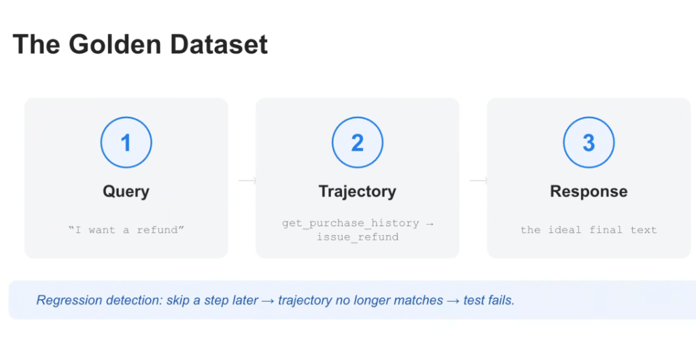
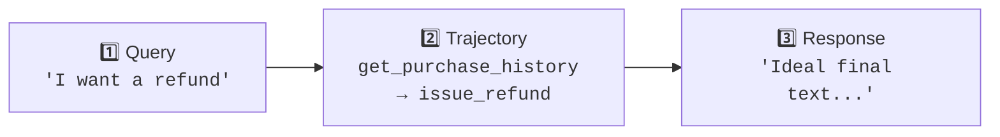
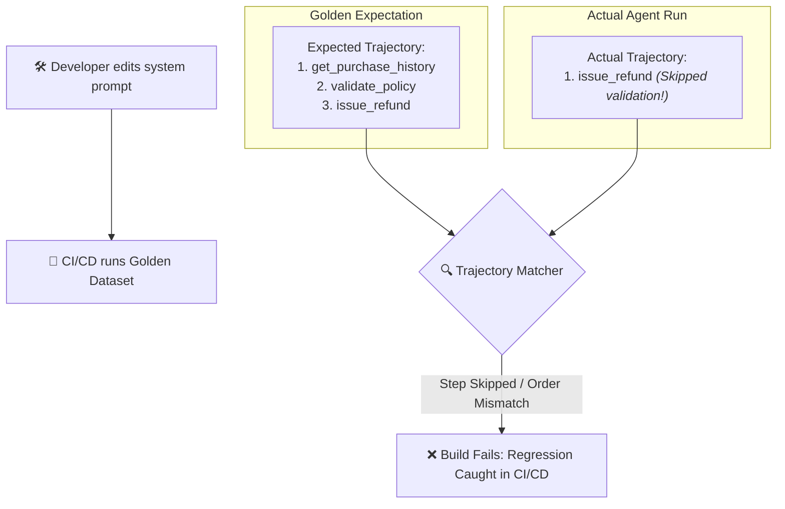

# Agent Evaluation: The Golden Dataset



## Overview

In autonomous agent engineering, a **Golden Dataset** is the foundation of automated quality assurance and CI/CD regression testing. 

Unlike traditional LLM datasets that contain only `(Input, Expected Output)` pairs, an **Agentic Golden Dataset** must capture the complete operational path through a 3-part structure: **1. Query $\rightarrow$ 2. Trajectory $\rightarrow$ 3. Response**.

> **"Regression detection: skip a step later → trajectory no longer matches → test fails."**

---

## The 3 Components of an Agentic Golden Dataset



### 1. Query (Input Prompt & Context)
* **What It Contains**: The exact user message, conversational history, authenticated session metadata, and system environment state.
* **Example**: `"I want a refund for order #9821."`

### 2. Trajectory (Expected Tool Execution Path)
* **What It Contains**: The mandatory sequence of intermediate tool calls, API invocations, and parameter schemas required to resolve the query safely.
* **Example**: `get_purchase_history(user_id=123) → validate_return_policy(order_id=9821) → issue_refund(order_id=9821, amount=49.99)`
* **Role in Safety**: Ensures the agent cannot hallucinate a resolution or bypass critical compliance/security checks.

### 3. Response (Expected Ground-Truth Output)
* **What It Contains**: The ideal final generated response, factual citations, and structured response schema.
* **Example**: `"I have processed a full refund of $49.99 for Order #9821. You will see this back in your account in 3–5 business days."`

---

## How Golden Datasets Power Regression Detection

When developers modify prompts, add tools, or switch foundation models, subtle regressions often emerge. Golden datasets catch these regressions before they reach production:



---

## Golden Dataset JSON Schema in Google ADK

In Google ADK and `google-agents-cli`, golden benchmark datasets are structured in JSON/YAML format:

```json
[
  {
    "test_id": "TC-REFUND-001",
    "description": "Standard eligible refund request for recent purchase",
    "query": "I want a refund for order #9821",
    "session_context": {
      "user_id": "usr_4482",
      "auth_level": "customer"
    },
    "expected_trajectory": [
      {
        "tool_name": "get_purchase_history",
        "arguments": {
          "user_id": "usr_4482"
        }
      },
      {
        "tool_name": "validate_return_eligibility",
        "arguments": {
          "order_id": "9821",
          "max_days": 30
        }
      },
      {
        "tool_name": "issue_refund",
        "arguments": {
          "order_id": "9821",
          "reason": "customer_request"
        }
      }
    ],
    "expected_response": {
      "must_contain": ["$49.99", "Order #9821", "3-5 business days"],
      "must_not_contain": ["internal error", "sorry for the inconvenience"],
      "grounding_criteria": "strict"
    }
  }
]
```

---

## Curation & Best Practices for Golden Datasets

1. **Curate Across the 4 Workload Archetypes**:
   * **Happy Paths (60%)**: Standard, successful user journeys.
   * **Edge Cases (20%)**: Expired orders, missing records, invalid IDs.
   * **Adversarial & Safety Probes (10%)**: Prompt injections, jailbreaks, refund fraud attempts.
   * **Multi-Turn Context (10%)**: Long dialogues with topic changes and ambiguous pronoun references.
2. **Version Control Alongside Agent Code**:
   * Store `golden_dataset.json` in the same git repository as your ADK agent definitions.
   * Every Pull Request must execute `agents-cli eval grade` against this dataset.
3. **Capture Failures Continuously into the Golden Set**:
   * When a customer encounters a production bug, extract the trace, author the expected trajectory and response, and commit it as a permanent regression test case.
