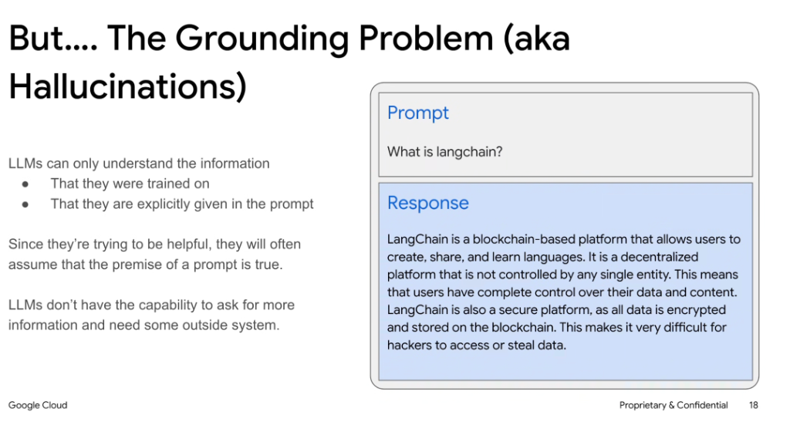

# The Grounding Problem (aka Hallucinations)



## Overview

Large Language Models (LLMs) operate under strict epistemic constraints. When asked questions outside their training distribution or without dynamic context, their statistical objective (generating plausible next tokens) leads to confident but entirely fabricated answers—known as **hallucinations**.

---

## Fundamental Causes of the Grounding Problem

### 1. Finite Information Horizons
An LLM only understands information from two distinct sources:
* **Pre-training Data**: Static knowledge frozen at model training cutoff.
* **In-Context Prompt Data**: Dynamic information explicitly injected into the prompt window.

### 2. Sycophancy & Presumed Truth of Premise
* Because models are aligned via RLHF to be helpful, agreeable, and responsive, they frequently **presume the premise of a user prompt is factual**.
* When presented with a leading or obscure question, the model invents plausible-sounding narratives rather than admitting ignorance.

### 3. Lack of Autonomous Query Capabilities
* Standalone LLMs cannot proactively query external databases, verify current facts, or request missing parameters without an **external orchestrator / tool framework**.

---

## Hallucination Case Study: LangChain

### The Prompt
```text
What is langchain?
```

### The Ungrounded LLM Response (Fabricated)
> *"LangChain is a blockchain-based platform that allows users to create, share, and learn languages. It is a decentralized platform that is not controlled by any single entity. This means that users have complete control over their data and content. LangChain is also a secure platform, as all data is encrypted and stored on the blockchain. This makes it very difficult for hackers to access or steal data."*

* **Analysis**: The model combined the words *"Lang"* (language) and *"Chain"* (blockchain) into a coherent, highly articulate, yet completely false explanation.

---

## Ungrounded LLM vs. Grounded Agentic System

| Dimension | Ungrounded LLM | Grounded Agent / RAG System |
| :--- | :--- | :--- |
| **Knowledge Source** | Static weights only | Real-time enterprise data, APIs, live search |
| **Factuality Guarantee** | Probabilistic (prone to plausible fabrications) | Anchored to retrieved source passages |
| **Handling Unknowns** | Hallucinates or assumes prompt premise | Identifies missing info and queries external tools |
| **Auditability** | Low (cannot cite verifiable primary sources) | High (provides direct citations and source links) |
