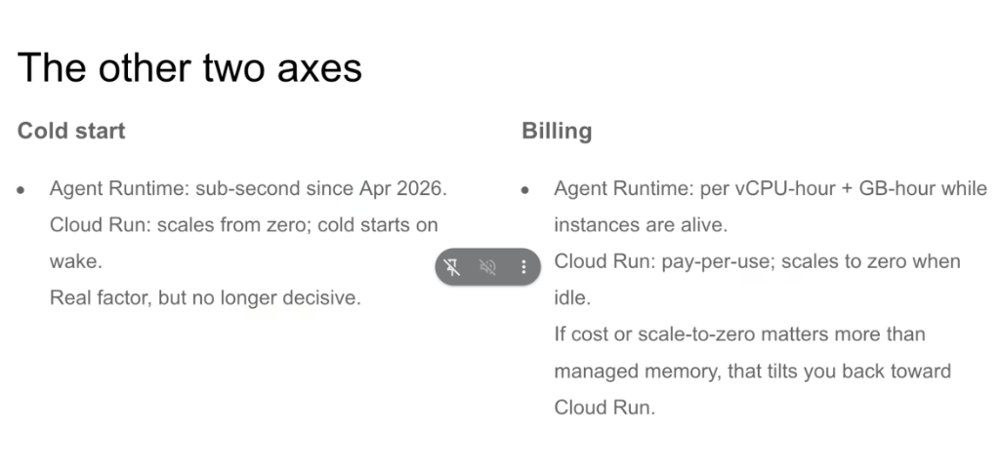
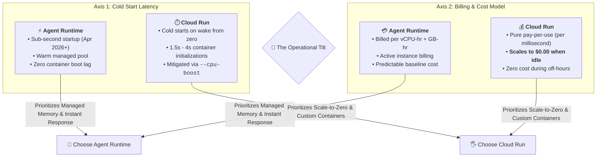
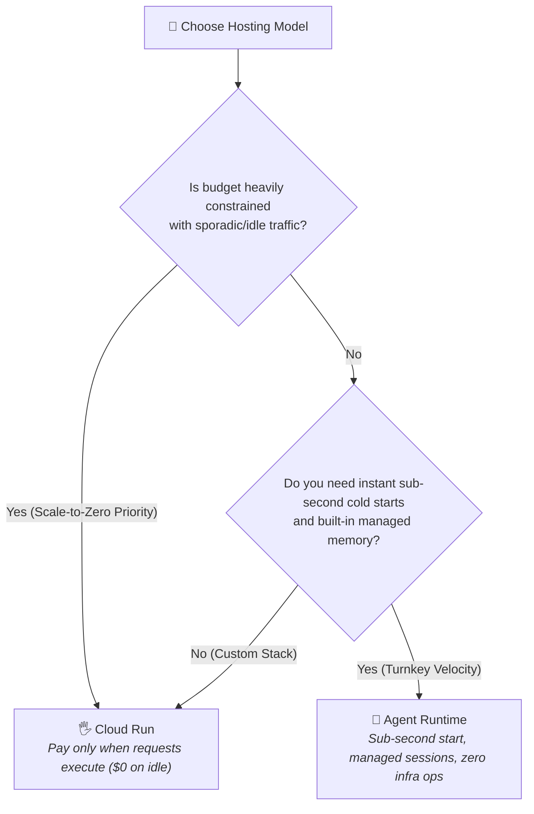

# ADK Deployment: The Other Two Axes (Cold Start & Billing)

## Overview

When choosing between **Agent Runtime** and **Cloud Run** for hosting Google Agent Development Kit (ADK) agents, state persistence is only part of the equation. Two critical operational dimensions complete the decision framework: **Cold Start Latency** and **Billing Models**.

> **"Cold start is a real factor, but no longer decisive. If cost or scale-to-zero matters more than managed memory, that tilts you back toward Cloud Run."**

---

## The Decision Tilt: Balancing Latency vs. Cost

---

## Deep Breakdown of the Two Axes

### Axis 1: Cold Start Latency

| Dimension | 👤 Agent Runtime | 🖐️ Cloud Run |
| :--- | :--- | :--- |
| **Startup Latency** | **Sub-second ($< 800\text{ms}$)** | $1.5\text{s} - 4.0\text{s}$ (from idle 0 instances) |
| **Runtime Architecture** | Pre-warmed managed execution pool | Fresh OCI container cold boot |
| **Optimization History** | Sub-second optimizations rolled out **April 2026** | Accelerated via startup CPU boost (`--cpu-boost`) |
| **Decisive Factor?** | **No longer decisive** — differences are negligible for multi-second LLM reasoning tasks. |

* **The Reality of Cold Starts in AI Agents**: 
  * Because LLM inference itself takes $1.5\text{s} - 5.0\text{s}$ for reasoning and tool generation, a $1.5\text{s}$ container wake time on Cloud Run is noticeable but rarely a deal-breaker.
  * Agent Runtime's sub-second startup provides superior UX for real-time human chat dialogues.

---

### Axis 2: Billing & Cost Dynamics

| Dimension | 👤 Agent Runtime | 🖐️ Cloud Run |
| :--- | :--- | :--- |
| **Pricing Model** | Provisioned resource time (vCPU-hour + GB-hour) | **Pure Pay-per-Use** (Request duration in ms) |
| **Idle Cost** | Baseline cost while instance is alive | **$0.00 (True Scale-to-Zero)** |
| **Traffic Suitability** | High, continuous, predictable conversation traffic | Sporadic, bursty, batch, or intermittent traffic |
| **Cost Optimization** | Commitments and continuous utilization | Inactivity windows cost nothing |

* **The "Scale-to-Zero" Factor**:
  * If your agent serves a 9-to-5 internal enterprise tool, Cloud Run incurs **zero compute cost** for the remaining 16 hours of the day and entire weekends.
  * If your budget mandates minimal idle spend, this economic reality strongly tilts the architectural choice back toward **Cloud Run**.

---

## Operational Comparison Matrix

| Operational Attribute | 👤 Agent Runtime | 🖐️ Cloud Run |
| :--- | :--- | :--- |
| **Cold Start Performance** | **Sub-second (Instant)** | $\approx 2\text{s}$ on wake (0 with `--min-instances=1`) |
| **Idle Cost Behavior** | Billed per instance lifespan | **$0.00 Idle Cost** |
| **Traffic Profile Sweet Spot** | Steady enterprise support / Always-on | Bursty, night/weekend idle, webhooks |
| **Container Customization** | Managed sandbox | **Full Dockerfile / Custom Binaries** |
| **State Setup Overhead** | **Zero Config (Managed)** | Requires Firestore / SQL / Memory layer |

---

## Architectural Decision Rules

1. **Choose Cloud Run when**:
   * Traffic is sporadic, intermittent, or off-hours idle.
   * You require custom OS-level binaries, C libraries, or headless browsers.
   * You already operate Firestore or Cloud SQL for application state.
2. **Choose Agent Runtime when**:
   * You want turn-key session memory without provisioning a database.
   * You demand instant sub-second startup responsiveness without managing minimum instance pools.
   * You want zero DevOps maintenance.
