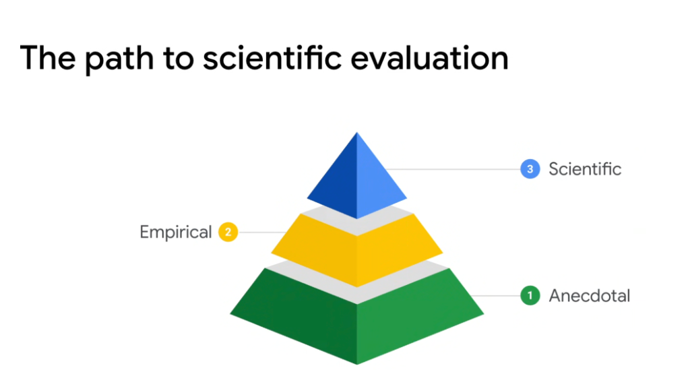
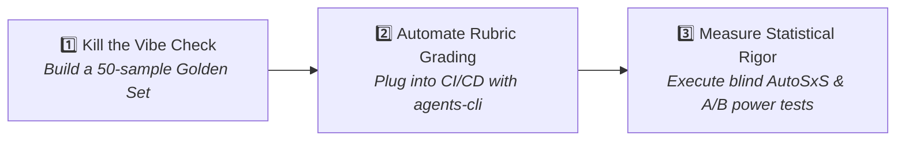

# Evaluation Maturity: The Path to Scientific Evaluation



## Overview

Moving from generative AI prototyping to enterprise-grade engineering requires an evolution in evaluation methodology. The **Evaluation Maturity Pyramid** illustrates the progression from subjective, ad-hoc testing to statistically rigorous, hypothesis-driven validation.

> **"The journey of evaluation maturity: from Anecdotal vibes to Empirical datasets, culminating in Scientific statistical rigor."**

---

## The 3 Tiers of Evaluation Maturity

```mermaid
graph TD
    subgraph 3. Scientific (Apex - Blue)
        T3["🔬 Level 3: Scientific Evaluation<br/><i>Controlled A/B experiments, AutoSxS, statistical significance & perturbation testing</i>"]
    end

    subgraph 2. Empirical (Middle - Yellow)
        T2["📊 Level 2: Empirical Evaluation<br/><i>Curated golden test sets, automated rubric grading & CI/CD regression suites</i>"]
    end

    subgraph 1. Anecdotal (Base - Green)
        T1["👀 Level 1: Anecdotal Evaluation<br/><i>Ad-hoc vibe checks, single-prompt playground testing & subjective review</i>"]
    end

    T1 --> T2 --> T3
```

---

## Deep Dive into the 3 Tiers

### 1. Level 1: Anecdotal Evaluation (The "Vibe Check")
* **Methodology**: Engineers and product managers manually test 3–5 subjective prompts in a web UI or playground.
* **Characteristics**:
  * Driven by confirmation bias: *"I tried my favorite query, and it gave a great answer!"*
  * Non-reproducible: No fixed dataset or systematic record of failures.
  * Fragile: A prompt tweak that fixes one query silently breaks ten others.
* **Production Risk**: High. Blind to edge cases, hallucinations, and security vulnerabilities.

### 2. Level 2: Empirical Evaluation (Structured Benchmarking)
* **Methodology**: Executing automated test suites across curated **Golden Datasets** (100–1,000 human-verified cases).
* **Characteristics**:
  * Quantitative scoring: Pass/fail assertions on tool schemas, status codes, and multi-point rubrics (Grounding $\ge 4/5$).
  * Automated CI/CD integration: Releases are blocked if regression accuracy drops below a fixed threshold (e.g. $< 95\%$).
  * Repeatable: The same dataset is run across model versions and prompt revisions.
* **Limitation**: Can overfit to the static golden set and may miss subtle distribution shifts in production.

### 3. Level 3: Scientific Evaluation (Statistical & Hypothesis-Driven)
* **Methodology**: Controlled experimental design, blind side-by-side comparisons (**Vertex AI AutoSxS**), and statistical significance analysis.
* **Characteristics**:
  * **Hypothesis Testing**: Stating explicit hypotheses before model upgrades (e.g. *"Switching to Gemini 2.5 Flash reduces latency by 40% with no statistically significant drop in grounding ($p < 0.01$)"*).
  * **Perturbation & Robustness Fuzzing**: Automatically generating adversarial variations (rephrasing, typos, edge formatting) to measure variance.
  * **Continuous Production Sampling**: Dynamically extracting real-world failure distributions into the eval loop.
  * **Ensemble Judges**: Calibrating multiple diverse evaluator models to eliminate single-judge LLM bias.
* **Outcome**: Statistically verified confidence intervals for quality, safety, latency, and cost.

---

## Evaluation Maturity Comparison Matrix

| Evaluation Dimension | Tier 1: Anecdotal | Tier 2: Empirical | Tier 3: Scientific |
| :--- | :--- | :--- | :--- |
| **Primary Technique** | Manual Playground "Vibe Check" | Automated Golden Datasets | Controlled A/B & AutoSxS Experiments |
| **Sample Size** | 1 – 5 ad-hoc prompts | 100 – 1,000 test cases | Thousands of stratified & perturbed samples |
| **Scoring Rigor** | Subjective human impression | Deterministic schemas + LLM Rubrics | Statistical significance ($p$-values, 95% CI) |
| **Tooling** | Web Console / Scratchpad | `agents-cli eval grade` / Python scripts | Vertex AI GenAI Evaluation Service / AutoSxS |
| **CI/CD Integration** | None (Manual only) | Automated PR build blocker | Automated canary & continuous production gating |
| **Production Risk** | **Extreme** | **Moderate (Controlled)** | **Minimal (Statistically Verified)** |

---

## The Journey to Scientific Rigor: Step-by-Step



1. **Step 1: Escape the Anecdotal Trap**:
   * Collect real user prompts and domain edge cases into a structured `golden_dataset.json`.
   * Define expected tool calls and ground-truth answers.
2. **Step 2: Establish Empirical Baselines**:
   * Run automated evaluations on every pull request using `agents-cli eval grade`.
   * Set strict quality gates for tool call precision, grounding, and latency SLOs.
3. **Step 3: Elevate to Scientific Discipline**:
   * Use **Vertex AI AutoSxS** to conduct blind pairwise win-rate comparisons between model versions.
   * Calculate confidence intervals to ensure observed improvements are statistically real rather than random prompt noise.
