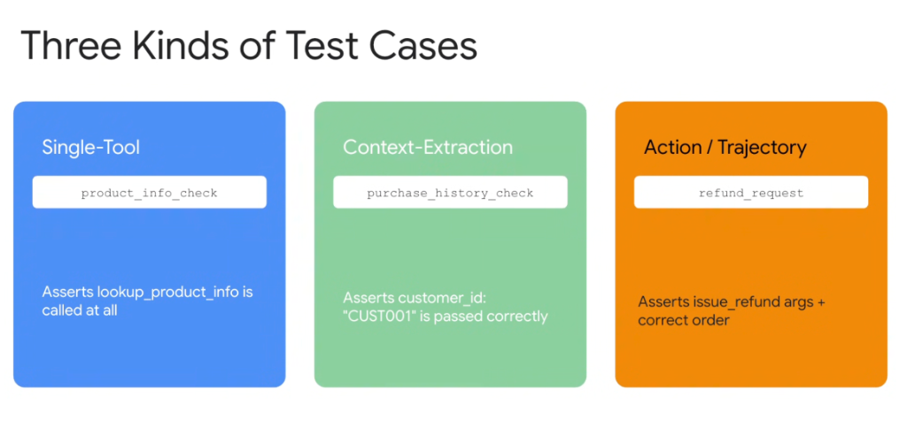
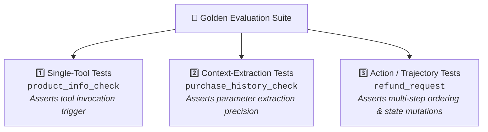
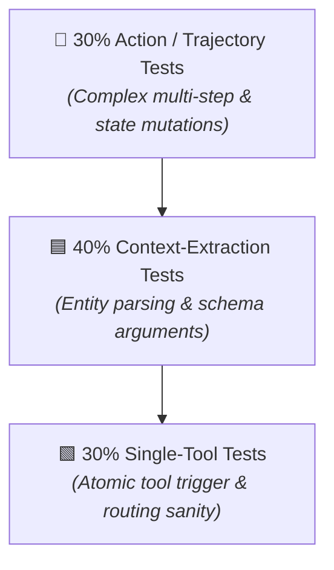

# Agent Evaluation: Three Kinds of Test Cases



## Overview

A robust golden evaluation dataset does not treat all scenarios uniformly. To isolate failure modes effectively, test cases are categorized into three distinct architectural tiers: **Single-Tool**, **Context-Extraction**, and **Action / Trajectory**.

> **"1. Single-Tool: Asserts tool is called at all → 2. Context-Extraction: Asserts parameters are extracted correctly → 3. Action / Trajectory: Asserts multi-step execution order and mutating arguments."**

---

## The 3-Tier Testing Hierarchy



---

## Deep Breakdown of the 3 Test Kinds

### 1. Single-Tool Tests (Trigger & Routing Verification)
* **Example Scenario**: `product_info_check`
* **Core Assertion**: Asserts that `lookup_product_info` is invoked when a product question is asked, rather than hallucinating from model weights.
* **Focus**: Routing accuracy, tool selection precision, and preventing lucky hallucinations.
* **Target Metric**: `tool_selection_recall == 1.0`.

```json
{
  "eval_id": "product_info_check",
  "conversation": [{
    "user_content": { "parts": [{ "text": "What are the dimensions of the Acme Model X?" }] },
    "intermediate_data": {
      "tool_uses": [{
        "name": "lookup_product_info",
        "args": { "product_name": "Acme Model X" }
      }]
    },
    "final_response": { "parts": [{ "text": "The Acme Model X dimensions are 12x8x4 inches." }] }
  }]
}
```

---

### 2. Context-Extraction Tests (Parameter Precision)
* **Example Scenario**: `purchase_history_check`
* **Core Assertion**: Asserts that messy or implicit user context is correctly extracted into exact structured parameters (e.g. `customer_id: "CUST001"`).
* **Focus**: Parameter extraction precision, entity resolution, type validation, and handling noisy multi-turn dialogue.
* **Target Metric**: `argument_exact_match == 1.0`.

```json
{
  "eval_id": "purchase_history_check",
  "conversation": [{
    "user_content": { "parts": [{ "text": "Hi, this is Jane Doe with customer ID CUST001. Show my recent orders." }] },
    "intermediate_data": {
      "tool_uses": [{
        "name": "get_purchase_history",
        "args": { "customer_id": "CUST001" }
      }]
    },
    "final_response": { "parts": [{ "text": "You have 2 recent orders: ORD-101 and ORD-102." }] }
  }]
}
```

---

### 3. Action / Trajectory Tests (Multi-Step & Mutating Workflows)
* **Example Scenario**: `refund_request`
* **Core Assertion**: Asserts the complete sequence of read and mutate operations with valid arguments and prerequisite checks (e.g. `lookup` $\rightarrow$ `validate` $\rightarrow$ `issue_refund`).
* **Focus**: Multi-step dependency ordering, state safety, conditional branch handling, and preventing destructive actions without validation.
* **Target Metric**: `tool_trajectory_avg_score >= 0.85`.

```json
{
  "eval_id": "refund_request",
  "session_input": { "user_id": "CUST001" },
  "conversation": [{
    "user_content": { "parts": [{ "text": "I want a refund for order ORD-102 because it arrived damaged." }] },
    "intermediate_data": {
      "tool_uses": [
        {
          "name": "lookup_order_details",
          "args": { "order_id": "ORD-102" }
        },
        {
          "name": "validate_refund_policy",
          "args": { "order_id": "ORD-102", "reason": "damaged" }
        },
        {
          "name": "issue_refund",
          "args": { "order_id": "ORD-102", "reason": "damaged", "amount": 49.99 }
        }
      ]
    },
    "final_response": { "parts": [{ "text": "Your refund of $49.99 for ORD-102 has been processed." }] }
  }]
}
```

---

## Test Kind Comparison Matrix

| Test Kind | Primary Question | Primary Assertion | Complexity | Diagnostic Insight |
| :--- | :--- | :--- | :--- | :--- |
| **1. Single-Tool** | *Did the agent know to use the tool?* | `tool_name` is called | Low | Catches hallucinated answers and prompt routing failures. |
| **2. Context-Extraction** | *Did the agent parse the right parameters?* | `tool.args` match expected values | Medium | Catches entity extraction bugs, typos, and schema type errors. |
| **3. Action / Trajectory** | *Did the agent follow the full operational process?* | Complete sequence + arguments + order | High | Catches skipped validation steps, race conditions, and unsafe mutations. |

---

## Production Dataset Distribution Guidelines

In an enterprise CI/CD evaluation suite, test cases should follow a balanced pyramid:



1. **Start with Single-Tool Tests**: Verify each tool in the agent's toolset has at least 3–5 dedicated trigger sanity tests.
2. **Layer Context-Extraction Tests**: Test parameter extraction against messy dialogue, typos, and negative cases (e.g. missing IDs).
3. **Finish with Action / Trajectory Tests**: Cover end-to-end mission-critical transactional flows with prerequisite validations.
