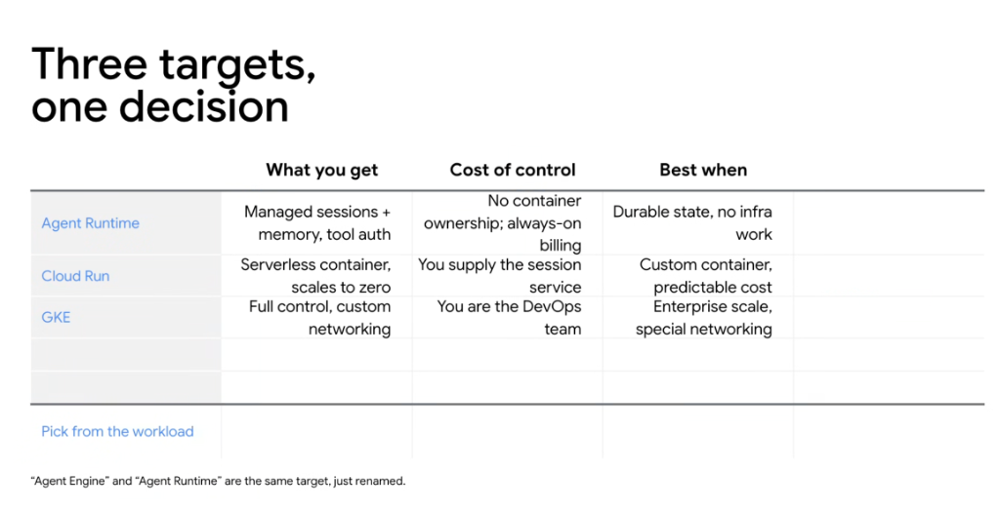
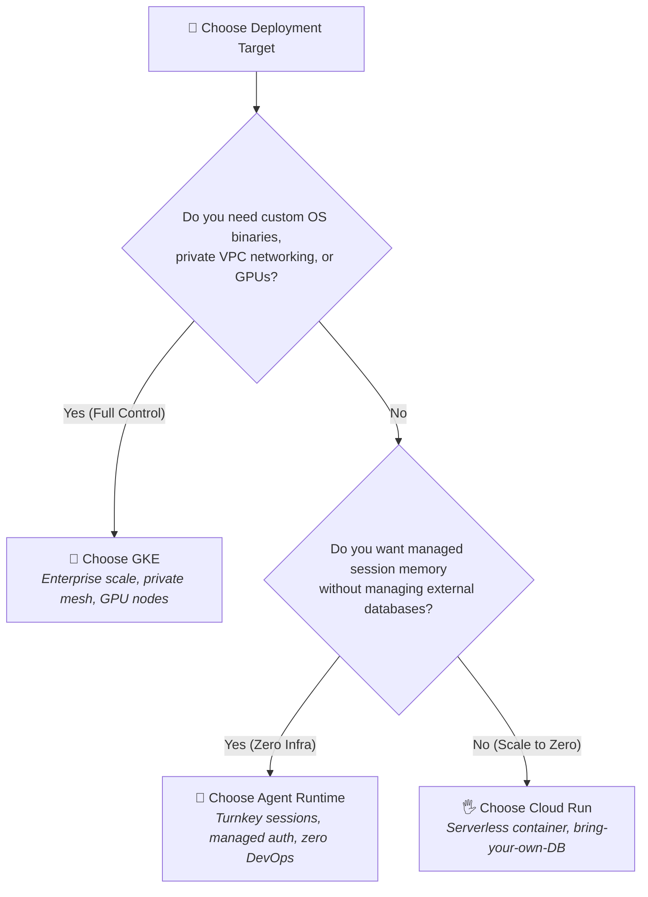

# Google ADK: Three Targets, One Decision (Deployment Trade-Offs)



## Overview

Choosing where to host an autonomous agent on Google Cloud comes down to a single architectural principle: **Pick from the workload**. 

Every deployment target represents a deliberate trade-off between **Turnkey Managed Convenience** and **Infrastructure Control**. Understanding what you get, what control you surrender, and when each target shines ensures optimal cost, latency, and operational efficiency.

> **"Pick from the workload: Agent Runtime for turnkey state and zero infra; Cloud Run for custom containers and scale-to-zero; GKE for enterprise scale and custom networking."**

---

## The Control vs. Convenience Spectrum

```mermaid
graph LR
    subgraph 👤 Maximum Convenience
        AR["<b>Agent Runtime</b><br/>• Managed Sessions + Memory<br/>• Managed Tool Auth<br/><i>Cost: No container ops</i>"]
    end

    subgraph 🖐️ Balanced Serverless
        CR["<b>Cloud Run</b><br/>• Serverless Containers<br/>• Scales to Zero<br/><i>Cost: Externalize session state</i>"]
    end

    subgraph 🔧 Maximum Control
        GKE["<b>GKE</b><br/>• Full Kubernetes & VPC<br/>• Custom GPUs / Accelerators<br/><i>Cost: You are the DevOps team</i>"]
    end

    AR <==> CR <==> GKE
```

---

## Deep Breakdown of the 3 Targets

### 1. Agent Runtime (Turnkey PaaS)
* **What You Get**:
  * **Managed Sessions & Memory**: Multi-turn dialogue history and long-term user context are persisted automatically out-of-the-box.
  * **Managed Tool Authentication**: Built-in OAuth token refresh and IAM credential brokering.
* **Cost of Control**:
  * **No Container Ownership**: You cannot install custom OS-level packages, C++ extensions, or arbitrary background daemons.
  * **Always-On Billing**: Standard managed service pricing tier rather than pure scale-to-zero.
* **Best When**: You need durable conversational state and memory with **zero infrastructure or DevOps work**.
* **Note**: *"Agent Engine"* and *"Agent Runtime"* are the exact same target (renamed).

---

### 2. Cloud Run (Containerized Serverless)
* **What You Get**:
  * **Serverless Container Runtime**: Full control over your Dockerfile, Python virtualenv, and system packages.
  * **True Scale-to-Zero**: Incurs $0.00 compute cost when there is no traffic; instantly scales to hundreds of instances during traffic spikes.
  * **Public/Private HTTPS Endpoints**: Production-ready TLS and HTTP/2 endpoints with minimal configuration.
* **Cost of Control**:
  * **You Supply the Session Service**: You must connect ADK to an external state store (**Cloud Firestore**, **Cloud SQL**, **AlloyDB**, or **Memorystore for Valkey/Redis**).
* **Best When**: You need custom container dependencies, predictable pay-per-use costs, and microservice integration.

---

### 3. Google Kubernetes Engine (GKE - Enterprise Scale)
* **What It Is / What You Get**:
  * **Full Kubernetes Control**: Custom Pod lifecycle, service mesh (Istio/Anthos), daemon sets, and custom sidecar containers.
  * **Custom Networking & Security**: Full support for VPC Service Controls, private clusters, and internal load balancers.
  * **Hardware Acceleration**: Dedicated GPU (NVIDIA H100, L4) and TPU node pools for co-locating local embeddings or rerankers.
* **Cost of Control**:
  * **"You Are the DevOps Team"**: Your team is responsible for cluster provisioning, node upgrades, ingress controllers, KEDA autoscaling, and monitoring.
* **Best When**: Enterprise scale, strict regulatory compliance, multi-tenant agent fleets, or dedicated compute environments.

---

## Detailed Trade-Off & Decision Matrix

| Target | What You Get | Cost of Control | Best When | State Storage | Scaling Model |
| :--- | :--- | :--- | :--- | :--- | :--- |
| **👤 Agent Runtime** | Managed sessions + memory, tool authentication | No container ownership; always-on billing | **Durable state, zero infra work** | Built-in / Managed | Automatic managed |
| **🖐️ Cloud Run** | Serverless container, real endpoint, scales to zero | You supply the session service | **Custom container, predictable cost** | External (Firestore / SQL / Valkey) | **Scales to Zero** $\leftrightarrow 1000+$ |
| **🔧 GKE** | Full control, custom networking, GPU support | You are the DevOps team | **Enterprise scale, special networking** | Persistent Volumes / External DB | Pod Autoscaling (HPA/KEDA) |

---

## Workload-Driven Selection Flowchart



---

## Architectural Rules of Thumb

1. **Start on Agent Runtime for Rapid Prototypes**: When proving agent value, avoid wasting sprint cycles setting up databases and Kubernetes clusters. Use Agent Runtime for instant managed state.
2. **Move to Cloud Run for Production Web Apps**: When integrating with existing microservices and cost-optimizing intermittent traffic, move to Cloud Run with Firestore.
3. **Graduate to GKE for Enterprise Platform Fleets**: When running dozens of co-located agents with private networking, custom fine-tuned models, and strict VPC perimeter controls, deploy to GKE.
