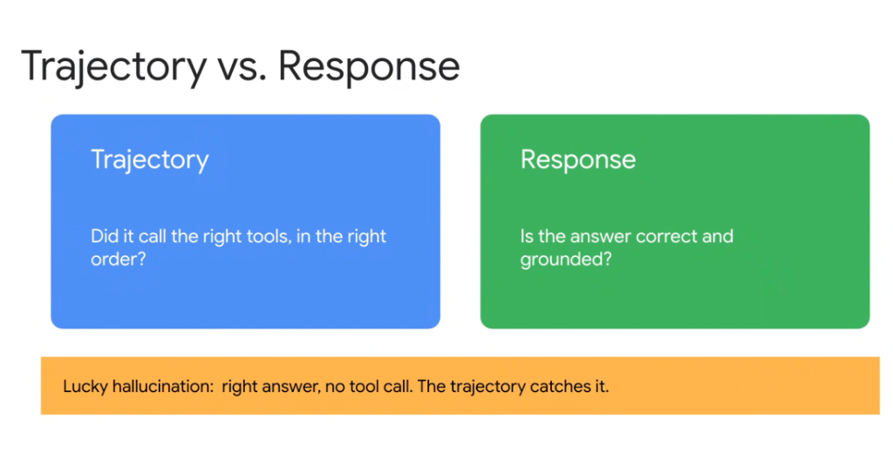
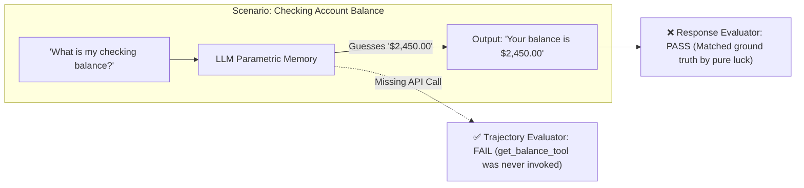
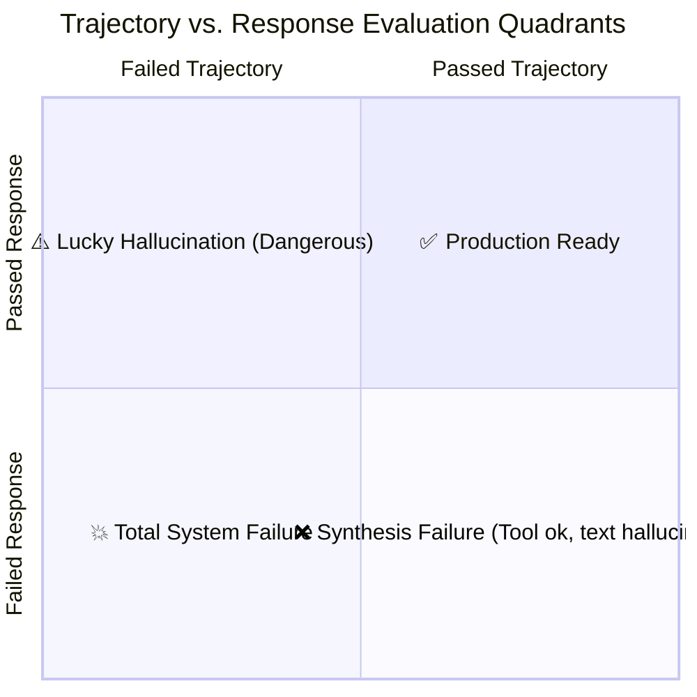

# Agent Evaluation: Trajectory vs. Response Evaluation



## Overview

In traditional LLM evaluation, systems are tested solely on their final **Response** (the end-state text output). In autonomous agent engineering, evaluating only the final response is dangerous. A production-ready agent must be evaluated across two distinct, complementary axes: **Trajectory** (the execution path) and **Response** (the final answer).

> **"Trajectory: Did it call the right tools, in the right order? | Response: Is the answer correct and grounded?"**

---

## The Dual-Axis Evaluation Model

```mermaid
graph TD
    UserPrompt["👤 User Input Prompt"] --> Agent["🤖 Autonomous Agent"]
    
    subgraph Axis 1: Trajectory (The Path)
        Agent --> Steps["🛠️ Intermediate Tool Calls & Reasoning Steps"]
        Steps --> T_Eval{"🔍 Trajectory Evaluation<br/><i>Right tools? Right order? Valid params?</i>"}
    end

    subgraph Axis 2: Response (The Destination)
        Steps --> FinalText["💬 Final Generated Response"]
        FinalText --> R_Eval{"🎯 Response Evaluation<br/><i>Correct facts? Factual grounding? Tone?</i>"}
    end

    T_Eval & R_Eval --> FinalGrade["📊 End-to-End Agent Assessment"]
```

---

## The "Lucky Hallucination" Trap

A primary reason why Response Evaluation alone is insufficient is the phenomenon of **Lucky Hallucinations**.

> **"Lucky Hallucination: The agent outputs the right answer, but made no tool call. The trajectory catches it."**



### Why Lucky Hallucinations are Catastrophic:
1. **False Confidence**: If the benchmark test case expected `$2,450.00`, a response-only evaluator marks the test as $100\%$ successful.
2. **Production Disaster**: In production, parametric training memory will be stale or wrong. The agent never actually verified the customer's live database record.
3. **Trajectory Defense**: A trajectory evaluator asserts that `get_account_balance(account_id=...)` was explicitly executed. When the tool call is absent, it immediately fails the build.

---

## The 4 Evaluation Quadrants



| Quadrant | Trajectory Status | Response Status | Diagnosis | Root Cause & Action |
| :--- | :--- | :--- | :--- | :--- |
| **1. Production Ready** | ✅ Passed | ✅ Passed | Healthy Execution | Agent executed the required tools with valid parameters and synthesized an accurate, grounded answer. |
| **2. Lucky Hallucination** | ❌ Failed | ✅ Passed | **Critical Defect** | Agent guessed the correct answer from training weights without calling the mandatory database/API tool. |
| **3. Total Failure** | ❌ Failed | ❌ Failed | Complete Breakdown | Agent hallucinated wrong tool calls or crashed, and returned an incorrect output. |
| **4. Synthesis Failure** | ✅ Passed | ❌ Failed | Grounding Breakdown | Agent called all the correct tools and received valid data, but hallucinated or misstated facts in the final summary. |

---

## Detailed Evaluation Criteria by Axis

### Axis 1: Trajectory Evaluation (The Path)
* **Tool Call Precision & Recall**: Did the agent call *all* required tools and *only* the required tools?
* **Invocation Sequence**: Were tools executed in the strict logical dependency order (e.g. `authenticate_user` $\rightarrow$ `lookup_record` $\rightarrow$ `update_status`)?
* **Schema & Argument Validity**: Were all tool arguments strictly compliant with the Pydantic/JSON schema without type errors?
* **Turn Efficiency**: Did the agent solve the task within the target turn count budget without circular retry thrashing?

### Axis 2: Response Evaluation (The Destination)
* **Factual Grounding (Faithfulness)**: Is every assertion in the response strictly supported by the data returned by the tool calls?
* **Completeness**: Did the final response address all dimensions of the user's initial prompt?
* **Tone & Conciseness**: Does the response follow operational rubrics (e.g. active voice, $< 150$ words, empathetic tone)?

---

## Google ADK Implementation: Dual-Axis Evaluator

```python
from google.adk.eval import EvaluationSuite, TrajectoryEvaluator, RubricJudge

# 1. Trajectory Evaluator: Validates exact tool calls and parameters
trajectory_gate = TrajectoryEvaluator(
    name="strict_tool_trajectory",
    required_tools=["lookup_customer_account", "query_billing_history"],
    disallowed_tools=["delete_account", "execute_raw_sql"],
    max_steps=3,
    validate_arguments=True,
)

# 2. Response Evaluator: Validates factual grounding and conciseness
response_judge = RubricJudge(
    name="response_grounding_and_tone",
    criteria="""
    1. Response must be 100% grounded in the output of query_billing_history.
    2. Zero ungrounded numeric claims allowed.
    3. Tone must be professional and empathetic.
    """,
    passing_threshold=4.5,
)

# 3. Dual-Axis Evaluation Suite
eval_suite = EvaluationSuite(
    name="billing_agent_dual_eval",
    evaluators=[trajectory_gate, response_judge],
    require_all_passed=True,  # Fails if trajectory OR response fails
)
```

---

## Production Reliability Invariants

1. **Never Deploy on Response Accuracy Alone**:
   * A passing response without a verified trajectory is a latent production vulnerability.
2. **Enforce Trajectory Assertions on Mission-Critical Workflows**:
   * For payments, data mutations, and security checks, require strict trajectory matching in CI/CD.
3. **Isolate Synthesis Errors from Tool Errors**:
   * By decoupling trajectory from response evaluations, engineers can instantly determine whether a bug is in tool calling (prompt/schema issue) or synthesis (hallucination during generation).
