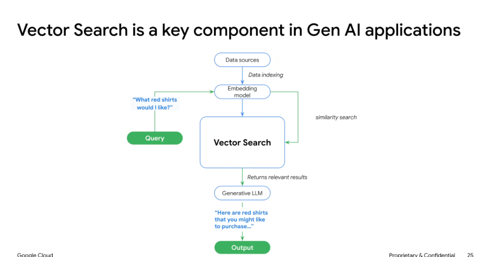
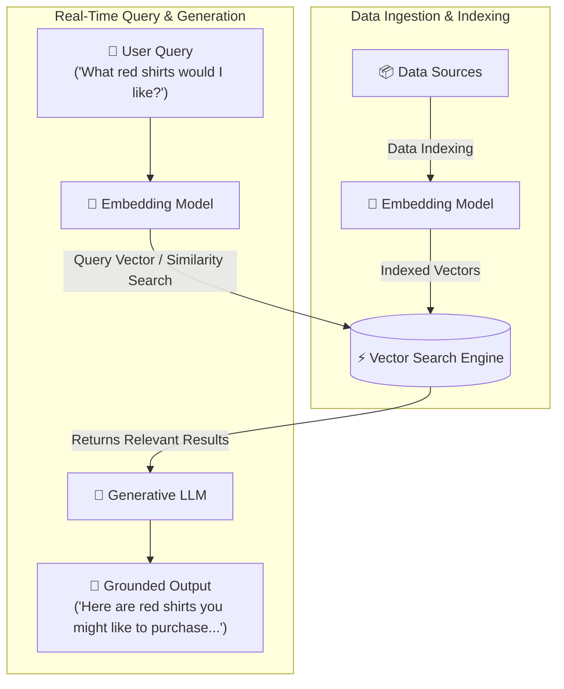

# Vector Search: The Key Component in Gen AI Applications

## Overview

**Vector Search** (Approximate Nearest Neighbor / ANN search) acts as the high-throughput semantic indexing engine that connects unstructured enterprise data to generative models. It allows systems to search by conceptual meaning rather than exact keyword matches.

---

## End-to-End System Architecture

---

## The Dual Operational Lifecycles

### 1. Data Indexing Pipeline (Offline / Ingestion)
1. **Data Ingestion**: Raw documents, catalog items, or multimedia records are ingested from enterprise data sources.
2. **Vectorization**: An embedding model (e.g. `text-embedding-004` or multimodal embeddings) encodes items into dense mathematical vectors.
3. **Index Construction**: Dense vectors and associated metadata IDs are loaded into the Vector Search index (using algorithms like ScaNN, HNSW, or IVF).

### 2. Query & Inference Pipeline (Online / Real-Time)
1. **User Query**: The user asks an intent-rich question (*"What red shirts would I like?"*).
2. **Query Vectorization**: The same embedding model converts the search query into a dense query vector in the identical embedding space.
3. **Similarity Search**: Vector Search compares the query vector against millions/billions of item vectors, executing nearest-neighbor lookups in single-digit milliseconds.
4. **Context Injection & LLM Synthesis**: Top matching product records/passages are passed to the Generative LLM.
5. **Grounded Generation**: The LLM synthesizes personalized recommendations with factual grounding.

---

## Technical Characteristics of Vector Search

| Feature | Description | Enterprise Value |
| :--- | :--- | :--- |
| **Semantic Matching** | Matches user intent and synonyms without requiring exact keyword matches. | Handles ambiguous, conversational, or descriptive user queries. |
| **Sub-10ms Latency** | Scalable Approximate Nearest Neighbor (ANN) index partitioning. | Meets interactive SLAs for real-time web and mobile applications. |
| **Billion-Scale Scalability** | Distributed vector indexing (e.g. Vertex AI Vector Search / Google ScaNN). | Scales across enterprise-scale catalogs, logs, and document stores. |
| **Hybrid Filtering** | Combines vector similarity with hard boolean metadata filters (e.g., price, size, in-stock). | Guarantees business logic constraints alongside semantic ranking. |
