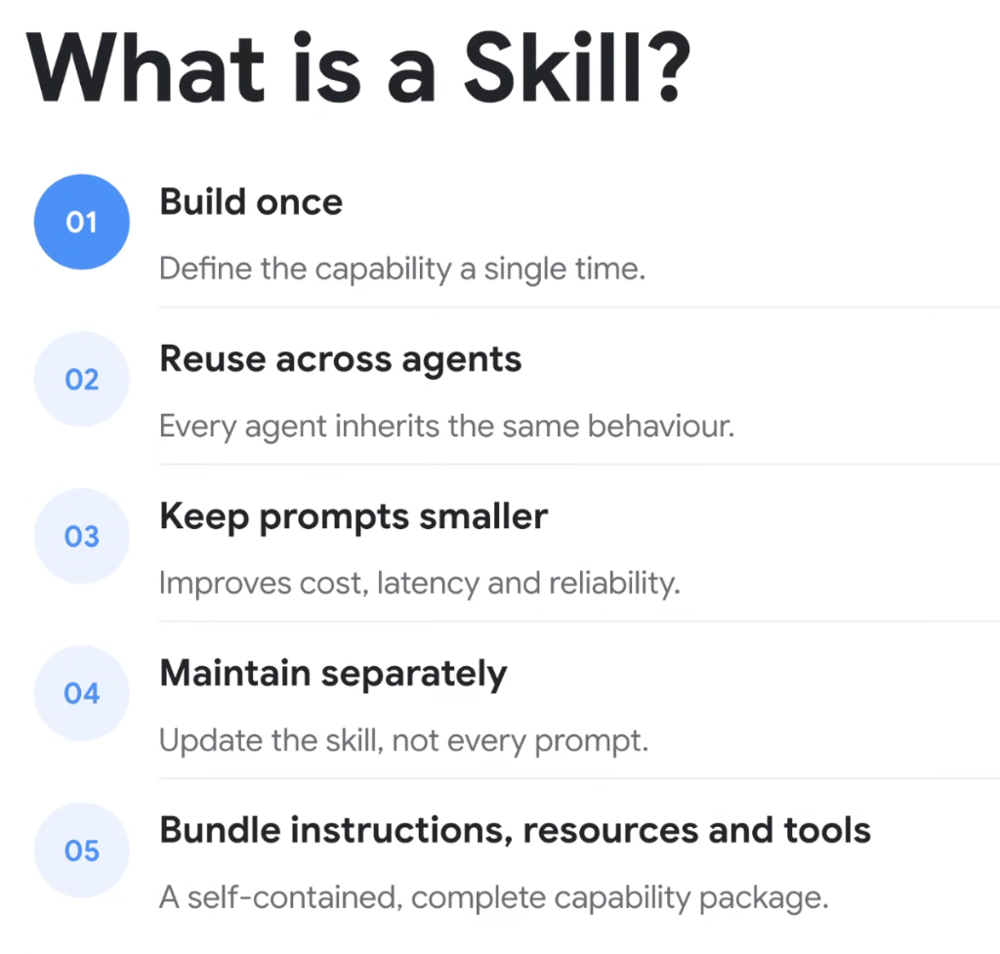
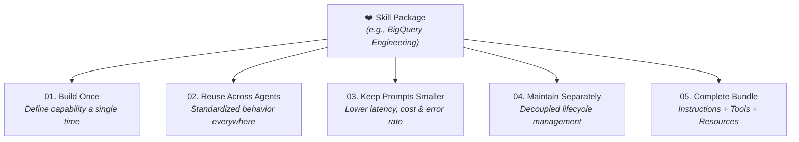

# Google ADK: What is a Skill?



## Overview

In modern agent engineering, a **Skill** is a self-contained, modular capability package. Rather than hardcoding instructions, tools, and domain rules directly into every agent's monolithic system prompt, a Skill bundles instructions, scripts, resources, and tool schemas into an independent, on-demand unit.

---

## The 5 Core Principles of Skills



---

## Deep Breakdown of the 5 Principles

### 01. Build Once
* **Concept**: Define the domain capability, API calling rules, error recovery patterns, and constraints a single time.
* **Benefit**: Eliminates redundant prompt drafting across multiple teams and projects.

### 02. Reuse Across Agents
* **Concept**: Multiple distinct agents (e.g. a customer support bot, a code reviewer, and an incident responder) can all load the exact same Skill.
* **Benefit**: Guarantees organizational consistency and uniform policy enforcement.

### 03. Keep Prompts Smaller
* **Concept**: Instead of loading hundreds of tool schemas and thousands of lines of prompt text permanently, skills are loaded dynamically on demand.
* **Benefit**: Reduces prompt token consumption by up to 90%, lowers Time-to-First-Token (TTFT) latency, and eliminates attention dilution.

### 04. Maintain Separately
* **Concept**: The skill repository lives in independent Git version control with its own test suite and review process.
* **Benefit**: When an API endpoint changes or a new policy is introduced, update the skill once—all consuming agents automatically inherit the update.

### 05. Bundle Instructions, Resources, and Tools
* **Concept**: A skill is not just a prompt string; it is a full capability bundle.
* **Contents**:
  * `SKILL.md`: Core system instructions, YAML frontmatter, and step-by-step procedures.
  * `scripts/`: Local deterministic helper scripts and automation wrappers.
  * `resources/`: Templates, schemas, and few-shot exemplars.
  * `references/`: Detailed documentation and domain runbooks.

---

## Anatomy of a Production Skill Bundle

```text
skills/bigquery-optimization/
├── SKILL.md                 # Core instructions, rules & tool triggers
├── scripts/
│   ├── dry_run_validator.py # Deterministic SQL cost estimator
│   └── partition_check.py   # Table partitioning audit script
├── resources/
│   └── query_templates.sql  # Golden query patterns & syntax
└── references/
    └── pricing_tiers.md     # Slot pricing & cost governance docs
```

---

## Summary Matrix

| Principle | Engineering Problem Solved | Business Value |
| :--- | :--- | :--- |
| **Build Once** | Duplicate prompt engineering across teams | Accelerates development velocity |
| **Reuse Across Agents** | Inconsistent agent behavior | Enforces standardized enterprise governance |
| **Keep Prompts Small** | Context window bloat & high token costs | Lowers operational inference expenses & latency |
| **Maintain Separately** | Fragile monolithic prompt maintenance | Enables clean CI/CD GitOps workflows |
| **Complete Bundle** | Missing scripts, tools, and docs | High reliability & self-contained capability |
