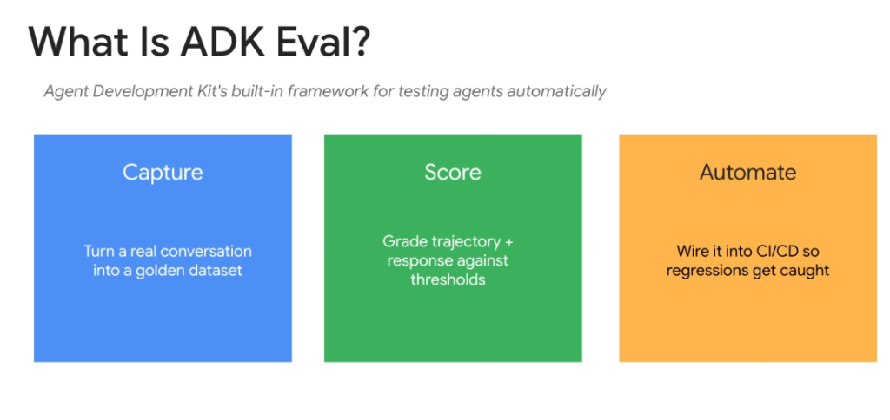
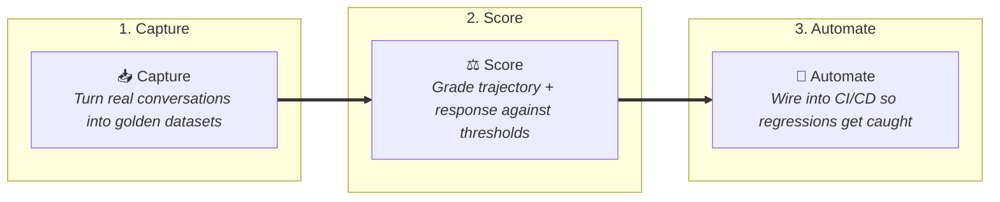
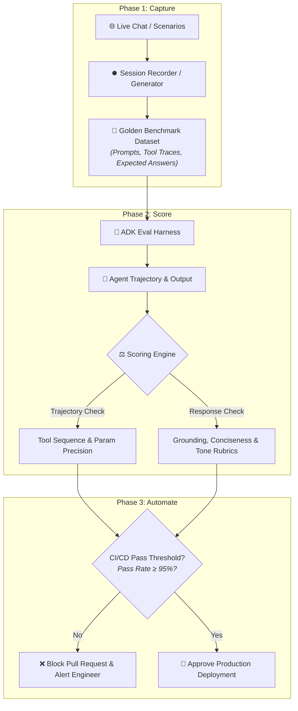

# Google ADK: What Is ADK Eval?



## Overview

**ADK Eval** is the Google Agent Development Kit's built-in, first-class framework designed to automate the testing, evaluation, and regression grading of autonomous single- and multi-agent systems.

> **"Agent Development Kit's built-in framework for testing agents automatically across three foundational capabilities: Capture, Score, and Automate."**

---

## The 3 Pillars of ADK Eval



---

## Deep Breakdown of the 3 Pillars

### 1. Capture (Dataset Creation)
* **Core Function**: Convert live interactive sessions and production execution traces into structured, reusable golden evaluation datasets.
* **Mechanisms**:
  * **Session Recording**: Record real user-agent dialogues, including user inputs, internal thoughts, tool calls, and final responses.
  * **Synthetic Generation**: Auto-generate diverse benchmark queries from enterprise documentation using `agents-cli eval generate`.
  * **Failure Ingestion**: Automatically ingest edge-case failures from production monitoring into the regression test suite.

---

### 2. Score (Trajectory & Response Evaluation)
* **Core Function**: Perform multi-dimensional grading of both intermediate reasoning trajectories and final model outputs against calibrated thresholds.
* **Evaluation Layers**:
  * **Trajectory Grading**:
    * Did the agent invoke the correct tool in the correct sequence?
    * Were tool parameters schema-compliant and accurate?
    * Did the agent complete the task in minimal turns without circular thrashing?
  * **Response Grading**:
    * Is the answer factually grounded in retrieved reference context?
    * Does the response adhere to conciseness, tone, and policy rubrics?
  * **Judge Ensemble**: Combines deterministic exact/regex matchers with LLM-as-a-Judge auto-raters (`RubricJudge`).

---

### 3. Automate (Continuous CI/CD Regression Gating)
* **Core Function**: Embed automated agent evaluation into developer pull request workflows and CI/CD pipelines to block regressions before production deployment.
* **Mechanisms**:
  * **CLI Execution**: Run full eval suites locally or in CI/CD via `agents-cli eval grade`.
  * **Automated Quality Gates**: Fail builds if overall accuracy drops below baseline (e.g. $< 95\%$) or if any critical safety rule is violated.
  * **Regression Telemetry**: Export structured JSON/HTML scorecards tracking quality drift across prompt revisions and model version upgrades.

---

## The Complete ADK Eval Execution Pipeline



---

## ADK Eval Code & CLI Reference

### 1. Programmatic Scoring with ADK Python SDK
```python
from google.adk.eval import EvaluationSuite, TrajectoryEvaluator, RubricJudge

# 1. Trajectory Evaluator: Validates tool execution path
trajectory_eval = TrajectoryEvaluator(
    expected_tool_sequence=["search_knowledge_base", "create_jira_ticket"],
    allow_extra_tools=False,
    max_allowed_turns=4,
)

# 2. Response Evaluator: Validates output grounding and conciseness
grounding_eval = RubricJudge(
    name="factual_grounding",
    criteria="Score 1-5 on factual consistency against retrieved documentation.",
    passing_threshold=4.5,
)

# 3. Complete Evaluation Suite
suite = EvaluationSuite(
    dataset="golden_benchmarks.json",
    evaluators=[trajectory_eval, grounding_eval],
    pass_rate_threshold=0.95,
)

# 4. Execute Suite
report = suite.run(agent=support_agent)
print(f"Passed: {report.passed} | Score: {report.mean_score:.2f}")
```

### 2. Automated Terminal & CI/CD Execution (`google-agents-cli`)
```bash
# 1. Generate synthetic test cases from documentation
agents-cli eval generate --num-samples=50 --output=golden_set.json

# 2. Run automated grading in CI/CD pipeline
agents-cli eval grade \
  --agent-dir=./src/my_agent \
  --dataset=golden_set.json \
  --output=eval_report.json \
  --fail-under=0.95

# 3. View executive summary
agents-cli eval summary --report=eval_report.json
```

---

## ADK Eval Pillar Summary

| Pillar | Focus | Key Input | Evaluation Output | Primary Value |
| :--- | :--- | :--- | :--- | :--- |
| **Capture** | Dataset Engineering | Live production traces & docs | Structured Golden Dataset (`.json`) | Replaces arbitrary prompt testing with real data. |
| **Score** | Trajectory + Response | Agent traces & golden ground truth | Quantitative scores & pass/fail rubrics | Evaluates both intermediate reasoning and final text. |
| **Automate** | CI/CD Integration | Eval suite config & PR branch | Build pass/fail gate & regression report | Guarantees zero unmonitored production regressions. |
