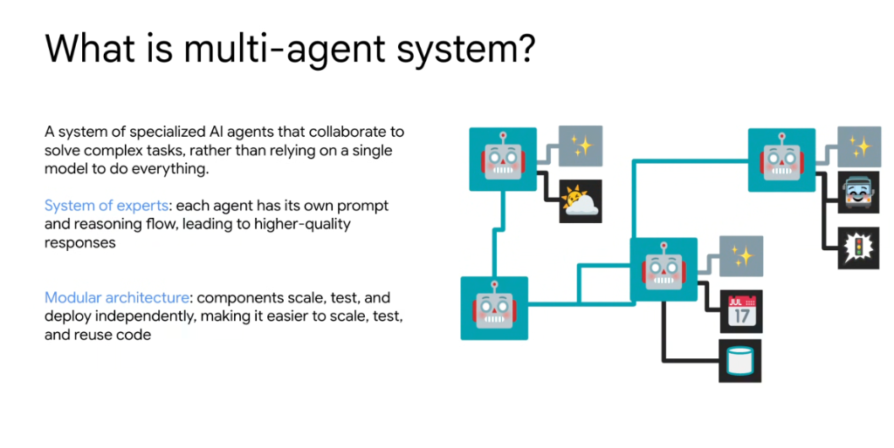
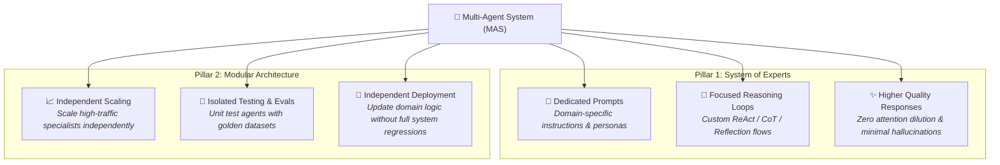
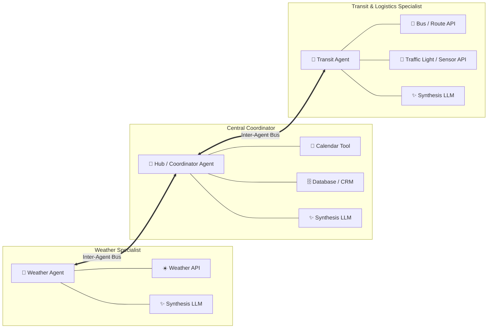

# What is a Multi-Agent System?



## Overview

A **Multi-Agent System (MAS)** is an architectural pattern composed of multiple specialized AI agents that collaborate, communicate, and divide labor to solve complex, multi-step tasks—rather than relying on a single monolithic model to do everything.

> **"A system of specialized AI agents that collaborate to solve complex tasks, rather than relying on a single model to do everything."**

As applications evolve from simple chatbots into enterprise-grade software, single-prompt architectures inevitably break down due to context window congestion, tool selection confusion, and maintenance bottlenecks. Multi-agent systems apply classical distributed systems and microservices principles to LLM engineering.

---

## The Two Foundational Pillars



---

## 1. System of Experts

Instead of forcing a single generalist model to comprehend every business policy, API schema, and edge-case handling rule simultaneously:

* **Dedicated Prompts & Roles**: Each agent is assigned a narrow, well-defined operational scope (e.g., Weather Specialist, Transit/Traffic Controller, Scheduling & Database Coordinator).
* **Focused Reasoning Flows**: Different tasks require different cognitive strategies. A math/data agent can run strict deterministic calculations or SQL queries, while a customer support agent executes empathy-driven summarization and policy compliance checks.
* **Tool Partitioning (Solving Decision-Space Bloat)**: Exposing 50+ tools to one LLM causes high tool-selection failure rates. In a multi-agent system, each specialist receives only the 2–4 tools relevant to its domain.
* **Higher-Quality Responses**: Removing distracting instructions and unrelated tool definitions preserves the model's effective attention span and eliminates cross-domain hallucination.

---

## 2. Modular Architecture

Applying modern software engineering and microservice patterns to agent fleets:

* **Independent Scaling**: High-volume, lightweight agents (e.g., triage routers, status checkers) can run on fast, cost-effective models (e.g., Gemini 2.5 Flash), while complex analytical agents run on high-reasoning models (e.g., Gemini 2.5 Pro) with dedicated compute quotas.
* **Isolated Testing & CI/CD Evals**: Each agent can be tested in isolation using automated evaluation suites (`agents-cli eval grade`), mock tool outputs, and golden benchmark datasets without needing to run end-to-end multi-agent simulations for every minor prompt tweak.
* **Independent Deployment & GitOps**: Teams can update, version-control, and deploy a specific agent (e.g., the Billing Support Agent) without touching or redeploying the surrounding fleet.
* **Code & Skill Reusability**: Specialized agents and skills can be packaged as reusable modules across multiple parent applications and business units.

---

## Architectural Interaction Model



---

## Monolithic Single Agent vs. Multi-Agent System

| Architectural Dimension | Monolithic "God Model" Agent | Multi-Agent System (MAS) |
| :--- | :--- | :--- |
| **Prompt Design** | Massive, fragile prompt with hundreds of rules | Small, modular, single-responsibility prompts |
| **Tool Registry** | 20–100+ tools injected into a single context | 2–5 isolated tools per specialized agent |
| **Decision-Space Confusion** | High risk of hallucinated or incorrect tool selection | Minimal risk; tools strictly scoped to specialist role |
| **Model Optimization** | Forced to use expensive flagship model for all turns | Cost-optimized model selection per agent tier (Pro vs. Flash) |
| **Failure Blast Radius** | Single error breaks entire workflow | Failure contained to one subagent; graceful fallback |
| **Observability & Tracing** | Opaque, tangled multi-step reasoning traces | Clean, distributed spans per agent and tool invocation |
| **Team Collaboration** | Multiple engineers merge into one giant prompt | Distinct teams own, develop, and test distinct agents |

---

## Google ADK: Multi-Agent Implementation Pattern

In the **Google Agent Development Kit (ADK)**, multi-agent collaboration is modeled natively through hierarchical supervisors, subagent registries, or Agent-to-Agent (A2A) protocol communication:

```python
from google.adk.agents import Agent, LlmAgent
from google.adk.tools import Tool

# 1. Specialized Weather Specialist Agent
weather_agent = LlmAgent(
    name="weather_specialist",
    model="gemini-2.5-flash",
    instruction="You are a weather expert. Retrieve live meteorological data and forecasts.",
    tools=[get_weather_forecast, get_radar_conditions],
)

# 2. Specialized Transit & Traffic Specialist Agent
transit_agent = LlmAgent(
    name="transit_specialist",
    model="gemini-2.5-flash",
    instruction="You are a transit and logistics expert. Analyze bus routes, schedules, and traffic delays.",
    tools=[get_bus_routes, get_traffic_incidents],
)

# 3. Central Coordinator / Supervisor Agent
coordinator_agent = LlmAgent(
    name="trip_coordinator",
    model="gemini-2.5-pro",
    instruction=(
        "You are the central travel coordinator. Deconstruct user queries, delegate domain tasks "
        "to specialized subagents, and synthesize a cohesive final plan."
    ),
    tools=[lookup_user_calendar, query_crm_database],
    subagents=[weather_agent, transit_agent],  # Multi-agent delegation
)
```

---

## Summary Matrix

| Principle | Core Mechanism | Engineering Benefit |
| :--- | :--- | :--- |
| **Specialization** | System of Experts with isolated domains | High accuracy, minimal hallucination, focused reasoning |
| **Decoupling** | Modular architecture and scoped toolsets | Eliminates context congestion and decision-space bloat |
| **Scalability** | Asymmetric compute and independent deployments | Cost-efficient inference and rapid CI/CD iteration |
| **Resilience** | Isolated blast radius and clear error boundaries | Predictable failure containment and localized recovery |
