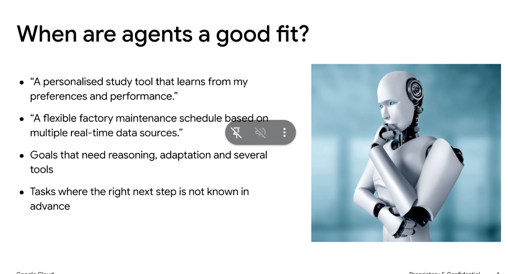

# When Are Agents a Good Fit?

## Core Fit Criteria

Agents provide the highest value in scenarios characterized by non-determinism, multi-step problem solving, and tool integration:

* **Goals requiring reasoning, adaptation, and multi-tool orchestration**:
  Tasks that cannot be solved by a single prompt or static pipeline and require deciding which tools to call, analyzing tool outputs, and adapting strategy dynamically.
* **Tasks where the next step is not known in advance**:
  Dynamic exploration, investigation, troubleshooting, or exploratory workflows where the path depends on intermediate discoveries.

---

## Real-World Examples & Use Cases

* **Personalized Adaptive Learning**:
  > *"A personalised study tool that learns from my preferences and performance."*
  * Involves tracking learner metrics, adjusting curriculum pacing, testing comprehension, and synthesizing custom explanations.

* **Predictive & Dynamic Operations**:
  > *"A flexible factory maintenance schedule based on multiple real-time data sources."*
  * Requires ingesting telemetry, querying inventory/ERP systems, prioritizing critical anomalies, and dispatching maintenance actions.
