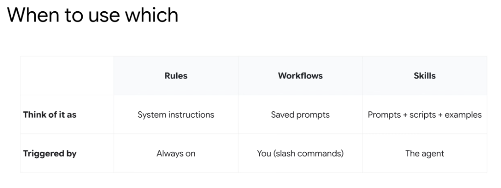
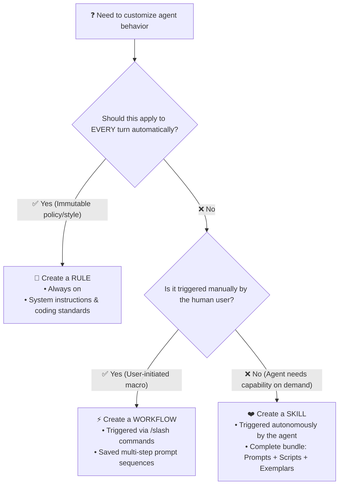

# Customization Triad: When to Use Rules vs. Workflows vs. Skills

## Overview

In **Google Antigravity**, developers frequently ask when to define a **Rule**, create a **Workflow**, or package a **Skill**. Understanding their conceptual differences and activation triggers is key to building clean, token-efficient, and maintainable systems.

---

## The Decision Matrix

| Dimension | Rules | Workflows | Skills |
| :--- | :--- | :--- | :--- |
| **Think of it as** | **System instructions** | **Saved prompts** | **Prompts + scripts + examples** |
| **Triggered by** | **Always on** | **You (slash commands)** | **The agent** |
| **Primary Scope** | Behavioral boundaries & style | User-initiated procedural routines | Specialized domain capabilities |
| **Context Lifetime** | Permanent in prompt context | Ephemeral during command turn | Dynamically loaded on demand (L1 $\rightarrow$ L2 $\rightarrow$ L3) |
| **Example** | *"Always format Python with PEP 8"* | `/review-pr` or `/daily-standup` | `bigquery-optimizer` skill package |

---

## Architectural Decision Flow

---

## Deep Dive: The Three Customization Primitives

### 1. Rules (Always On · System Instructions)
* **What it is**: The persistent baseline rules of engagement for a repository or user environment.
* **How it triggers**: Automatically loaded into the context window for every interaction.
* **When to use**:
  * Mandatory code formatting (PEP 8, Google Style Guides).
  * Architecture invariants (e.g. *"Controllers must never query the database directly"*).
  * Global operational directives (e.g. Zero-Mock rules, read-only access modes).

### 2. Workflows (User-Triggered · Saved Prompts / Macros)
* **What it is**: Pre-defined prompt templates and chained command macros designed to automate repetitive user tasks.
* **How it triggers**: Explicitly invoked by the developer typing a slash command (e.g. `/plan`, `/deploy`, `/summarize`).
* **When to use**:
  * Routine developer workflows that need human initiation.
  * Standardized sprint kickoffs, PR reviews, and deployment checklists.
  * Interactive guided interviews and setup wizards.

### 3. Skills (Agent-Triggered · Complete Capability Bundles)
* **What it is**: A modular, multi-file capability package bundling operational instructions (`SKILL.md`), deterministic Python/Bash scripts (`scripts/`), schemas, and few-shot examples (`resources/`).
* **How it triggers**: Autonomously selected and loaded by the agent when it detects that the user's task requires specialized domain expertise.
* **When to use**:
  * Complex domain capabilities (e.g. BigQuery query optimization, Cloud SQL migration, Buganizer issue triage).
  * Tool-heavy workflows that would bloat the prompt if permanently loaded.
  * Standardized enterprise expertise shared across multiple distinct agents.
