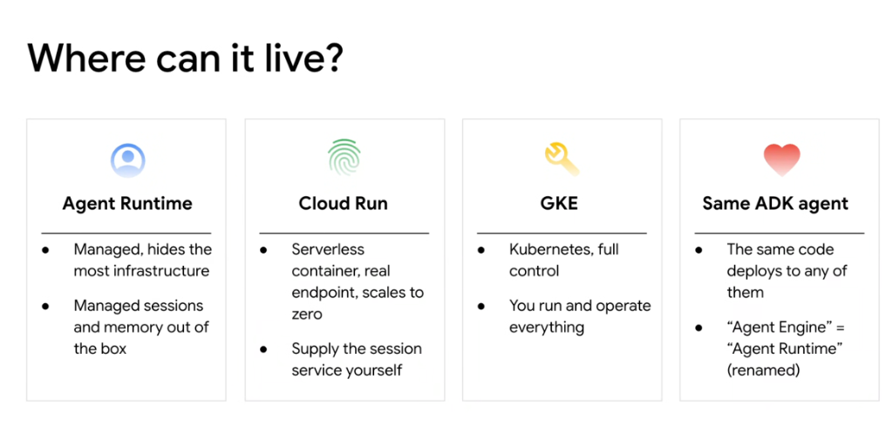
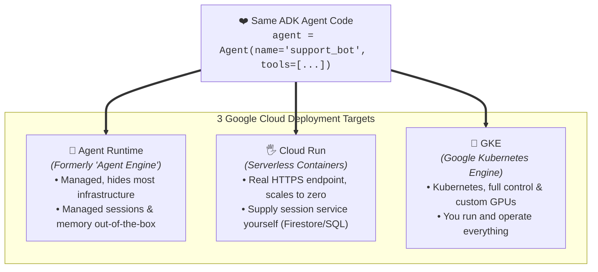
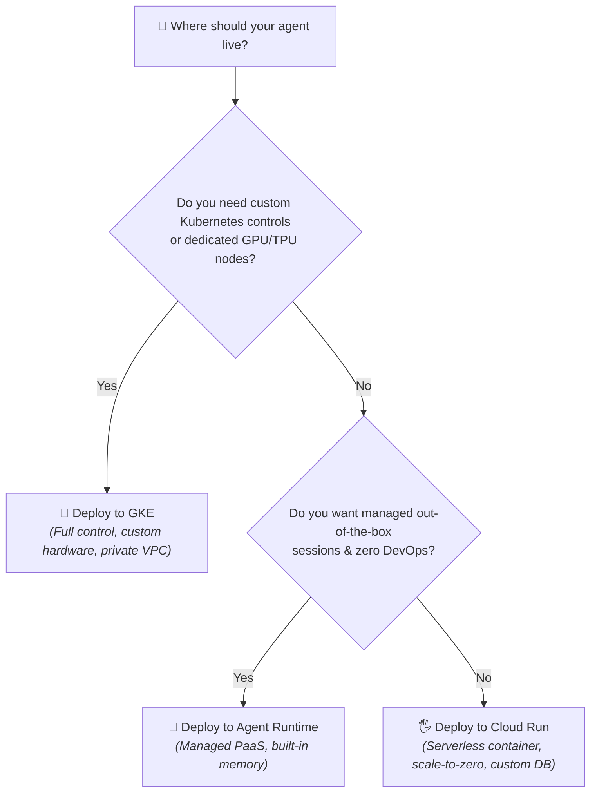

# Google ADK: Where Can It Live? (Deployment Targets)



## Overview

A core architectural tenet of the Google Agent Development Kit (ADK) is **runtime portability**. The exact same ADK agent codebase deploys seamlessly across three production hosting tiers on Google Cloud: **Agent Runtime**, **Cloud Run**, and **Google Kubernetes Engine (GKE)**.

> **"The same ADK agent code deploys to any of them — from fully-managed Agent Runtime to serverless Cloud Run and full-control GKE."**

---

## The 3 Deployment Tiers & Unified Core



---

## Deep Breakdown of Deployment Targets

### 1. Agent Runtime (Managed Agent PaaS)
* **What It Is**: Google Cloud's fully-managed, serverless platform purpose-built specifically for running autonomous agents.
* **Naming Note**: Originally called **"Agent Engine"**, now officially renamed to **"Agent Runtime"**.
* **Key Features**:
  * **Zero Infrastructure Management**: Completely abstracts compute nodes, container builds, and networking.
  * **Built-in Session & Memory Management**: Persists multi-turn dialogues and long-term user memories out of the box without requiring external database provisioning.
  * **Native Observability**: Integrated with Cloud Trace and Vertex AI evaluation telemetry.
* **Best Fit**: Teams prioritizing rapid time-to-market, minimal DevOps overhead, and standard agentic workflows.

---

### 2. Cloud Run (Serverless Containers)
* **What It Is**: Fully-managed serverless compute running OCI containers with automated scale-to-zero economics.
* **Key Features**:
  * **Real HTTPS Endpoints**: Exposes standard REST/gRPC endpoints with automatic TLS certificates and custom domain mapping.
  * **Scale-to-Zero Cost Efficiency**: Scales down to 0 instances when idle, incurring zero compute cost during off-peak hours.
  * **Custom State Storage**: Developers supply their own session and memory backend by connecting ADK to **Cloud Firestore**, **Cloud SQL**, **AlloyDB**, or **Memorystore for Valkey/Redis**.
* **Best Fit**: Microservice ecosystems, unpredictable web traffic, cost-optimized workloads, and custom runtime dependencies.

---

### 3. Google Kubernetes Engine (GKE - Full Control)
* **What It Is**: Enterprise-grade managed Kubernetes offering maximum operational flexibility, compliance, and infrastructure customizability.
* **Key Features**:
  * **Complete Cluster Control**: Fine-grained pod autoscaling (HPA/KEDA), custom daemon sets, and sidecar proxies.
  * **Hardware Acceleration**: Attach custom GPU (NVIDIA H100/L4) or TPU accelerators for co-located local embedding models and rerankers.
  * **Private VPC & Security**: Full support for VPC Service Controls, private clusters, and internal-only load balancers.
* **Best Fit**: Highly regulated enterprises (finance, healthcare), multi-tenant agent platforms, and high-throughput systems requiring dedicated infrastructure.

---

## Deployment Target Comparison Matrix

| Dimension | 👤 Agent Runtime | 🖐️ Cloud Run | 🔧 GKE |
| :--- | :--- | :--- | :--- |
| **Infrastructure Model** | Fully Managed (PaaS) | Serverless Container | Managed Kubernetes |
| **Operational Overhead** | **Lowest (Zero DevOps)** | Low (Container config) | High (Full cluster ops) |
| **Session & Memory State** | **Built-in / Managed** | External (Firestore/SQL) | External / Persistent Volumes |
| **Scaling Behavior** | Automatic managed scaling | **Scales to Zero** $\leftrightarrow 1000+$ | Pod-level (HPA / KEDA) |
| **Hardware Accelerators** | Standard managed compute | GPU support available | **Full GPU/TPU Support** |
| **VPC / Enterprise Security** | Standard Google Cloud IAM | Private VPC Connector | Full VPC-SC & Private Cluster |
| **Primary CLI Command** | `agents-cli deploy agent-runtime` | `agents-cli deploy cloud-run` | `agents-cli deploy gke` |

---

## Single Codebase: Multi-Target Deployment

The developer writes the ADK agent once in standard Python:

```python
# src/customer_agent/agent.py
from google.adk import Agent
from google.adk.tools import FunctionTool

def lookup_ticket(ticket_id: str) -> dict:
    return {"ticket_id": ticket_id, "status": "resolved"}

agent = Agent(
    name="customer_service_agent",
    model="gemini-2.5-pro",
    instruction="You are an enterprise customer service assistant.",
    tools=[FunctionTool(lookup_ticket)],
)
```

Deploying to any target is a single CLI invocation:

```bash
# 1. Deploy to Agent Runtime (Managed PaaS)
agents-cli deploy agent-runtime --agent-dir=./src/customer_agent

# 2. Deploy to Cloud Run (Serverless Container)
agents-cli deploy cloud-run \
  --agent-dir=./src/customer_agent \
  --session-backend=firestore

# 3. Deploy to GKE (Kubernetes Cluster)
agents-cli deploy gke \
  --agent-dir=./src/customer_agent \
  --cluster=prod-agents-cluster \
  --namespace=support
```

---

## Decision Flowchart: Choosing the Right Hosting Target


