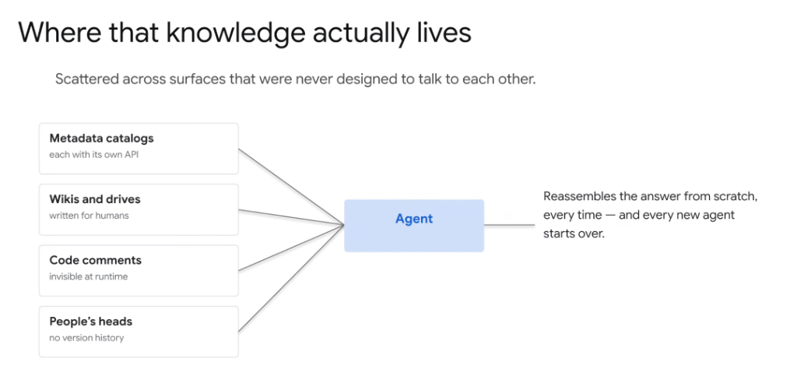
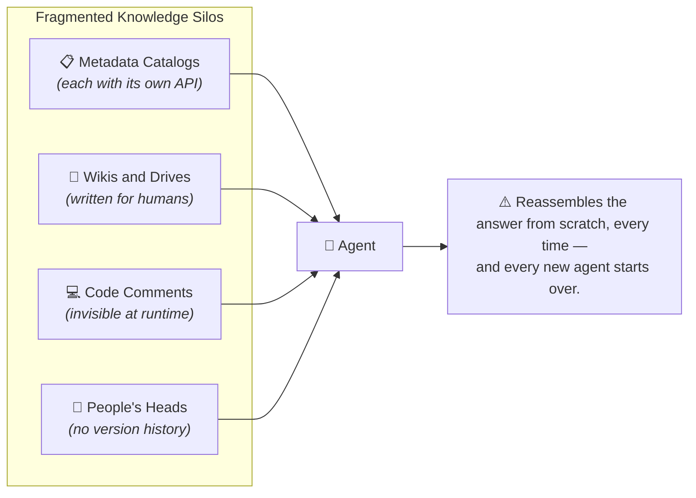

# Where That Knowledge Actually Lives: The Enterprise Fragmentation Problem

## Overview

Enterprise domain knowledge is fundamentally fragmented across heterogeneous systems, repositories, and tacit tribal knowledge. Because these surfaces were never designed to interoperate, autonomous agents bear the heavy burden of discovering, reconciling, and reassembling context dynamically on every execution.

> **"Scattered across surfaces that were never designed to talk to each other."**

---

## The Fragmented Knowledge Surfaces

---

## The Four Knowledge Silos

### 1. Metadata Catalogs
* **Current State**: Data catalogs, dbt docs, Collibra, Dataplex, or custom SQL data dictionaries.
* **The Challenge**: Each catalog exposes distinct, bespoke query APIs and inconsistent metadata schemas, requiring specialized connectors.

### 2. Wikis and Shared Drives
* **Current State**: Google Docs, Confluence, Notion, shared drives, presentation decks.
* **The Challenge**: Formatted for human readability rather than programmatic extraction; frequently outdated, unversioned, or contradictory.

### 3. Code Comments & Repository Logic
* **Current State**: Inline comments, dbt SQL transformations, pipeline configs, and Git commit messages.
* **The Challenge**: Encapsulates vital business logic (e.g. why specific churn conditions are filtered), but remains completely invisible at runtime to external systems.

### 4. Tacit Human Knowledge ("People's Heads")
* **Current State**: Tribal folklore, unwritten rules, informal Slack conversations, and legacy domain memory.
* **The Challenge**: Completely unindexed with zero version history, audit trail, or programmatic access point.

---

## The Systemic Inefficiency

When systems lack a unified semantic context layer:
* **Repeated Computation**: The agent must reassemble context from scratch on every single invocation.
* **Cold-Start Penalty**: Every new agent instance starts with zero accumulated organizational context, repeating the same discovery journeys and query overheads.
* **High Token & Latency Cost**: Multi-hop discovery across disjointed APIs inflates token consumption and degrades real-time responsiveness.

---

## Architectural Imperative

To overcome this fragmentation, modern agent architectures require:
1. **Unified Semantic Knowledge Graphs / Metadata Layers**: Centralizing access to schemas and business rules.
2. **Persistent Agent Memory (LTM)**: Storing derived entity mappings so agents don't restart from zero.
3. **Runtime Tool Interfaces (MCP)**: Providing standardized abstractions over disparate metadata APIs.
