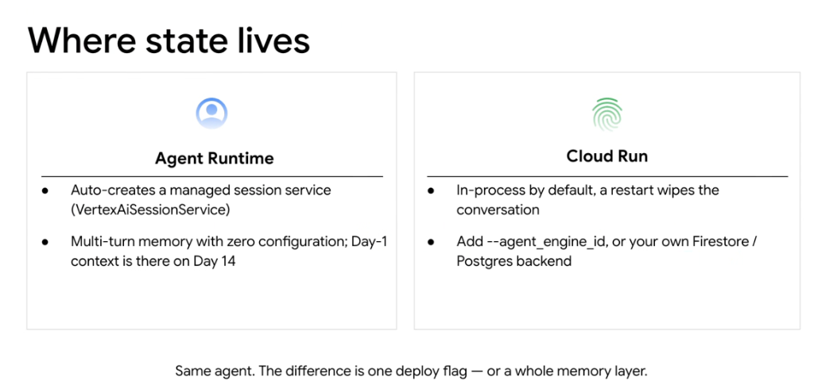

# Google ADK: Where State Lives (Agent Runtime vs. Cloud Run)



## Overview

In the Google Agent Development Kit (ADK), runtime state and memory persistence depend directly on the deployment environment. While the Python agent logic remains identical across platforms, **where state lives** differs fundamentally between **Agent Runtime** and **Cloud Run**.

> **"Same agent. The difference is one deploy flag — or a whole memory layer."**

---

## State Architecture: Agent Runtime vs. Cloud Run

```mermaid
graph TD
    subgraph 👤 Agent Runtime (Zero-Config Managed State)
        AR_Agent["🤖 ADK Agent"] --> AR_State["⚙️ Auto-Created Managed Session Service<br/><code>VertexAiSessionService</code>"]
        AR_State --> AR_Mem["🔒 Multi-Turn Memory (Zero Configuration)<br/><i>Day 1 context persists through Day 14+</i>"]
    end

    subgraph 🖐️ Cloud Run (Configurable State Architecture)
        CR_Agent["🤖 ADK Agent (Cloud Run Container)"]
        
        CR_Agent -->|Default: In-Process| Ephemeral["❌ In-Process RAM<br/><i>(Restart wipes conversation)</i>"]
        CR_Agent -->|Option A: --agent_engine_id| Hybrid["🔗 Managed Agent Engine Backend<br/><i>(Turnkey state across restarts)</i>"]
        CR_Agent -->|Option B: Custom Backend| CustomDB[("🗄️ External State Store<br/><i>Cloud Firestore / Cloud SQL Postgres / Valkey</i>")]
    end
```

---

## Deep Breakdown: Platform State Behaviors

### 1. Agent Runtime (Turnkey `VertexAiSessionService`)
* **State Behavior**: Fully managed, auto-created session service.
* **Configuration Overhead**: **Zero configuration**.
* **Under the Hood**:
  * Agent Runtime automatically instantiates `VertexAiSessionService` for your agent.
  * Every conversation turn, tool invocation output, and session variable is written to Google's managed state infrastructure.
  * Preserves multi-turn conversational history and long-term user context indefinitely (**Day 1 context is seamlessly available on Day 14**).
* **Deployment**:
  ```bash
  agents-cli deploy agent-runtime --agent-dir=./src/my_agent
  ```

---

### 2. Cloud Run (Configurable State Architecture)
* **Default Behavior (In-Process)**:
  * By default, Cloud Run runs the agent in ephemeral container memory.
  * **Critical Risk**: When Cloud Run scales down to zero instances on idle or restarts during deployment, all conversation state and in-flight variables are wiped out.
* **Option A: Connect to Managed State (`--agent_engine_id`)**:
  * Gives you container flexibility (custom Dockerfile, C libraries) with managed session persistence.
  * Passes the ID of a managed Agent Runtime / Agent Engine instance to handle session persistence:
  ```bash
  agents-cli deploy cloud-run \
    --agent-dir=./src/my_agent \
    --agent_engine_id="projects/my-p/locations/us-central1/agentEngines/support-engine"
  ```
* **Option B: Connect Custom External Datastore**:
  * Connect ADK directly to your enterprise database using native session adapters:
    * **Cloud Firestore**: Serverless, multi-region NoSQL document store.
    * **Cloud SQL / AlloyDB for PostgreSQL**: ACID-compliant relational tables.
    * **Memorystore for Valkey/Redis**: Sub-millisecond in-memory cache.

---

## Code Comparison: Managing State Across Platforms

The same agent code can run on either target with zero modifications, or configure explicit database connectors:

### 1. Zero-Config Agent (Runs natively on Agent Runtime or Cloud Run + `--agent_engine_id`)
```python
from google.adk import Agent

# Zero-config state: Automatically managed on Agent Runtime
agent = Agent(
    name="customer_service_agent",
    model="gemini-2.5-pro",
    instruction="Assist enterprise users with billing and account inquiries.",
)
```

### 2. Cloud Run with Custom Firestore Session Backend
```python
from google.adk import Agent
from google.adk.sessions import FirestoreSessionService

# Configure custom Firestore state store for standalone Cloud Run container
session_service = FirestoreSessionService(
    project_id="my-gcp-project",
    collection_name="chat_sessions",
    ttl_days=30,
)

agent = Agent(
    name="customer_service_agent",
    model="gemini-2.5-pro",
    session_service=session_service,
    instruction="Assist enterprise users with billing and account inquiries.",
)
```

---

## State Storage Architecture Matrix

| Dimension | 👤 Agent Runtime | 🖐️ Cloud Run (Default) | 🖐️ Cloud Run (`--agent_engine_id`) | 🖐️ Cloud Run (Firestore/SQL) |
| :--- | :--- | :--- | :--- | :--- |
| **Session Backend** | `VertexAiSessionService` | In-Process Python Dict | Managed Agent Engine | External Firestore / Postgres |
| **Restart Behavior** | **100% Preserved** | ❌ **Wiped Blank** | **100% Preserved** | **100% Preserved** |
| **Config Overhead** | **Zero Config** | Zero Config | Single CLI Flag | Database provisioning |
| **Multi-Turn Lifespan** | Day 1 $\rightarrow$ Day 14+ | Process uptime only | Day 1 $\rightarrow$ Day 14+ | Configurable (e.g. 30–90 days) |
| **Custom DB Schema** | Standard managed schema | N/A | Standard managed schema | **Full SQL / NoSQL control** |

---

## Engineering Rules of Thumb

1. **Never Rely on Cloud Run Default State in Production**:
   * Running Cloud Run without `--agent_engine_id` or an external datastore is an anti-pattern that causes silent session drops.
2. **Use Agent Runtime for Instant State**:
   * If your workload does not require custom databases or proprietary schemas, deploy to Agent Runtime for zero-effort state durability.
3. **Use Firestore or PostgreSQL for Existing Microservices**:
   * If your application already uses Cloud SQL or Firestore for customer data, plug ADK directly into your existing database using `FirestoreSessionService` or `PostgresSessionService`.
